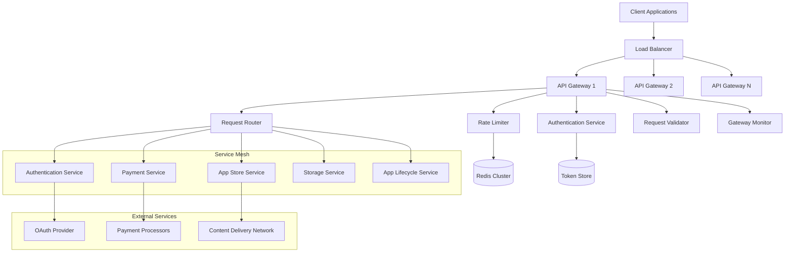
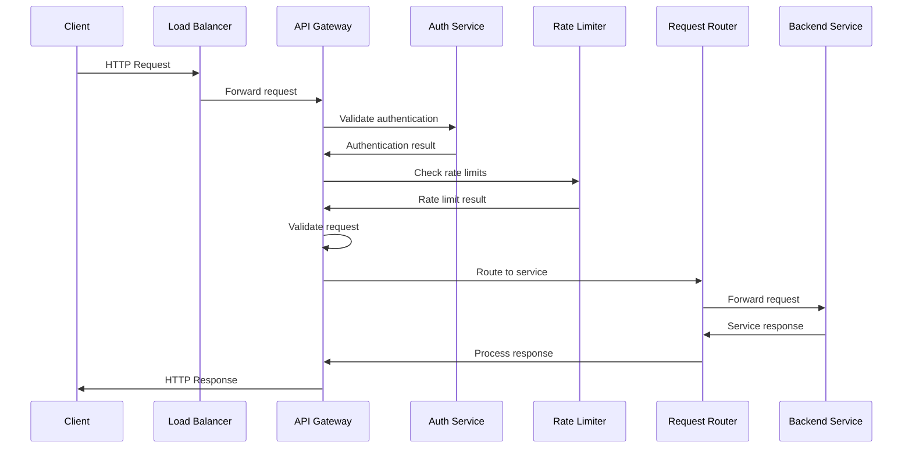
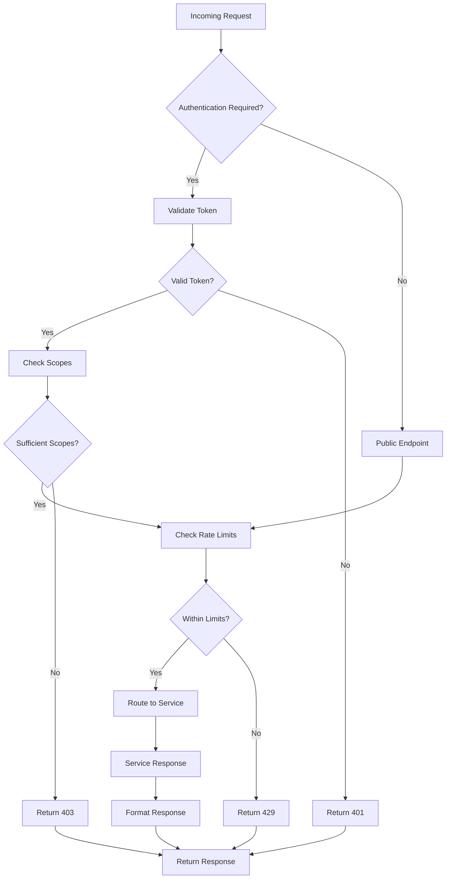
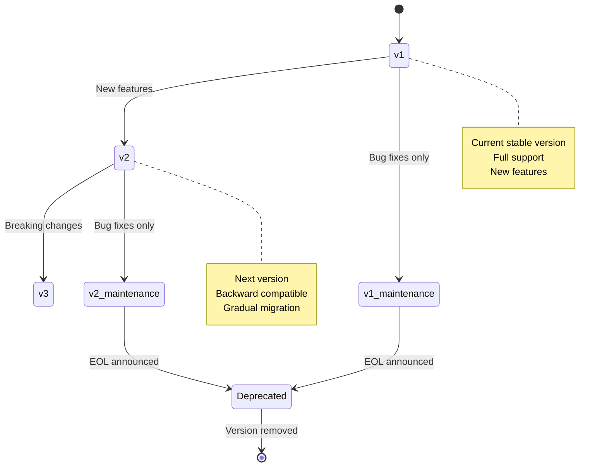
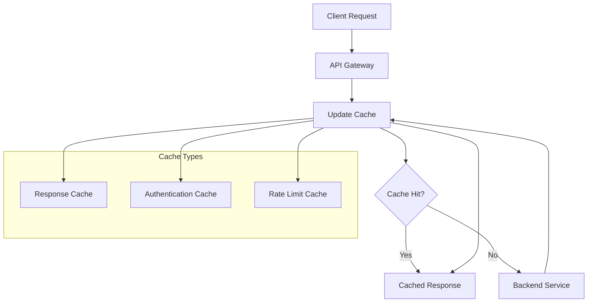
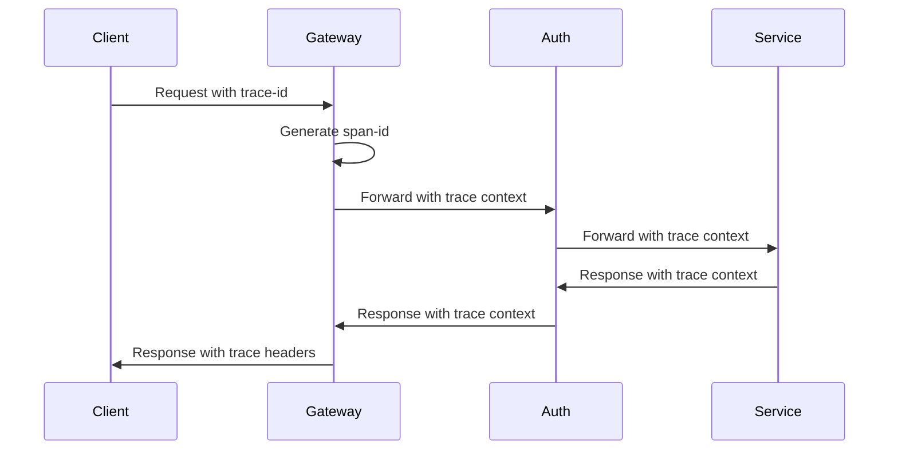
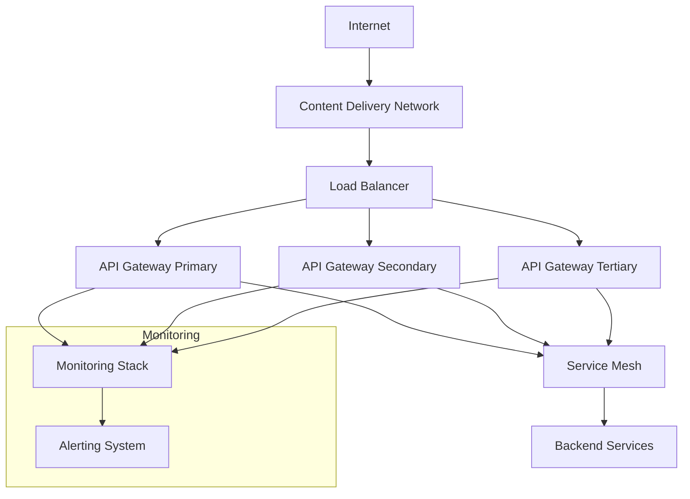

# TMCP API Gateway and Request Routing Design

## 1. Overview

The TMCP API Gateway serves as the single entry point for all client requests to the TMCP ecosystem. It handles request routing, authentication, rate limiting, protocol translation, and provides a unified interface to the various microservices.

## 2. System Architecture



## 3. Request Flow

### 3.1 Request Processing Pipeline



### 3.2 Request Routing Decision Tree



## 4. API Gateway Components

### 4.1 Authentication Handler

**Responsibilities:**
- Token validation and extraction
- JWT signature verification
- Token expiration checking
- User context extraction

**Implementation:**
```javascript
class AuthenticationHandler {
  async validateToken(request) {
    const token = this.extractToken(request);
    if (!token) return null;
    
    const payload = await this.verifyJWT(token);
    if (!payload || this.isExpired(payload)) return null;
    
    return {
      userId: payload.sub,
      appId: payload.app_id,
      scopes: payload.scp,
      expiresAt: payload.exp
    };
  }
}
```

### 4.2 Rate Limiter

**Responsibilities:**
- Rate limit enforcement
- Distributed rate limiting
- Multiple limit types (user, IP, endpoint)
- Configurable limit policies

**Rate Limiting Algorithms:**
1. **Token Bucket** - Smooth rate limiting
2. **Sliding Window** - Precise rate control
3. **Fixed Window** - Simple implementation

**Configuration:**
```yaml
rate_limits:
  default:
    requests_per_minute: 100
    burst: 20
  
  authentication:
    requests_per_minute: 10
    burst: 5
  
  payments:
    requests_per_minute: 30
    burst: 10
    
  storage:
    requests_per_minute: 200
    burst: 50
```

### 4.3 Request Router

**Responsibilities:**
- Path-based routing
- Service discovery integration
- Load balancing
- Circuit breaker pattern

**Routing Configuration:**
```yaml
routes:
  - path: "/auth/v1/*"
    service: "authentication-service"
    methods: ["GET", "POST", "PUT", "DELETE"]
    auth_required: false
    
  - path: "/store/v1/*"
    service: "app-store-service"
    methods: ["GET", "POST", "PUT", "DELETE"]
    auth_required: true
    scopes: ["profile"]
    
  - path: "/payments/v1/*"
    service: "payment-service"
    methods: ["GET", "POST", "PUT", "DELETE"]
    auth_required: true
    scopes: ["payment:read", "payment:write"]
    
  - path: "/storage/v1/*"
    service: "storage-service"
    methods: ["GET", "POST", "PUT", "DELETE"]
    auth_required: true
    scopes: ["storage:read", "storage:write"]
```

### 4.4 Request Validator

**Responsibilities:**
- Request schema validation
- Input sanitization
- Size limits enforcement
- Content type validation

**Validation Rules:**
```json
{
  "validation_rules": {
    "max_request_size": "10MB",
    "max_header_size": "8KB",
    "allowed_content_types": [
      "application/json",
      "application/x-www-form-urlencoded",
      "multipart/form-data"
    ],
    "sanitization": {
      "remove_html": true,
      "trim_strings": true,
      "normalize_unicode": true
    }
  }
}
```

## 5. API Versioning Strategy

### 5.1 Versioning Approaches

```mermaid
graph LR
    A[Versioning Strategies] --> B[URL Path Versioning]
    A --> C[Header Versioning]
    A --> D[Query Parameter Versioning]
    
    B --> B1[/v1/resource]
    B --> B2[/v2/resource]
    
    C --> C1[Accept: application/vnd.tmcp.v1+json]
    C --> C2[API-Version: v1]
    
    D --> D1[?version=v1]
    D --> D2[?api_version=v2]
```

**Chosen Strategy: URL Path Versioning**
- Clear and explicit versioning
- Easy to implement and understand
- Supports multiple versions simultaneously
- Simple for client developers

### 5.2 Version Compatibility



## 6. Security Implementation

### 6.1 Security Headers

```http
Strict-Transport-Security: max-age=31536000; includeSubDomains
Content-Security-Policy: default-src 'self'
X-Content-Type-Options: nosniff
X-Frame-Options: DENY
X-XSS-Protection: 1; mode=block
Referrer-Policy: strict-origin-when-cross-origin
```

### 6.2 CORS Configuration

```yaml
cors:
  default:
    allowed_origins: ["https://tween.com", "https://*.tween.com"]
    allowed_methods: ["GET", "POST", "PUT", "DELETE", "OPTIONS"]
    allowed_headers: ["Authorization", "Content-Type", "X-API-Version"]
    max_age: 86400
    credentials: true
  
  public_endpoints:
    allowed_origins: ["*"]
    allowed_methods: ["GET", "OPTIONS"]
    allowed_headers: ["Content-Type"]
    max_age: 3600
    credentials: false
```

### 6.3 Request/Response Filtering

**Input Filtering:**
- SQL injection prevention
- XSS attack prevention
- Path traversal prevention
- Command injection prevention

**Output Filtering:**
- Sensitive data redaction
- PII filtering
- Error message sanitization
- Response size limits

## 7. Performance Optimization

### 7.1 Caching Strategy



**Cache Configuration:**
```yaml
cache:
  response_cache:
    ttl: 300  # 5 minutes
    max_size: 100MB
    vary_by: ["Authorization", "Accept-Language"]
  
  auth_cache:
    ttl: 60   # 1 minute
    max_size: 50MB
    
  rate_limit_cache:
    ttl: 3600  # 1 hour
    max_size: 200MB
```

### 7.2 Connection Pooling

**Backend Connection Pools:**
- HTTP/2 connection multiplexing
- Keep-alive connections
- Connection timeout configuration
- Circuit breaker implementation

**Database Connection Pools:**
- Read/write splitting
- Connection health checks
- Automatic failover
- Connection retry logic

## 8. Monitoring and Observability

### 8.1 Metrics Collection

**Gateway Metrics:**
- Request count and rate
- Response time percentiles
- Error rates by endpoint
- Authentication success/failure rates
- Rate limit violations

**Service Metrics:**
- Service response times
- Service health status
- Circuit breaker state
- Connection pool utilization

### 8.2 Distributed Tracing



**Trace Headers:**
```
X-Trace-Id: unique-trace-identifier
X-Parent-Span-Id: parent-span-identifier
X-Span-Id: current-span-identifier
X-Sampled: true/false
```

## 9. Error Handling

### 9.1 Error Response Format

```json
{
  "error": {
    "code": "PAYMENT_REQUIRED",
    "message": "Payment method required for this operation",
    "details": {
      "field": "payment_method_id",
      "reason": "missing_required_field"
    },
    "request_id": "req_123456789",
    "timestamp": "2025-12-20T01:15:00Z"
  }
}
```

### 9.2 Error Classification

| Error Type | HTTP Status | Description |
|------------|-------------|-------------|
| Client Error | 4xx | Invalid request, authentication, authorization |
| Server Error | 5xx | Internal service failures |
| Rate Limit | 429 | Too many requests |
| Service Unavailable | 503 | Service temporarily unavailable |

## 10. Configuration Management

### 10.1 Dynamic Configuration

```yaml
gateway:
  port: 8080
  tls_port: 8443
  max_connections: 10000
  request_timeout: 30s
  
services:
  authentication:
    url: "http://auth-service:8080"
    timeout: 5s
    retries: 3
  
  app_store:
    url: "http://app-store-service:8080"
    timeout: 10s
    retries: 2
```

### 10.2 Environment-Specific Configs

**Development:**
- Debug logging enabled
- Relaxed security headers
- Mock services for testing
- Local database connections

**Production:**
- Strict security configuration
- Comprehensive monitoring
- High availability setup
- Production service endpoints

## 11. Deployment Architecture

### 11.1 High Availability Setup



### 11.2 Scaling Strategy

**Horizontal Scaling:**
- Auto-scaling based on CPU/memory
- Request-based scaling triggers
- Geographic distribution
- Blue-green deployments

**Vertical Scaling:**
- Resource allocation optimization
- Performance tuning
- Connection limit adjustments
- Cache size optimization

This API Gateway design provides a robust, secure, and scalable entry point for the TMCP ecosystem, ensuring proper request routing, authentication, rate limiting, and monitoring for all client interactions.