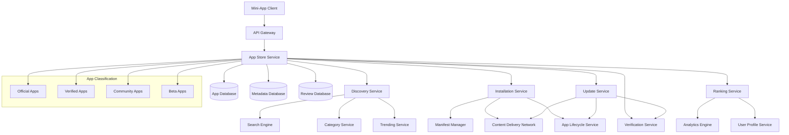
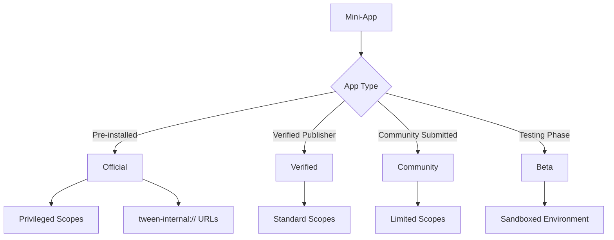
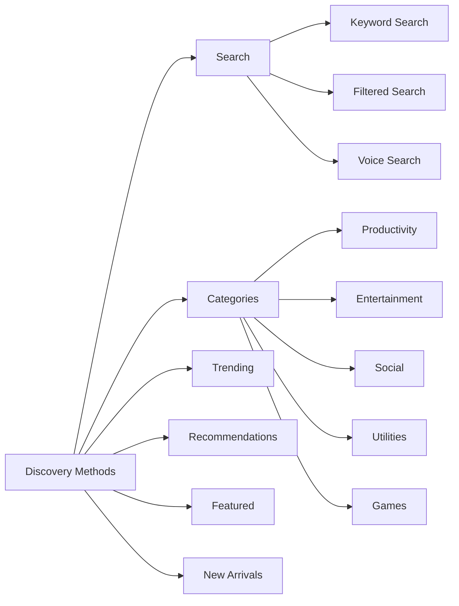
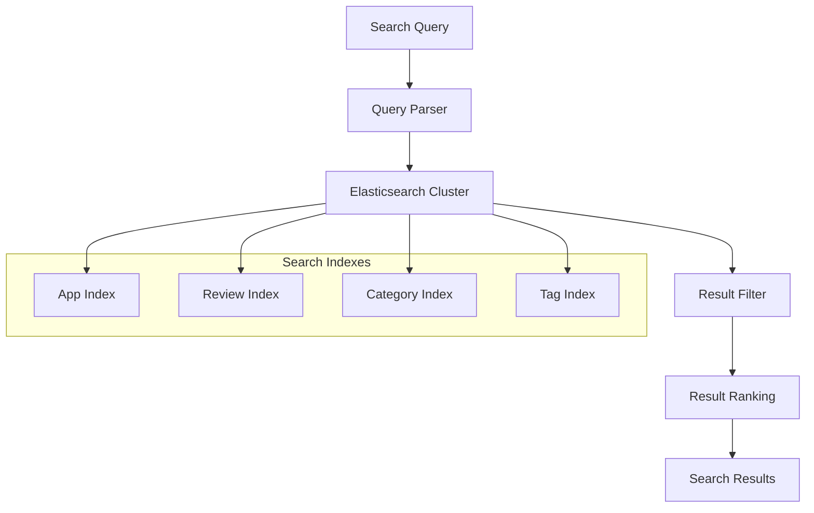
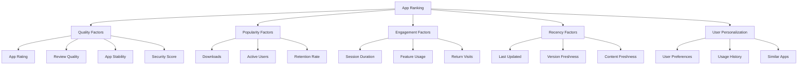
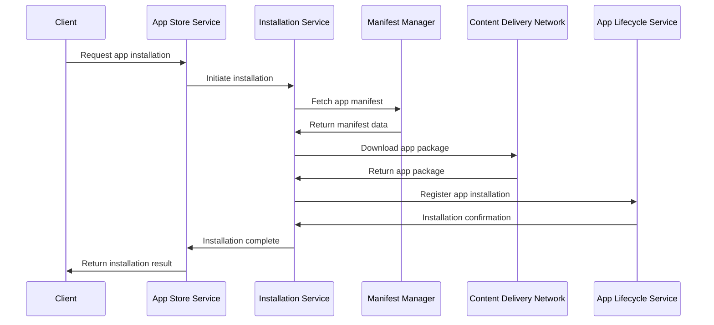
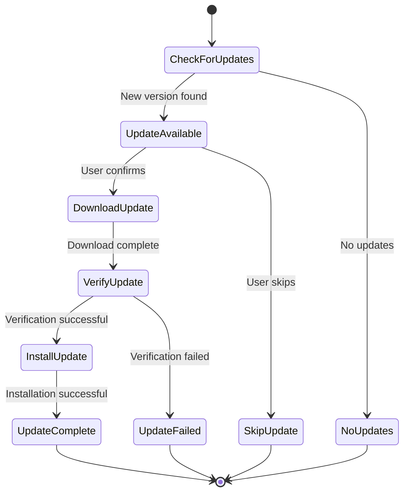

# TMCP Mini-App Store and Discovery System Design

## 1. Overview

The TMCP Mini-App Store and Discovery System provides a comprehensive platform for mini-app distribution, discovery, installation, and lifecycle management. It supports app classification, ranking algorithms, preinstallation, and update management with verification.

## 2. System Architecture



## 3. App Classification System

### 3.1 App Categories



### 3.2 Classification Criteria

| Category | Criteria | Privileges |
|----------|----------|------------|
| Official | Developed by Tween team | Full privileged scopes, internal URLs |
| Verified | Verified publisher identity | Standard scopes, enhanced visibility |
| Community | Community submitted | Basic scopes, standard review |
| Beta | Testing phase | Sandboxed, limited distribution |

## 4. Discovery and Search

### 4.1 Discovery Methods



### 4.2 Search Architecture



## 5. Ranking Algorithm

### 5.1 Ranking Factors



### 5.2 Ranking Formula

```
Rank Score = (w1 × Quality) + (w2 × Popularity) + (w3 × Engagement) + 
             (w4 × Recency) + (w5 × Personalization)

Where:
- w1-w5 are configurable weights
- Each factor is normalized to 0-1 scale
- Personalization factor is user-specific
```

## 6. Installation and Update System

### 6.1 Installation Flow



### 6.2 Update Management



### 6.3 Preinstallation System

**Preinstallation Manifest Format:**
```json
{
  "version": "1.0",
  "apps": [
    {
      "appId": "com.tween.official.browser",
      "version": "2.1.0",
      "url": "tween-internal://browser",
      "required": true,
      "autoUpdate": true,
      "scopes": ["privileged", "system"]
    },
    {
      "appId": "com.tween.official.messages",
      "version": "1.5.2",
      "url": "tween-internal://messages",
      "required": true,
      "autoUpdate": true,
      "scopes": ["privileged", "messaging"]
    }
  ]
}
```

## 7. API Design

### 7.1 Discovery APIs

```
GET /store/v1/apps/search?q={query}&category={cat}&limit={limit}
GET /store/v1/apps/trending?period={day|week|month}&limit={limit}
GET /store/v1/apps/featured?category={cat}&limit={limit}
GET /store/v1/apps/new?limit={limit}
GET /store/v1/apps/recommended?userId={userId}&limit={limit}
GET /store/v1/categories
GET /store/v1/categories/{categoryId}/apps
```

### 7.2 App Details APIs

```
GET /store/v1/apps/{appId}
GET /store/v1/apps/{appId}/versions
GET /store/v1/apps/{appId}/reviews
GET /store/v1/apps/{appId}/permissions
GET /store/v1/apps/{appId}/changelog
```

### 7.3 Installation APIs

```
POST /store/v1/apps/{appId}/install
POST /store/v1/apps/{appId}/uninstall
POST /store/v1/apps/{appId}/update
GET /store/v1/apps/{appId}/installations
GET /store/v1/installed-apps?userId={userId}
```

### 7.4 Management APIs (Official Apps)

```
POST /store/v1/admin/apps
PUT /store/v1/admin/apps/{appId}
DELETE /store/v1/admin/apps/{appId}
POST /store/v1/admin/apps/{appId}/verify
POST /store/v1/admin/apps/{appId}/feature
POST /store/v1/admin/preinstallation/manifest
```

## 8. Data Models

### 8.1 App Model

```json
{
  "appId": "com.tween.browser",
  "name": "Tween Browser",
  "description": "Fast and secure web browser",
  "version": "2.1.0",
  "category": "productivity",
  "classification": "official",
  "developer": {
    "id": "dev_tween",
    "name": "Tween Inc.",
    "verified": true
  },
  "metadata": {
    "icon": "https://cdn.tween.com/icons/browser.png",
    "screenshots": [
      "https://cdn.tween.com/screenshots/browser1.png",
      "https://cdn.tween.com/screenshots/browser2.png"
    ],
    "website": "https://tween.com/browser",
    "support": "support@tween.com"
  },
  "stats": {
    "downloads": 1500000,
    "rating": 4.7,
    "reviewCount": 12500,
    "activeUsers": 850000
  },
  "permissions": [
    "storage:read",
    "storage:write",
    "network:access"
  ],
  "urls": {
    "install": "https://cdn.tween.com/apps/browser-2.1.0.tpkg",
    "internal": "tween-internal://browser"
  },
  "createdAt": "2025-01-15T00:00:00Z",
  "updatedAt": "2025-12-18T10:30:00Z"
}
```

### 8.2 Review Model

```json
{
  "reviewId": "uuid",
  "appId": "com.tween.browser",
  "userId": "uuid",
  "version": "2.1.0",
  "rating": 5,
  "title": "Excellent browser",
  "comment": "Fast, secure, and feature-rich. Highly recommended!",
  "helpful": 42,
  "verified": true,
  "createdAt": "2025-12-15T14:30:00Z",
  "updatedAt": "2025-12-15T14:30:00Z"
}
```

### 8.3 Installation Model

```json
{
  "installationId": "uuid",
  "appId": "com.tween.browser",
  "userId": "uuid",
  "version": "2.1.0",
  "source": "store",
  "autoUpdate": true,
  "status": "installed",
  "installedAt": "2025-12-10T09:15:00Z",
  "lastUsedAt": "2025-12-20T08:45:00Z",
  "updateAvailable": "2.2.0"
}
```

## 9. Database Schema

### 9.1 Apps Table

```sql
CREATE TABLE apps (
    app_id VARCHAR(255) PRIMARY KEY,
    name VARCHAR(255) NOT NULL,
    description TEXT,
    version VARCHAR(50) NOT NULL,
    category VARCHAR(100),
    classification VARCHAR(50) NOT NULL, -- 'official', 'verified', 'community', 'beta'
    developer_id UUID NOT NULL,
    metadata JSONB,
    stats JSONB,
    permissions JSONB,
    urls JSONB,
    status VARCHAR(50) DEFAULT 'active', -- 'active', 'deprecated', 'removed'
    created_at TIMESTAMP DEFAULT NOW(),
    updated_at TIMESTAMP DEFAULT NOW()
);

CREATE INDEX idx_apps_category ON apps(category);
CREATE INDEX idx_apps_classification ON apps(classification);
CREATE INDEX idx_apps_developer ON apps(developer_id);
CREATE INDEX idx_apps_status ON apps(status);
```

### 9.2 App Versions Table

```sql
CREATE TABLE app_versions (
    id UUID PRIMARY KEY,
    app_id VARCHAR(255) REFERENCES apps(app_id),
    version VARCHAR(50) NOT NULL,
    changelog TEXT,
    download_url VARCHAR(500),
    package_size BIGINT,
    checksum VARCHAR(255),
    min_os_version VARCHAR(50),
    status VARCHAR(50) DEFAULT 'active',
    created_at TIMESTAMP DEFAULT NOW()
);

CREATE INDEX idx_app_versions_app ON app_versions(app_id);
CREATE UNIQUE INDEX idx_app_versions_unique ON app_versions(app_id, version);
```

### 9.3 Reviews Table

```sql
CREATE TABLE reviews (
    review_id UUID PRIMARY KEY,
    app_id VARCHAR(255) REFERENCES apps(app_id),
    user_id UUID NOT NULL,
    version VARCHAR(50),
    rating INTEGER CHECK (rating >= 1 AND rating <= 5),
    title VARCHAR(255),
    comment TEXT,
    helpful INTEGER DEFAULT 0,
    verified BOOLEAN DEFAULT FALSE,
    status VARCHAR(50) DEFAULT 'active',
    created_at TIMESTAMP DEFAULT NOW(),
    updated_at TIMESTAMP DEFAULT NOW()
);

CREATE INDEX idx_reviews_app ON reviews(app_id);
CREATE INDEX idx_reviews_user ON reviews(user_id);
CREATE INDEX idx_reviews_rating ON reviews(rating);
```

### 9.4 Installations Table

```sql
CREATE TABLE installations (
    installation_id UUID PRIMARY KEY,
    app_id VARCHAR(255) REFERENCES apps(app_id),
    user_id UUID NOT NULL,
    version VARCHAR(50) NOT NULL,
    source VARCHAR(100), -- 'store', 'preinstalled', 'sideload'
    auto_update BOOLEAN DEFAULT TRUE,
    status VARCHAR(50) DEFAULT 'installed',
    installed_at TIMESTAMP DEFAULT NOW(),
    last_used_at TIMESTAMP,
    updated_at TIMESTAMP DEFAULT NOW()
);

CREATE INDEX idx_installations_app ON installations(app_id);
CREATE INDEX idx_installations_user ON installations(user_id);
CREATE UNIQUE INDEX idx_installations_unique ON installations(app_id, user_id);
```

## 10. Security Considerations

### 10.1 App Verification

**Verification Process:**
1. **Code Review** - Security and quality analysis
2. **Static Analysis** - Vulnerability scanning
3. **Dynamic Analysis** - Runtime behavior analysis
4. **Manual Review** - Expert security assessment

**Verification Levels:**
- **Basic** - Automated checks only
- **Standard** - Automated + manual review
- **Enhanced** - Comprehensive security analysis

### 10.2 Package Security

**Package Integrity:**
- Digital signatures for all packages
- Checksum verification
- Tamper detection
- Secure distribution via CDN

**Runtime Security:**
- Sandboxed execution environment
- Permission enforcement
- Resource usage limits
- Network access controls

## 11. Performance Optimization

### 11.1 Caching Strategy

**Multi-level Caching:**
1. **CDN Cache** - App packages and media
2. **Edge Cache** - Search results and metadata
3. **Application Cache** - Frequently accessed apps
4. **Database Cache** - Query results

**Cache Invalidation:**
- Time-based expiration
- Event-driven invalidation
- Manual cache refresh
- Stale-while-revalidate strategy

### 11.2 Search Optimization

**Elasticsearch Optimization:**
- Custom analyzers for app metadata
- Fuzzy search capabilities
- Autocomplete suggestions
- Faceted search support

**Query Optimization:**
- Index optimization for common queries
- Query result caching
- Pagination optimization
- Search result ranking tuning

## 12. Analytics and Monitoring

### 12.1 Key Metrics

**App Store Metrics:**
- Daily active users
- App downloads and installations
- Search query analysis
- Conversion rates (view → install)

**App Performance Metrics:**
- App ratings and reviews
- Crash rates and stability
- User engagement and retention
- Performance benchmarks

### 12.2 Trending Algorithm

**Trending Factors:**
- Recent download velocity
- Rating improvements
- User engagement spikes
- Social media mentions

**Trending Calculation:**
```
Trending Score = (Recent Downloads × Velocity Weight) + 
                 (Rating Change × Quality Weight) + 
                 (Engagement × Activity Weight)
```

This design provides a comprehensive app store and discovery system that meets the TMCP protocol requirements while ensuring security, performance, and a great user experience for app discovery and management.