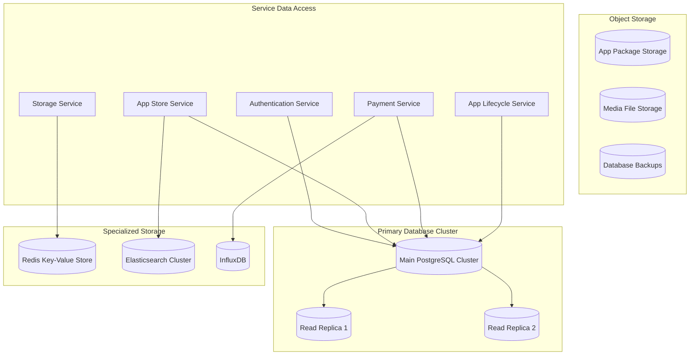

# TMCP Database Schema Design

## 1. Overview

This document provides a comprehensive database schema design for the TMCP (Tween Mini-App Communication Protocol) Server, consolidating all data models required for the authentication, storage, payment, app store, and other core services.

## 2. Database Architecture



## 3. Core Data Models

### 3.1 User Management

```sql
-- Users table
CREATE TABLE users (
    id UUID PRIMARY KEY DEFAULT gen_random_uuid(),
    username VARCHAR(255) UNIQUE NOT NULL,
    email VARCHAR(255) UNIQUE NOT NULL,
    password_hash VARCHAR(255) NOT NULL,
    first_name VARCHAR(100),
    last_name VARCHAR(100),
    phone VARCHAR(50),
    avatar_url VARCHAR(500),
    email_verified BOOLEAN DEFAULT FALSE,
    phone_verified BOOLEAN DEFAULT FALSE,
    mfa_enabled BOOLEAN DEFAULT FALSE,
    status VARCHAR(50) DEFAULT 'active', -- 'active', 'suspended', 'deleted'
    preferences JSONB DEFAULT '{}',
    created_at TIMESTAMP DEFAULT NOW(),
    updated_at TIMESTAMP DEFAULT NOW(),
    last_login_at TIMESTAMP
);

-- User sessions table
CREATE TABLE user_sessions (
    id UUID PRIMARY KEY DEFAULT gen_random_uuid(),
    user_id UUID NOT NULL REFERENCES users(id) ON DELETE CASCADE,
    session_token VARCHAR(255) UNIQUE NOT NULL,
    refresh_token VARCHAR(255) UNIQUE,
    device_id VARCHAR(255),
    device_name VARCHAR(255),
    user_agent TEXT,
    ip_address INET,
    expires_at TIMESTAMP NOT NULL,
    created_at TIMESTAMP DEFAULT NOW(),
    last_accessed_at TIMESTAMP DEFAULT NOW()
);

-- User profile data
CREATE TABLE user_profiles (
    user_id UUID PRIMARY KEY REFERENCES users(id) ON DELETE CASCADE,
    display_name VARCHAR(255),
    bio TEXT,
    location VARCHAR(255),
    website VARCHAR(500),
    birth_date DATE,
    language VARCHAR(10) DEFAULT 'en',
    timezone VARCHAR(50) DEFAULT 'UTC',
    public_profile BOOLEAN DEFAULT FALSE,
    metadata JSONB DEFAULT '{}',
    updated_at TIMESTAMP DEFAULT NOW()
);
```

### 3.2 Authentication and Authorization

```sql
-- OAuth clients table
CREATE TABLE oauth_clients (
    id UUID PRIMARY KEY DEFAULT gen_random_uuid(),
    client_id VARCHAR(255) UNIQUE NOT NULL,
    client_secret_hash VARCHAR(255),
    app_id VARCHAR(255),
    name VARCHAR(255) NOT NULL,
    description TEXT,
    redirect_uris TEXT[] NOT NULL,
    grant_types VARCHAR(50)[] DEFAULT ARRAY['authorization_code'],
    scopes VARCHAR(100)[] DEFAULT ARRAY['profile'],
    is_official BOOLEAN DEFAULT FALSE,
    is_active BOOLEAN DEFAULT TRUE,
    created_at TIMESTAMP DEFAULT NOW(),
    updated_at TIMESTAMP DEFAULT NOW()
);

-- OAuth tokens table
CREATE TABLE oauth_tokens (
    id UUID PRIMARY KEY DEFAULT gen_random_uuid(),
    client_id VARCHAR(255) NOT NULL REFERENCES oauth_clients(client_id),
    user_id UUID REFERENCES users(id) ON DELETE CASCADE,
    token_type VARCHAR(50) NOT NULL, -- 'access', 'refresh'
    token_hash VARCHAR(255) UNIQUE NOT NULL,
    scopes VARCHAR(100)[] NOT NULL,
    expires_at TIMESTAMP NOT NULL,
    created_at TIMESTAMP DEFAULT NOW(),
    revoked_at TIMESTAMP
);

-- MFA methods table
CREATE TABLE mfa_methods (
    id UUID PRIMARY KEY DEFAULT gen_random_uuid(),
    user_id UUID NOT NULL REFERENCES users(id) ON DELETE CASCADE,
    method_type VARCHAR(50) NOT NULL, -- 'transaction_pin', 'biometric', 'totp'
    method_data JSONB NOT NULL,
    is_primary BOOLEAN DEFAULT FALSE,
    is_active BOOLEAN DEFAULT TRUE,
    created_at TIMESTAMP DEFAULT NOW(),
    updated_at TIMESTAMP DEFAULT NOW()
);

-- Device registrations table
CREATE TABLE device_registrations (
    id UUID PRIMARY KEY DEFAULT gen_random_uuid(),
    user_id UUID NOT NULL REFERENCES users(id) ON DELETE CASCADE,
    device_id VARCHAR(255) NOT NULL,
    device_name VARCHAR(255),
    device_type VARCHAR(50), -- 'mobile', 'desktop', 'tablet'
    platform VARCHAR(50), -- 'ios', 'android', 'windows', 'macos', 'linux'
    biometric_key_id VARCHAR(255),
    attestation_data JSONB,
    is_trusted BOOLEAN DEFAULT FALSE,
    created_at TIMESTAMP DEFAULT NOW(),
    last_used_at TIMESTAMP,
    last_seen_at TIMESTAMP DEFAULT NOW()
);
```

### 3.3 Mini-App Store

```sql
-- Apps table
CREATE TABLE apps (
    app_id VARCHAR(255) PRIMARY KEY,
    name VARCHAR(255) NOT NULL,
    description TEXT,
    short_description VARCHAR(500),
    version VARCHAR(50) NOT NULL,
    category VARCHAR(100),
    classification VARCHAR(50) NOT NULL, -- 'official', 'verified', 'community', 'beta'
    developer_id UUID NOT NULL,
    developer_name VARCHAR(255) NOT NULL,
    website VARCHAR(500),
    support_email VARCHAR(255),
    privacy_policy_url VARCHAR(500),
    terms_of_service_url VARCHAR(500),
    metadata JSONB DEFAULT '{}',
    stats JSONB DEFAULT '{}',
    permissions JSONB DEFAULT '[]',
    urls JSONB DEFAULT '{}',
    status VARCHAR(50) DEFAULT 'active', -- 'active', 'deprecated', 'removed', 'pending'
    featured BOOLEAN DEFAULT FALSE,
    created_at TIMESTAMP DEFAULT NOW(),
    updated_at TIMESTAMP DEFAULT NOW()
);

-- App versions table
CREATE TABLE app_versions (
    id UUID PRIMARY KEY DEFAULT gen_random_uuid(),
    app_id VARCHAR(255) NOT NULL REFERENCES apps(app_id) ON DELETE CASCADE,
    version VARCHAR(50) NOT NULL,
    changelog TEXT,
    download_url VARCHAR(500),
    package_size BIGINT,
    checksum VARCHAR(255),
    min_os_version VARCHAR(50),
    max_os_version VARCHAR(50),
    permissions JSONB DEFAULT '[]',
    status VARCHAR(50) DEFAULT 'active', -- 'active', 'deprecated', 'removed'
    created_at TIMESTAMP DEFAULT NOW()
);

-- App reviews table
CREATE TABLE app_reviews (
    review_id UUID PRIMARY KEY DEFAULT gen_random_uuid(),
    app_id VARCHAR(255) NOT NULL REFERENCES apps(app_id) ON DELETE CASCADE,
    user_id UUID NOT NULL REFERENCES users(id) ON DELETE CASCADE,
    version VARCHAR(50),
    rating INTEGER CHECK (rating >= 1 AND rating <= 5),
    title VARCHAR(255),
    comment TEXT,
    helpful_count INTEGER DEFAULT 0,
    verified BOOLEAN DEFAULT FALSE,
    status VARCHAR(50) DEFAULT 'active', -- 'active', 'hidden', 'removed'
    created_at TIMESTAMP DEFAULT NOW(),
    updated_at TIMESTAMP DEFAULT NOW()
);

-- App installations table
CREATE TABLE app_installations (
    installation_id UUID PRIMARY KEY DEFAULT gen_random_uuid(),
    app_id VARCHAR(255) NOT NULL REFERENCES apps(app_id) ON DELETE CASCADE,
    user_id UUID NOT NULL REFERENCES users(id) ON DELETE CASCADE,
    version VARCHAR(50) NOT NULL,
    source VARCHAR(100), -- 'store', 'preinstalled', 'sideload'
    device_id VARCHAR(255),
    auto_update BOOLEAN DEFAULT TRUE,
    status VARCHAR(50) DEFAULT 'installed', -- 'installed', 'uninstalled', 'updating'
    installed_at TIMESTAMP DEFAULT NOW(),
    last_used_at TIMESTAMP,
    updated_at TIMESTAMP DEFAULT NOW()
);

-- App categories table
CREATE TABLE app_categories (
    id UUID PRIMARY KEY DEFAULT gen_random_uuid(),
    name VARCHAR(100) UNIQUE NOT NULL,
    display_name VARCHAR(255) NOT NULL,
    description TEXT,
    icon_url VARCHAR(500),
    parent_id UUID REFERENCES app_categories(id),
    sort_order INTEGER DEFAULT 0,
    is_active BOOLEAN DEFAULT TRUE,
    created_at TIMESTAMP DEFAULT NOW()
);

-- App category mappings
CREATE TABLE app_category_mappings (
    app_id VARCHAR(255) NOT NULL REFERENCES apps(app_id) ON DELETE CASCADE,
    category_id UUID NOT NULL REFERENCES app_categories(id) ON DELETE CASCADE,
    is_primary BOOLEAN DEFAULT FALSE,
    PRIMARY KEY (app_id, category_id)
);
```

### 3.4 Payment System

```sql
-- Payment methods table
CREATE TABLE payment_methods (
    id UUID PRIMARY KEY DEFAULT gen_random_uuid(),
    user_id UUID NOT NULL REFERENCES users(id) ON DELETE CASCADE,
    type VARCHAR(50) NOT NULL, -- 'card', 'bank_account', 'digital_wallet'
    provider VARCHAR(50) NOT NULL, -- 'stripe', 'paypal', 'apple_pay', 'google_pay'
    provider_method_id VARCHAR(255) NOT NULL,
    method_data JSONB NOT NULL,
    is_default BOOLEAN DEFAULT FALSE,
    is_active BOOLEAN DEFAULT TRUE,
    metadata JSONB DEFAULT '{}',
    created_at TIMESTAMP DEFAULT NOW(),
    updated_at TIMESTAMP DEFAULT NOW()
);

-- Payment transactions table
CREATE TABLE payment_transactions (
    payment_id UUID PRIMARY KEY DEFAULT gen_random_uuid(),
    user_id UUID NOT NULL REFERENCES users(id),
    app_id VARCHAR(255) REFERENCES apps(app_id),
    amount BIGINT NOT NULL, -- Amount in smallest currency unit (cents)
    currency VARCHAR(3) NOT NULL DEFAULT 'USD',
    payment_method_id UUID REFERENCES payment_methods(id),
    description TEXT,
    metadata JSONB DEFAULT '{}',
    status VARCHAR(50) NOT NULL, -- 'pending', 'processing', 'completed', 'failed', 'refunded'
    state VARCHAR(50) NOT NULL, -- 'Initiated', 'Validating', 'MFA_Required', 'Authorized', 'Processing', 'Completed', 'Failed'
    mfa_required BOOLEAN DEFAULT FALSE,
    mfa_method VARCHAR(50),
    mfa_verified BOOLEAN DEFAULT FALSE,
    processor_id VARCHAR(255),
    processor_transaction_id VARCHAR(255),
    failure_reason TEXT,
    created_at TIMESTAMP DEFAULT NOW(),
    updated_at TIMESTAMP DEFAULT NOW(),
    completed_at TIMESTAMP
);

-- Payment ledger table
CREATE TABLE payment_ledger (
    id UUID PRIMARY KEY DEFAULT gen_random_uuid(),
    payment_id UUID REFERENCES payment_transactions(payment_id),
    user_id UUID NOT NULL REFERENCES users(id),
    amount BIGINT NOT NULL,
    currency VARCHAR(3) NOT NULL DEFAULT 'USD',
    type VARCHAR(20) NOT NULL, -- 'payment', 'refund', 'fee', 'adjustment'
    balance_after BIGINT,
    description TEXT,
    metadata JSONB DEFAULT '{}',
    created_at TIMESTAMP DEFAULT NOW()
);

-- Payment MFA challenges table
CREATE TABLE payment_mfa_challenges (
    challenge_id UUID PRIMARY KEY DEFAULT gen_random_uuid(),
    payment_id UUID NOT NULL REFERENCES payment_transactions(payment_id),
    user_id UUID NOT NULL REFERENCES users(id),
    method_type VARCHAR(50) NOT NULL, -- 'transaction_pin', 'biometric', 'totp'
    challenge_data JSONB NOT NULL,
    status VARCHAR(50) DEFAULT 'pending', -- 'pending', 'verified', 'failed', 'expired'
    attempts INTEGER DEFAULT 0,
    max_attempts INTEGER DEFAULT 3,
    expires_at TIMESTAMP NOT NULL,
    created_at TIMESTAMP DEFAULT NOW(),
    verified_at TIMESTAMP
);
```

### 3.5 Storage System

```sql
-- Storage entries table
CREATE TABLE storage_entries (
    user_id UUID NOT NULL,
    app_id VARCHAR(255) NOT NULL,
    key VARCHAR(255) NOT NULL,
    value BYTEA NOT NULL,
    content_type VARCHAR(100) DEFAULT 'application/octet-stream',
    version INTEGER DEFAULT 1,
    created_at TIMESTAMP DEFAULT NOW(),
    updated_at TIMESTAMP DEFAULT NOW(),
    ttl INTEGER, -- seconds until expiration
    size INTEGER NOT NULL,
    checksum VARCHAR(64) NOT NULL,
    metadata JSONB DEFAULT '{}',
    PRIMARY KEY (user_id, app_id, key)
);

-- Storage quotas table
CREATE TABLE storage_quotas (
    user_id UUID NOT NULL,
    app_id VARCHAR(255) NOT NULL,
    total_bytes BIGINT DEFAULT 10485760, -- 10MB default
    used_bytes BIGINT DEFAULT 0,
    total_keys INTEGER DEFAULT 1000,
    used_keys INTEGER DEFAULT 0,
    last_updated TIMESTAMP DEFAULT NOW(),
    PRIMARY KEY (user_id, app_id)
);

-- Sync operations table
CREATE TABLE storage_sync_operations (
    id UUID PRIMARY KEY DEFAULT gen_random_uuid(),
    user_id UUID NOT NULL,
    app_id VARCHAR(255) NOT NULL,
    operation_type VARCHAR(20) NOT NULL, -- 'set', 'delete'
    key VARCHAR(255) NOT NULL,
    value BYTEA,
    version INTEGER,
    status VARCHAR(20) DEFAULT 'pending', -- 'pending', 'completed', 'failed'
    conflict_data JSONB,
    created_at TIMESTAMP DEFAULT NOW(),
    processed_at TIMESTAMP,
    error_message TEXT
);

-- Storage conflicts table
CREATE TABLE storage_conflicts (
    id UUID PRIMARY KEY DEFAULT gen_random_uuid(),
    user_id UUID NOT NULL,
    app_id VARCHAR(255) NOT NULL,
    key VARCHAR(255) NOT NULL,
    local_value BYTEA,
    remote_value BYTEA,
    resolution_strategy VARCHAR(50), -- 'local_wins', 'remote_wins', 'manual'
    resolved_value BYTEA,
    status VARCHAR(20) DEFAULT 'pending', -- 'pending', 'resolved', 'ignored'
    created_at TIMESTAMP DEFAULT NOW(),
    resolved_at TIMESTAMP
);
```

### 3.6 App Lifecycle Management

```sql
-- App lifecycle events table
CREATE TABLE app_lifecycle_events (
    event_id UUID PRIMARY KEY DEFAULT gen_random_uuid(),
    app_id VARCHAR(255) NOT NULL REFERENCES apps(app_id),
    user_id UUID REFERENCES users(id),
    device_id VARCHAR(255),
    event_type VARCHAR(50) NOT NULL, -- 'installed', 'updated', 'uninstalled', 'launched', 'closed'
    event_data JSONB DEFAULT '{}',
    timestamp TIMESTAMP DEFAULT NOW()
);

-- App usage analytics table
CREATE TABLE app_usage_analytics (
    id UUID PRIMARY KEY DEFAULT gen_random_uuid(),
    app_id VARCHAR(255) NOT NULL REFERENCES apps(app_id),
    user_id UUID REFERENCES users(id),
    device_id VARCHAR(255),
    session_id VARCHAR(255),
    event_type VARCHAR(50) NOT NULL, -- 'session_start', 'session_end', 'feature_used'
    event_data JSONB DEFAULT '{}',
    duration_seconds INTEGER,
    timestamp TIMESTAMP DEFAULT NOW()
);

-- App performance metrics table
CREATE TABLE app_performance_metrics (
    id UUID PRIMARY KEY DEFAULT gen_random_uuid(),
    app_id VARCHAR(255) NOT NULL REFERENCES apps(app_id),
    version VARCHAR(50) NOT NULL,
    metric_type VARCHAR(50) NOT NULL, -- 'crash_rate', 'load_time', 'memory_usage', 'cpu_usage'
    metric_value NUMERIC NOT NULL,
    device_info JSONB,
    timestamp TIMESTAMP DEFAULT NOW()
);
```

## 4. Indexes and Performance Optimization

### 4.1 Primary Indexes

```sql
-- User-related indexes
CREATE INDEX idx_users_email ON users(email);
CREATE INDEX idx_users_username ON users(username);
CREATE INDEX idx_users_status ON users(status);
CREATE INDEX idx_users_created_at ON users(created_at);

CREATE INDEX idx_user_sessions_user_id ON user_sessions(user_id);
CREATE INDEX idx_user_sessions_token ON user_sessions(session_token);
CREATE INDEX idx_user_sessions_expires_at ON user_sessions(expires_at);

CREATE INDEX idx_mfa_methods_user_id ON mfa_methods(user_id);
CREATE INDEX idx_mfa_methods_type ON mfa_methods(method_type);

CREATE INDEX idx_device_registrations_user_id ON device_registrations(user_id);
CREATE INDEX idx_device_registrations_device_id ON device_registrations(device_id);

-- App-related indexes
CREATE INDEX idx_apps_category ON apps(category);
CREATE INDEX idx_apps_classification ON apps(classification);
CREATE INDEX idx_apps_developer_id ON apps(developer_id);
CREATE INDEX idx_apps_status ON apps(status);
CREATE INDEX idx_apps_featured ON apps(featured);
CREATE INDEX idx_apps_created_at ON apps(created_at);

CREATE INDEX idx_app_versions_app_id ON app_versions(app_id);
CREATE UNIQUE INDEX idx_app_versions_unique ON app_versions(app_id, version);

CREATE INDEX idx_app_reviews_app_id ON app_reviews(app_id);
CREATE INDEX idx_app_reviews_user_id ON app_reviews(user_id);
CREATE INDEX idx_app_reviews_rating ON app_reviews(rating);
CREATE INDEX idx_app_reviews_created_at ON app_reviews(created_at);

CREATE INDEX idx_app_installations_app_id ON app_installations(app_id);
CREATE INDEX idx_app_installations_user_id ON app_installations(user_id);
CREATE INDEX idx_app_installations_status ON app_installations(status);

-- Payment-related indexes
CREATE INDEX idx_payment_transactions_user_id ON payment_transactions(user_id);
CREATE INDEX idx_payment_transactions_app_id ON payment_transactions(app_id);
CREATE INDEX idx_payment_transactions_status ON payment_transactions(status);
CREATE INDEX idx_payment_transactions_state ON payment_transactions(state);
CREATE INDEX idx_payment_transactions_created_at ON payment_transactions(created_at);

CREATE INDEX idx_payment_methods_user_id ON payment_methods(user_id);
CREATE INDEX idx_payment_methods_type ON payment_methods(type);
CREATE UNIQUE INDEX idx_payment_methods_provider ON payment_methods(provider, provider_method_id);

CREATE INDEX idx_payment_ledger_user_id ON payment_ledger(user_id);
CREATE INDEX idx_payment_ledger_payment_id ON payment_ledger(payment_id);
CREATE INDEX idx_payment_ledger_type ON payment_ledger(type);
CREATE INDEX idx_payment_ledger_created_at ON payment_ledger(created_at);

-- Storage-related indexes
CREATE INDEX idx_storage_entries_updated_at ON storage_entries(updated_at);
CREATE INDEX idx_storage_entries_ttl ON storage_entries(ttl) WHERE ttl IS NOT NULL;

CREATE INDEX idx_storage_sync_operations_user_app ON storage_sync_operations(user_id, app_id);
CREATE INDEX idx_storage_sync_operations_status ON storage_sync_operations(status);
CREATE INDEX idx_storage_sync_operations_created_at ON storage_sync_operations(created_at);

-- Lifecycle-related indexes
CREATE INDEX idx_app_lifecycle_events_app_id ON app_lifecycle_events(app_id);
CREATE INDEX idx_app_lifecycle_events_user_id ON app_lifecycle_events(user_id);
CREATE INDEX idx_app_lifecycle_events_type ON app_lifecycle_events(event_type);
CREATE INDEX idx_app_lifecycle_events_timestamp ON app_lifecycle_events(timestamp);

CREATE INDEX idx_app_usage_analytics_app_id ON app_usage_analytics(app_id);
CREATE INDEX idx_app_usage_analytics_user_id ON app_usage_analytics(user_id);
CREATE INDEX idx_app_usage_analytics_type ON app_usage_analytics(event_type);
CREATE INDEX idx_app_usage_analytics_timestamp ON app_usage_analytics(timestamp);
```

### 4.2 Partitioning Strategy

```sql
-- Partition payment_transactions by month
CREATE TABLE payment_transactions_y2025m12 PARTITION OF payment_transactions
FOR VALUES FROM ('2025-12-01') TO ('2026-01-01');

-- Partition storage_entries by user_id hash
CREATE TABLE storage_entries_p0 PARTITION OF storage_entries
FOR VALUES WITH (MODULUS 4, REMAINDER 0);

CREATE TABLE storage_entries_p1 PARTITION OF storage_entries
FOR VALUES WITH (MODULUS 4, REMAINDER 1);

-- Partition app_usage_analytics by time
CREATE TABLE app_usage_analytics_y2025m12 PARTITION OF app_usage_analytics
FOR VALUES FROM ('2025-12-01') TO ('2026-01-01');
```

## 5. Constraints and Data Integrity

### 5.1 Foreign Key Constraints

```sql
-- Add foreign key constraints if not already defined in table creation
ALTER TABLE oauth_tokens ADD CONSTRAINT fk_oauth_tokens_client_id 
    FOREIGN KEY (client_id) REFERENCES oauth_clients(client_id);

ALTER TABLE payment_transactions ADD CONSTRAINT fk_payment_transactions_payment_method 
    FOREIGN KEY (payment_method_id) REFERENCES payment_methods(id);

ALTER TABLE storage_sync_operations ADD CONSTRAINT fk_sync_operations_user_app 
    FOREIGN KEY (user_id, app_id) REFERENCES storage_quotas(user_id, app_id);
```

### 5.2 Check Constraints

```sql
-- Add check constraints for data validation
ALTER TABLE users ADD CONSTRAINT chk_users_email_format 
    CHECK (email ~* '^[A-Za-z0-9._%+-]+@[A-Za-z0-9.-]+\.[A-Za-z]{2,}$');

ALTER TABLE payment_transactions ADD CONSTRAINT chk_payment_amount 
    CHECK (amount > 0);

ALTER TABLE app_reviews ADD CONSTRAINT chk_review_rating 
    CHECK (rating >= 1 AND rating <= 5);

ALTER TABLE storage_entries ADD CONSTRAINT chk_storage_size 
    CHECK (size > 0 AND size <= 1048576); -- Max 1MB per key
```

## 6. Database Triggers and Functions

### 6.1 Update Timestamps

```sql
-- Function to update updated_at timestamp
CREATE OR REPLACE FUNCTION update_updated_at_column()
RETURNS TRIGGER AS $$
BEGIN
    NEW.updated_at = NOW();
    RETURN NEW;
END;
$$ language 'plpgsql';

-- Apply to relevant tables
CREATE TRIGGER update_users_updated_at BEFORE UPDATE ON users
    FOR EACH ROW EXECUTE FUNCTION update_updated_at_column();

CREATE TRIGGER update_apps_updated_at BEFORE UPDATE ON apps
    FOR EACH ROW EXECUTE FUNCTION update_updated_at_column();

CREATE TRIGGER update_storage_entries_updated_at BEFORE UPDATE ON storage_entries
    FOR EACH ROW EXECUTE FUNCTION update_updated_at_column();
```

### 6.2 Quota Management

```sql
-- Function to update storage quota usage
CREATE OR REPLACE FUNCTION update_storage_quota_usage()
RETURNS TRIGGER AS $$
BEGIN
    IF TG_OP = 'INSERT' THEN
        INSERT INTO storage_quotas (user_id, app_id, used_bytes, used_keys)
        VALUES (NEW.user_id, NEW.app_id, NEW.size, 1)
        ON CONFLICT (user_id, app_id) 
        DO UPDATE SET 
            used_bytes = storage_quotas.used_bytes + NEW.size,
            used_keys = storage_quotas.used_keys + 1,
            last_updated = NOW();
        RETURN NEW;
    ELSIF TG_OP = 'UPDATE' THEN
        UPDATE storage_quotas SET 
            used_bytes = used_bytes - OLD.size + NEW.size,
            last_updated = NOW()
        WHERE user_id = NEW.user_id AND app_id = NEW.app_id;
        RETURN NEW;
    ELSIF TG_OP = 'DELETE' THEN
        UPDATE storage_quotas SET 
            used_bytes = used_bytes - OLD.size,
            used_keys = used_keys - 1,
            last_updated = NOW()
        WHERE user_id = OLD.user_id AND app_id = OLD.app_id;
        RETURN OLD;
    END IF;
    RETURN NULL;
END;
$$ language 'plpgsql';

-- Apply trigger to storage_entries
CREATE TRIGGER manage_storage_quota 
    AFTER INSERT OR UPDATE OR DELETE ON storage_entries
    FOR EACH ROW EXECUTE FUNCTION update_storage_quota_usage();
```

## 7. Database Views

### 7.1 User Summary View

```sql
CREATE VIEW user_summary AS
SELECT 
    u.id,
    u.username,
    u.email,
    u.first_name,
    u.last_name,
    u.status,
    u.mfa_enabled,
    u.created_at,
    u.last_login_at,
    COUNT(DISTINCT ai.app_id) as installed_apps_count,
    COUNT(DISTINCT pt.payment_id) as payment_count,
    COALESCE(SUM(pt.amount), 0) as total_spent
FROM users u
LEFT JOIN app_installations ai ON u.id = ai.user_id AND ai.status = 'installed'
LEFT JOIN payment_transactions pt ON u.id = pt.user_id AND pt.status = 'completed'
GROUP BY u.id, u.username, u.email, u.first_name, u.last_name, u.status, u.mfa_enabled, u.created_at, u.last_login_at;
```

### 7.2 App Summary View

```sql
CREATE VIEW app_summary AS
SELECT 
    a.app_id,
    a.name,
    a.category,
    a.classification,
    a.developer_name,
    a.status,
    a.featured,
    a.created_at,
    a.updated_at,
    COUNT(DISTINCT ai.user_id) as install_count,
    COUNT(DISTINCT ar.review_id) as review_count,
    COALESCE(AVG(ar.rating), 0) as average_rating,
    COUNT(DISTINCT pt.payment_id) as purchase_count,
    COALESCE(SUM(pt.amount), 0) as total_revenue
FROM apps a
LEFT JOIN app_installations ai ON a.app_id = ai.app_id AND ai.status = 'installed'
LEFT JOIN app_reviews ar ON a.app_id = ar.app_id AND ar.status = 'active'
LEFT JOIN payment_transactions pt ON a.app_id = pt.app_id AND pt.status = 'completed'
GROUP BY a.app_id, a.name, a.category, a.classification, a.developer_name, a.status, a.featured, a.created_at, a.updated_at;
```

## 8. Data Migration Strategy

### 8.1 Version Control

```sql
-- Migration tracking table
CREATE TABLE schema_migrations (
    version VARCHAR(255) PRIMARY KEY,
    applied_at TIMESTAMP DEFAULT NOW(),
    description TEXT
);

-- Example migration record
INSERT INTO schema_migrations (version, description) 
VALUES ('1.0.0', 'Initial TMCP database schema');
```

### 8.2 Migration Scripts

```sql
-- Example migration script for adding new column
-- File: migrations/001_add_user_preferences.sql

-- Check if migration already applied
DO $$
BEGIN
    IF NOT EXISTS (SELECT 1 FROM schema_migrations WHERE version = '001_add_user_preferences') THEN
        -- Apply migration
        ALTER TABLE users ADD COLUMN IF NOT EXISTS preferences JSONB DEFAULT '{}';
        
        -- Record migration
        INSERT INTO schema_migrations (version, description) 
        VALUES ('001_add_user_preferences', 'Add preferences column to users table');
    END IF;
END $$;
```

## 9. Backup and Recovery

### 9.1 Backup Strategy

```sql
-- Create backup user
CREATE USER backup_user WITH PASSWORD 'secure_backup_password';
GRANT CONNECT ON DATABASE tmcp TO backup_user;
GRANT USAGE ON SCHEMA public TO backup_user;
GRANT SELECT ON ALL TABLES IN SCHEMA public TO backup_user;

-- Backup script template
-- pg_dump -h localhost -U backup_user -d tmcp -f backup_$(date +%Y%m%d_%H%M%S).sql
```

### 9.2 Point-in-Time Recovery

```sql
-- Enable WAL archiving
-- In postgresql.conf:
-- wal_level = replica
-- archive_mode = on
-- archive_command = 'cp %p /backup/archive/%f'

-- Recovery configuration
-- In recovery.conf:
-- restore_command = 'cp /backup/archive/%f %p'
-- recovery_target_time = '2025-12-20 01:15:00'
```

## 10. Security Considerations

### 10.1 Row-Level Security

```sql
-- Enable RLS on sensitive tables
ALTER TABLE user_sessions ENABLE ROW LEVEL SECURITY;
ALTER TABLE storage_entries ENABLE ROW LEVEL SECURITY;
ALTER TABLE payment_transactions ENABLE ROW LEVEL SECURITY;

-- Create RLS policies
CREATE POLICY user_sessions_policy ON user_sessions
    FOR ALL TO authenticated_users
    USING (user_id = current_user_id());

CREATE POLICY storage_entries_policy ON storage_entries
    FOR ALL TO authenticated_users
    USING (user_id = current_user_id());

CREATE POLICY payment_transactions_policy ON payment_transactions
    FOR ALL TO authenticated_users
    USING (user_id = current_user_id());
```

### 10.2 Data Encryption

```sql
-- Enable transparent data encryption (TDE) if supported
-- For PostgreSQL, consider using pgcrypto for column-level encryption

-- Example of encrypted column
CREATE EXTENSION IF NOT EXISTS pgcrypto;

ALTER TABLE users ADD COLUMN phone_encrypted BYTEA;
UPDATE users SET phone_encrypted = pgp_sym_encrypt(phone, 'encryption_key');
ALTER TABLE users DROP COLUMN phone;
ALTER TABLE users RENAME COLUMN phone_encrypted TO phone;
```

This comprehensive database schema design provides a solid foundation for the TMCP server implementation, ensuring data integrity, performance, and security across all system components.