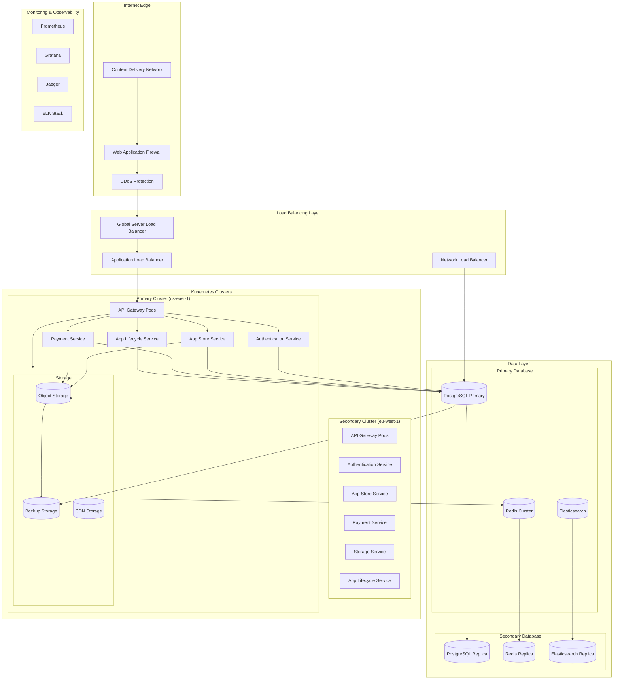

# TMCP Deployment Architecture and Infrastructure Design

## 1. Overview

This document outlines the deployment architecture and infrastructure requirements for TMCP (Tween Mini-App Communication Protocol) Server, covering cloud infrastructure, containerization, networking, scaling, and disaster recovery strategies.

## 2. Infrastructure Architecture



## 3. Container Strategy

### 3.1 Container Architecture

```dockerfile
# Base image for TMCP services
FROM node:18-alpine AS base
WORKDIR /app
RUN apk add --no-cache \
    dumb-init \
    curl \
    && rm -rf /var/cache/apk/*

# Development stage
FROM base AS development
COPY package*.json ./
RUN npm ci --include=dev
COPY . .
EXPOSE 3000
CMD ["dumb-init", "npm", "run", "dev"]

# Build stage
FROM base AS build
COPY package*.json ./
RUN npm ci --only=production
COPY . .
RUN npm run build

# Production stage
FROM node:18-alpine AS production
RUN addgroup -g 1001 -S nodejs && \
    adduser -S nodejs -u 1001
WORKDIR /app
COPY --from=build --chown=nodejs:nodejs /app/dist ./dist
COPY --from=build --chown=nodejs:nodejs /app/node_modules ./node_modules
COPY --from=build --chown=nodejs:nodejs /app/package.json ./package.json
USER nodejs
EXPOSE 3000
HEALTHCHECK --interval=30s --timeout=3s --start-period=5s --retries=3 \
    CMD curl -f http://localhost:3000/health || exit 1
CMD ["dumb-init", "node", "dist/index.js"]
```

### 3.2 Kubernetes Deployment Templates

```yaml
# API Gateway Deployment
apiVersion: apps/v1
kind: Deployment
metadata:
  name: api-gateway
  namespace: tmcp
  labels:
    app: api-gateway
    version: v1
spec:
  replicas: 3
  strategy:
    type: RollingUpdate
    rollingUpdate:
      maxSurge: 1
      maxUnavailable: 0
  selector:
    matchLabels:
      app: api-gateway
  template:
    metadata:
      labels:
        app: api-gateway
        version: v1
      annotations:
        prometheus.io/scrape: "true"
        prometheus.io/port: "9090"
        prometheus.io/path: "/metrics"
    spec:
      containers:
      - name: api-gateway
        image: tmcp/api-gateway:1.2.0
        ports:
        - containerPort: 3000
          name: http
        - containerPort: 9090
          name: metrics
        env:
        - name: NODE_ENV
          value: "production"
        - name: PORT
          value: "3000"
        - name: METRICS_PORT
          value: "9090"
        - name: REDIS_URL
          valueFrom:
            secretKeyRef:
              name: tmcp-secrets
              key: redis-url
        - name: DATABASE_URL
          valueFrom:
            secretKeyRef:
              name: tmcp-secrets
              key: database-url
        resources:
          requests:
            memory: "256Mi"
            cpu: "250m"
          limits:
            memory: "512Mi"
            cpu: "500m"
        livenessProbe:
          httpGet:
            path: /health
            port: 3000
          initialDelaySeconds: 30
          periodSeconds: 10
        readinessProbe:
          httpGet:
            path: /ready
            port: 3000
          initialDelaySeconds: 5
          periodSeconds: 5
        securityContext:
          runAsNonRoot: true
          runAsUser: 1001
          allowPrivilegeEscalation: false
          readOnlyRootFilesystem: true
          capabilities:
            drop:
            - ALL
      securityContext:
        fsGroup: 1001
      imagePullSecrets:
      - name: tmcp-registry-secret
      nodeSelector:
        node-type: application
      tolerations:
      - key: "application"
        operator: "Equal"
        value: "true"
        effect: "NoSchedule"
```

### 3.3 Service Configuration

```yaml
# API Gateway Service
apiVersion: v1
kind: Service
metadata:
  name: api-gateway
  namespace: tmcp
  labels:
    app: api-gateway
  annotations:
    prometheus.io/scrape: "true"
    service.beta.kubernetes.io/aws-load-balancer-type: "nlb"
    service.beta.kubernetes.io/aws-load-balancer-ssl-cert: "arn:aws:acm:us-east-1:123456789012:certificate/12345678-1234-1234-1234-123456789012"
    service.beta.kubernetes.io/aws-load-balancer-backend-protocol: "http"
spec:
  type: LoadBalancer
  selector:
    app: api-gateway
  ports:
  - name: http
    port: 80
    targetPort: 3000
    protocol: TCP
  - name: https
    port: 443
    targetPort: 3000
    protocol: TCP
  - name: metrics
    port: 9090
    targetPort: 9090
    protocol: TCP
```

## 4. Infrastructure as Code

### 4.1 Terraform Configuration

```hcl
# Provider configuration
provider "aws" {
  region = var.aws_region
  version = "~> 4.0"
}

provider "kubernetes" {
  host                   = module.eks.cluster_endpoint
  cluster_ca_certificate = base64decode(module.eks.cluster_certificate_authority_data)
  token                  = data.aws_eks_cluster_auth.tokendata.token
}

# VPC configuration
module "vpc" {
  source = "terraform-aws-modules/vpc/aws"
  version = "3.14.0"
  
  name = "tmcp-vpc"
  cidr = "10.0.0.0/16"
  
  azs             = ["us-east-1a", "us-east-1b", "us-east-1c"]
  private_subnets = ["10.0.1.0/24", "10.0.2.0/24", "10.0.3.0/24"]
  public_subnets  = ["10.0.101.0/24", "10.0.102.0/24", "10.0.103.0/24"]
  
  enable_nat_gateway = true
  enable_vpn_gateway = true
  enable_dns_hostnames = true
  enable_dns_support = true
  
  tags = {
    Name = "tmcp-vpc"
    Environment = var.environment
  }
}

# EKS Cluster
module "eks" {
  source = "terraform-aws-modules/eks/aws"
  version = "18.0.0"
  
  cluster_name    = "tmcp-${var.environment}"
  cluster_version = "1.24"
  
  vpc_id = module.vpc.vpc_id
  subnet_ids = module.vpc.private_subnets
  
  cluster_endpoint_private_access = true
  cluster_endpoint_public_access  = true
  
  node_groups = {
    application_nodes = {
      desired_capacity = 3
      max_capacity     = 10
      min_capacity     = 2
      
      instance_types = ["t3.large", "t3.xlarge"]
      k8s_labels = {
        node-type = "application"
      }
      additional_tags = {
        NodeGroupType = "application"
      }
    }
    
    database_nodes = {
      desired_capacity = 2
      max_capacity     = 4
      min_capacity     = 1
      
      instance_types = ["r5.large", "r5.xlarge"]
      k8s_labels = {
        node-type = "database"
      }
      taints = {
        dedicated = {
          key    = "database"
          value  = "true"
          effect = "NO_SCHEDULE"
        }
      }
      additional_tags = {
        NodeGroupType = "database"
      }
    }
  }
  
  tags = {
    Environment = var.environment
    Project = "tmcp"
  }
}

# RDS PostgreSQL
resource "aws_db_instance" "tmcp_postgres" {
  identifier = "tmcp-postgres-${var.environment}"
  
  engine         = "postgres"
  engine_version = "14.6"
  instance_class = "db.r5.large"
  
  allocated_storage     = 100
  max_allocated_storage = 1000
  storage_type          = "gp2"
  storage_encrypted     = true
  
  db_name  = "tmcp"
  username = var.db_username
  password = var.db_password
  
  vpc_security_group_ids = [aws_security_group.rds.id]
  db_subnet_group_name   = aws_db_subnet_group.tmcp.name
  
  backup_retention_period = 7
  backup_window          = "03:00-04:00"
  maintenance_window     = "sun:04:00-sun:05:00"
  
  skip_final_snapshot = false
  final_snapshot_identifier = "tmcp-postgres-final-${var.environment}"
  
  tags = {
    Name = "tmcp-postgres-${var.environment}"
    Environment = var.environment
  }
}

# ElastiCache Redis
resource "aws_elasticache_subnet_group" "tmcp" {
  name       = "tmcp-cache-subnet-${var.environment}"
  subnet_ids = module.vpc.private_subnets
}

resource "aws_elasticache_cluster" "tmcp_redis" {
  cluster_id           = "tmcp-redis-${var.environment}"
  engine               = "redis"
  node_type            = "cache.r5.large"
  num_cache_nodes      = 3
  parameter_group_name = "default.redis6.x"
  port                 = 6379
  subnet_group_name    = aws_elasticache_subnet_group.tmcp.name
  security_group_ids  = [aws_security_group.redis.id]
  
  at_rest_encryption_enabled = true
  transit_encryption_enabled = true
  auth_token                 = var.redis_auth_token
  
  tags = {
    Name = "tmcp-redis-${var.environment}"
    Environment = var.environment
  }
}
```

### 4.2 Helm Charts

```yaml
# Chart.yaml
apiVersion: v2
name: tmcp
description: TMCP Server Helm Chart
type: application
version: 1.2.0
appVersion: "1.2.0"

dependencies:
  - name: postgresql
    version: 11.9.13
    repository: https://charts.bitnami.com/bitnami
    condition: postgresql.enabled
  - name: redis
    version: 16.13.2
    repository: https://charts.bitnami.com/bitnami
    condition: redis.enabled
```

```yaml
# values.yaml
global:
  imageRegistry: registry.tween.com
  imagePullSecrets:
    - name: tmcp-registry-secret
  
  storageClass: "gp2"

apiGateway:
  replicaCount: 3
  image:
    repository: tmcp/api-gateway
    tag: "1.2.0"
    pullPolicy: IfNotPresent
  
  service:
    type: LoadBalancer
    port: 80
    targetPort: 3000
    annotations:
      service.beta.kubernetes.io/aws-load-balancer-type: "nlb"
  
  resources:
    requests:
      memory: "256Mi"
      cpu: "250m"
    limits:
      memory: "512Mi"
      cpu: "500m"
  
  autoscaling:
    enabled: true
    minReplicas: 3
    maxReplicas: 10
    targetCPUUtilizationPercentage: 70
    targetMemoryUtilizationPercentage: 80

authentication:
  replicaCount: 2
  image:
    repository: tmcp/authentication-service
    tag: "1.2.0"
  
  resources:
    requests:
      memory: "512Mi"
      cpu: "500m"
    limits:
      memory: "1Gi"
      cpu: "1000m"

postgresql:
  enabled: true
  auth:
    postgresPassword: "secure-password"
    database: "tmcp"
  
  primary:
    persistence:
      enabled: true
      size: 100Gi
      storageClass: "gp2"
  
  readReplicas:
    replicaCount: 2
    persistence:
      enabled: true
      size: 100Gi
      storageClass: "gp2"

redis:
  enabled: true
  auth:
    enabled: true
    password: "redis-password"
  
  master:
    persistence:
      enabled: true
      size: 20Gi
      storageClass: "gp2"
  
  replica:
    replicaCount: 2
    persistence:
      enabled: true
      size: 20Gi
      storageClass: "gp2"
```

## 5. Networking and Security

### 5.1 Network Security

```yaml
# Network Policy for API Gateway
apiVersion: networking.k8s.io/v1
kind: NetworkPolicy
metadata:
  name: api-gateway-netpol
  namespace: tmcp
spec:
  podSelector:
    matchLabels:
      app: api-gateway
  policyTypes:
  - Ingress
  - Egress
  ingress:
  - from:
    - namespaceSelector:
        matchLabels:
          name: ingress-nginx
    ports:
    - protocol: TCP
      port: 3000
  - from:
    - namespaceSelector:
        matchLabels:
          name: monitoring
    ports:
    - protocol: TCP
      port: 9090
  egress:
  - to:
    - podSelector:
        matchLabels:
          app: authentication-service
    ports:
    - protocol: TCP
      port: 3000
  - to:
    - podSelector:
        matchLabels:
          app: app-store-service
    ports:
    - protocol: TCP
      port: 3000
  - to:
    - podSelector:
        matchLabels:
          app: payment-service
    ports:
    - protocol: TCP
      port: 3000
  - to:
    - podSelector:
        matchLabels:
          app: storage-service
    ports:
    - protocol: TCP
      port: 3000
```

### 5.2 Security Groups

```hcl
# Security Group for Application Load Balancer
resource "aws_security_group" "alb" {
  name_prefix = "tmcp-alb-"
  vpc_id      = module.vpc.vpc_id
  
  ingress {
    description = "HTTP"
    from_port   = 80
    to_port     = 80
    protocol    = "tcp"
    cidr_blocks = ["0.0.0.0/0"]
  }
  
  ingress {
    description = "HTTPS"
    from_port   = 443
    to_port     = 443
    protocol    = "tcp"
    cidr_blocks = ["0.0.0.0/0"]
  }
  
  egress {
    from_port   = 0
    to_port     = 0
    protocol    = "-1"
    cidr_blocks = ["0.0.0.0/0"]
  }
  
  tags = {
    Name = "tmcp-alb-sg"
    Environment = var.environment
  }
}

# Security Group for RDS
resource "aws_security_group" "rds" {
  name_prefix = "tmcp-rds-"
  vpc_id      = module.vpc.vpc_id
  
  ingress {
    description     = "PostgreSQL from application nodes"
    from_port       = 5432
    to_port         = 5432
    protocol        = "tcp"
    security_groups = [aws_security_group.application.id]
  }
  
  egress {
    from_port   = 0
    to_port     = 0
    protocol    = "-1"
    cidr_blocks = ["0.0.0.0/0"]
  }
  
  tags = {
    Name = "tmcp-rds-sg"
    Environment = var.environment
  }
}

# Security Group for Application Nodes
resource "aws_security_group" "application" {
  name_prefix = "tmcp-app-"
  vpc_id      = module.vpc.vpc_id
  
  ingress {
    description     = "From ALB"
    from_port       = 3000
    to_port         = 3000
    protocol        = "tcp"
    security_groups = [aws_security_group.alb.id]
  }
  
  ingress {
    description = "Metrics from monitoring"
    from_port   = 9090
    to_port     = 9090
    protocol    = "tcp"
    cidr_blocks = ["10.0.0.0/16"]
  }
  
  egress {
    from_port   = 0
    to_port     = 0
    protocol    = "-1"
    cidr_blocks = ["0.0.0.0/0"]
  }
  
  tags = {
    Name = "tmcp-app-sg"
    Environment = var.environment
  }
}
```

## 6. Scaling and Auto-scaling

### 6.1 Horizontal Pod Autoscaler

```yaml
apiVersion: autoscaling/v2
kind: HorizontalPodAutoscaler
metadata:
  name: api-gateway-hpa
  namespace: tmcp
spec:
  scaleTargetRef:
    apiVersion: apps/v1
    kind: Deployment
    name: api-gateway
  minReplicas: 3
  maxReplicas: 20
  metrics:
  - type: Resource
    resource:
      name: cpu
      target:
        type: Utilization
        averageUtilization: 70
  - type: Resource
    resource:
      name: memory
      target:
        type: Utilization
        averageUtilization: 80
  - type: Pods
    pods:
      metric:
        name: http_requests_per_second
      target:
        type: AverageValue
        averageValue: "100"
  behavior:
    scaleDown:
      stabilizationWindowSeconds: 300
      policies:
      - type: Percent
        value: 10
        periodSeconds: 60
    scaleUp:
      stabilizationWindowSeconds: 0
      policies:
      - type: Percent
        value: 100
        periodSeconds: 15
      - type: Pods
        value: 4
        periodSeconds: 15
      selectPolicy: Max
```

### 6.2 Cluster Autoscaler

```yaml
apiVersion: apps/v1
kind: Deployment
metadata:
  name: cluster-autoscaler
  namespace: kube-system
spec:
  replicas: 1
  selector:
    matchLabels:
      app: cluster-autoscaler
  template:
    metadata:
      labels:
        app: cluster-autoscaler
    spec:
      containers:
      - image: k8s.gcr.io/autoscaling/cluster-autoscaler:v1.21.0
        name: cluster-autoscaler
        resources:
          limits:
            cpu: 100m
            memory: 300Mi
          requests:
            cpu: 100m
            memory: 300Mi
        command:
        - ./cluster-autoscaler
        - --v=4
        - --stderrthreshold=info
        - --cloud-provider=aws
        - --skip-nodes-with-local-storage=false
        - --expander=least-waste
        - --node-group-auto-discovery=asg:tag=k8s.io/cluster-autoscaler/enabled,k8s.io/cluster-autoscaler/tmcp
        - --balance-similar-node-groups
        - --skip-nodes-with-system-pods=false
```

## 7. Disaster Recovery and Backup

### 7.1 Backup Strategy

```yaml
# CronJob for Database Backups
apiVersion: batch/v1
kind: CronJob
metadata:
  name: postgres-backup
  namespace: tmcp
spec:
  schedule: "0 2 * * *"  # Daily at 2 AM
  jobTemplate:
    spec:
      template:
        spec:
          containers:
          - name: postgres-backup
            image: postgres:14
            command:
            - /bin/bash
            - -c
            - |
              BACKUP_FILE="tmcp-backup-$(date +%Y%m%d_%H%M%S).sql"
              pg_dump $DATABASE_URL > /backup/$BACKUP_FILE
              gzip /backup/$BACKUP_FILE
              aws s3 cp /backup/$BACKUP_FILE.gz s3://tmcp-backups/database/
              rm /backup/$BACKUP_FILE.gz
            env:
            - name: DATABASE_URL
              valueFrom:
                secretKeyRef:
                  name: tmcp-secrets
                  key: database-url
            - name: AWS_ACCESS_KEY_ID
              valueFrom:
                secretKeyRef:
                  name: aws-credentials
                  key: access-key-id
            - name: AWS_SECRET_ACCESS_KEY
              valueFrom:
                secretKeyRef:
                  name: aws-credentials
                  key: secret-access-key
            volumeMounts:
            - name: backup-storage
              mountPath: /backup
          volumes:
          - name: backup-storage
            emptyDir: {}
          restartPolicy: OnFailure
```

### 7.2 Multi-Region Disaster Recovery

```hcl
# Cross-region replication for S3
resource "aws_s3_bucket" "primary" {
  bucket = "tmcp-primary-${var.environment}"
  
  versioning {
    enabled = true
  }
  
  server_side_encryption_configuration {
    rule {
      apply_server_side_encryption_by_default {
        sse_algorithm = "AES256"
      }
    }
  }
  
  replication_configuration {
    role = aws_iam_role.replication.arn
    
    rules {
      id     = "backup"
      status = "Enabled"
      
      destination {
        bucket        = aws_s3_bucket.backup.id
        storage_class = "STANDARD_IA"
      }
    }
  }
  
  tags = {
    Name = "tmcp-primary-${var.environment}"
    Environment = var.environment
  }
}

resource "aws_s3_bucket" "backup" {
  bucket = "tmcp-backup-${var.environment}"
  provider = aws.backup_region
  
  versioning {
    enabled = true
  }
  
  server_side_encryption_configuration {
    rule {
      apply_server_side_encryption_by_default {
        sse_algorithm = "AES256"
      }
    }
  }
  
  tags = {
    Name = "tmcp-backup-${var.environment}"
    Environment = var.environment
  }
}

# RDS Cross-Region Read Replica
resource "aws_db_instance" "backup_replica" {
  provider = aws.backup_region
  
  identifier = "tmcp-postgres-backup-${var.environment}"
  
  replicate_source_db = aws_db_instance.tmcp_postgres.identifier
  instance_class      = "db.r5.large"
  
  skip_final_snapshot = true
  
  tags = {
    Name = "tmcp-postgres-backup-${var.environment}"
    Environment = var.environment
  }
}
```

## 8. CI/CD Pipeline

### 8.1 GitHub Actions Workflow

```yaml
name: TMCP CI/CD Pipeline

on:
  push:
    branches: [main, develop]
  pull_request:
    branches: [main]

env:
  REGISTRY: registry.tween.com
  IMAGE_NAME: tmcp

jobs:
  test:
    runs-on: ubuntu-latest
    steps:
    - uses: actions/checkout@v3
    
    - name: Setup Node.js
      uses: actions/setup-node@v3
      with:
        node-version: '18'
        cache: 'npm'
    
    - name: Install dependencies
      run: npm ci
    
    - name: Run tests
      run: npm test
    
    - name: Run security audit
      run: npm audit --audit-level high
    
    - name: Run linting
      run: npm run lint
    
    - name: Upload coverage reports
      uses: codecov/codecov-action@v3
      with:
        file: ./coverage/lcov.info

  build-and-push:
    needs: test
    runs-on: ubuntu-latest
    if: github.ref == 'refs/heads/main'
    
    steps:
    - uses: actions/checkout@v3
    
    - name: Log in to Container Registry
      uses: docker/login-action@v2
      with:
        registry: ${{ env.REGISTRY }}
        username: ${{ secrets.REGISTRY_USERNAME }}
        password: ${{ secrets.REGISTRY_PASSWORD }}
    
    - name: Extract metadata
      id: meta
      uses: docker/metadata-action@v4
      with:
        images: ${{ env.REGISTRY }}/${{ env.IMAGE_NAME }}
        tags: |
          type=ref,event=branch
          type=ref,event=pr
          type=sha,prefix={{branch}}-
    
    - name: Build and push Docker image
      uses: docker/build-push-action@v4
      with:
        context: .
        push: true
        tags: ${{ steps.meta.outputs.tags }}
        labels: ${{ steps.meta.outputs.labels }}

  deploy:
    needs: build-and-push
    runs-on: ubuntu-latest
    if: github.ref == 'refs/heads/main'
    
    steps:
    - uses: actions/checkout@v3
    
    - name: Setup kubectl
      uses: azure/setup-kubectl@v3
      with:
        version: 'v1.24.0'
    
    - name: Configure kubectl
      run: |
        echo "${{ secrets.KUBE_CONFIG }}" | base64 -d > kubeconfig
        export KUBECONFIG=kubeconfig
    
    - name: Deploy to Kubernetes
      run: |
        helm upgrade --install tmcp ./helm/tmcp \
          --namespace tmcp \
          --create-namespace \
          --set image.tag=${{ github.sha }} \
          --values ./helm/tmcp/values-production.yaml
```

## 9. Infrastructure Monitoring

### 9.1 Infrastructure Metrics

```yaml
# Prometheus configuration for infrastructure monitoring
global:
  scrape_interval: 15s
  evaluation_interval: 15s

rule_files:
  - "infrastructure_rules.yml"

scrape_configs:
  - job_name: 'kubernetes-apiservers'
    kubernetes_sd_configs:
    - role: endpoints
    scheme: https
    tls_config:
      ca_file: /var/run/secrets/kubernetes.io/serviceaccount/ca.crt
    bearer_token_file: /var/run/secrets/kubernetes.io/serviceaccount/token
    relabel_configs:
    - source_labels: [__meta_kubernetes_namespace, __meta_kubernetes_service_name, __meta_kubernetes_endpoint_port_name]
      action: keep
      regex: default;kubernetes;https

  - job_name: 'kubernetes-nodes'
    kubernetes_sd_configs:
    - role: node
    relabel_configs:
    - action: labelmap
      regex: __meta_kubernetes_node_label_(.+)

  - job_name: 'kubernetes-pods'
    kubernetes_sd_configs:
    - role: pod
    relabel_configs:
    - source_labels: [__meta_kubernetes_pod_annotation_prometheus_io_scrape]
      action: keep
      regex: true
    - source_labels: [__meta_kubernetes_pod_annotation_prometheus_io_path]
      action: replace
      target_label: __metrics_path__
      regex: (.+)
    - source_labels: [__address__, __meta_kubernetes_pod_annotation_prometheus_io_port]
      action: replace
      regex: ([^:]+)(?::\d+)?;(\d+)
      replacement: $1:$2
      target_label: __address__
    - action: labelmap
      regex: __meta_kubernetes_pod_label_(.+)
    - source_labels: [__meta_kubernetes_namespace]
      action: replace
      target_label: kubernetes_namespace
    - source_labels: [__meta_kubernetes_pod_name]
      action: replace
      target_label: kubernetes_pod_name
```

This comprehensive deployment architecture provides a scalable, secure, and resilient infrastructure for the TMCP server, supporting high availability, disaster recovery, and efficient operations.