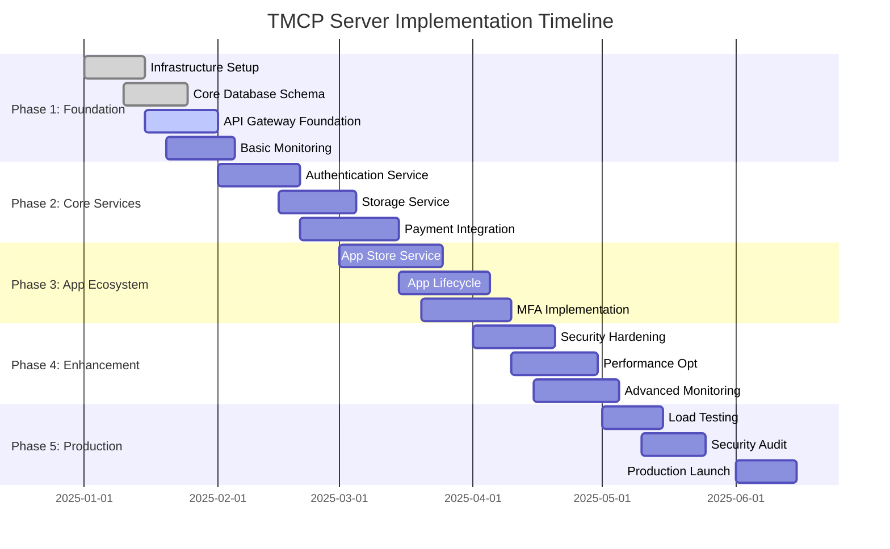

# TMCP Server Development Roadmap

## 1. Overview

This roadmap outlines the implementation phases for the TMCP (Tween Mini-App Communication Protocol) Server, providing a structured approach to building a scalable, secure, and compliant system that meets all protocol requirements.

## 2. Implementation Phases

## 3. Phase 1: Foundation (Weeks 1-4)

### 3.1 Infrastructure Setup (Week 1)

**Objectives:**
- Establish cloud infrastructure
- Set up development environments
- Implement CI/CD pipeline
- Configure basic security

**Tasks:**
- [ ] Set up AWS VPC and networking
- [ ] Configure Kubernetes clusters (dev/staging/prod)
- [ ] Set up container registry
- [ ] Implement Terraform infrastructure as code
- [ ] Configure GitHub Actions CI/CD
- [ ] Set up basic monitoring stack

**Deliverables:**
- Functional development environment
- CI/CD pipeline
- Infrastructure documentation
- Security baseline

### 3.2 Core Database Schema (Weeks 1-2)

**Objectives:**
- Implement database schema
- Set up database replication
- Create migration system
- Implement backup strategy

**Tasks:**
- [ ] Create PostgreSQL databases
- [ ] Implement core tables (users, apps, transactions)
- [ ] Set up Redis clusters
- [ ] Configure database backups
- [ ] Implement migration scripts
- [ ] Set up read replicas

**Deliverables:**
- Database schema v1.0
- Migration system
- Backup and recovery procedures

### 3.3 API Gateway Foundation (Weeks 2-4)

**Objectives:**
- Implement basic API gateway
- Set up routing and load balancing
- Implement rate limiting
- Add basic security

**Tasks:**
- [ ] Implement API gateway service
- [ ] Set up request routing
- [ ] Implement basic rate limiting
- [ ] Add authentication middleware
- [ ] Configure SSL/TLS
- [ ] Set up health checks

**Deliverables:**
- Functional API gateway
- Rate limiting implementation
- Security middleware
- Health monitoring

### 3.4 Basic Monitoring (Weeks 3-4)

**Objectives:**
- Set up monitoring infrastructure
- Implement logging system
- Create basic dashboards
- Set up alerting

**Tasks:**
- [ ] Deploy Prometheus and Grafana
- [ ] Set up ELK stack for logging
- [ ] Create basic dashboards
- [ ] Configure alerting rules
- [ ] Implement structured logging
- [ ] Set up error tracking

**Deliverables:**
- Monitoring infrastructure
- Logging system
- Basic dashboards
- Alerting configuration

## 4. Phase 2: Core Services (Weeks 5-8)

### 4.1 Authentication Service (Weeks 5-6)

**Objectives:**
- Implement OAuth 2.0 with PKCE
- Set up user management
- Implement basic MFA
- Integrate with Keycloak

**Tasks:**
- [ ] Implement OAuth 2.0 flows
- [ ] Set up user registration/login
- [ ] Implement JWT token management
- [ ] Configure Keycloak integration
- [ ] Implement basic MFA (PIN)
- [ ] Add session management

**Deliverables:**
- OAuth 2.0 compliant service
- User management system
- Basic MFA implementation
- Keycloak integration

### 4.2 Storage Service (Weeks 6-7)

**Objectives:**
- Implement key-value storage
- Set up quota management
- Add offline sync support
- Implement conflict resolution

**Tasks:**
- [ ] Implement storage API
- [ ] Set up Redis for storage
- [ ] Implement quota management
- [ ] Add batch operations
- [ ] Implement offline sync
- [ ] Add conflict resolution

**Deliverables:**
- Storage service v1.0
- Quota management system
- Offline sync capabilities
- Conflict resolution

### 4.3 Payment Integration (Weeks 7-8)

**Objectives:**
- Integrate with TweenPay API
- Implement payment state machine
- Add MFA for payments
- Set up transaction logging

**Tasks:**
- [ ] Integrate TweenPay API client
- [ ] Implement payment state machine
- [ ] Add MFA for high-value payments
- [ ] Set up transaction logging
- [ ] Implement refund handling
- [ ] Add payment status tracking

**Deliverables:**
- TweenPay API integration
- Payment state machine
- MFA for payments
- Transaction management

## 5. Phase 3: App Ecosystem (Weeks 9-12)

### 5.1 App Store Service (Weeks 9-10)

**Objectives:**
- Implement app discovery
- Set up app installation
- Add ranking algorithm
- Implement app categories

**Tasks:**
- [ ] Implement app discovery API
- [ ] Set up app installation process
- [ ] Implement ranking algorithm
- [ ] Add app categories
- [ ] Set up search functionality
- [ ] Implement app reviews

**Deliverables:**
- App store service v1.0
- App discovery system
- Ranking algorithm
- Review system

### 5.2 App Lifecycle Service (Weeks 10-11)

**Objectives:**
- Implement app lifecycle management
- Set up Matrix events
- Add preinstallation support
- Implement update management

**Tasks:**
- [ ] Implement lifecycle events
- [ ] Set up Matrix event publishing
- [ ] Add preinstallation manifest
- [ ] Implement update management
- [ ] Add app verification
- [ ] Set up app sandboxing

**Deliverables:**
- App lifecycle management
- Matrix event system
- Preinstallation support
- Update management

### 5.3 MFA Implementation (Weeks 11-12)

**Objectives:**
- Complete MFA implementation
- Add biometric support
- Implement TOTP
- Set up device registration

**Tasks:**
- [ ] Complete MFA challenge system
- [ ] Add biometric authentication
- [ ] Implement TOTP support
- [ ] Set up device registration
- [ ] Add MFA recovery options
- [ ] Implement MFA policies

**Deliverables:**
- Complete MFA system
- Biometric authentication
- TOTP support
- Device management

## 6. Phase 4: Enhancement (Weeks 13-16)

### 6.1 Security Hardening (Weeks 13-14)

**Objectives:**
- Implement advanced security measures
- Add input validation
- Set up audit logging
- Perform security testing

**Tasks:**
- [ ] Implement input validation framework
- [ ] Add SQL injection protection
- [ ] Set up audit logging
- [ ] Implement rate limiting enhancements
- [ ] Add security headers
- [ ] Perform security testing

**Deliverables:**
- Enhanced security measures
- Input validation system
- Audit logging
- Security test results

### 6.2 Performance Optimization (Weeks 14-15)

**Objectives:**
- Optimize database queries
- Implement caching strategies
- Add performance monitoring
- Optimize API responses

**Tasks:**
- [ ] Optimize database queries
- [ ] Implement caching layers
- [ ] Add performance monitoring
- [ ] Optimize API responses
- [ ] Implement connection pooling
- [ ] Add CDN integration

**Deliverables:**
- Performance optimizations
- Caching system
- Performance monitoring
- CDN integration

### 6.3 Advanced Monitoring (Weeks 15-16)

**Objectives:**
- Implement distributed tracing
- Add business metrics
- Set up synthetic monitoring
- Enhance alerting

**Tasks:**
- [ ] Implement distributed tracing
- [ ] Add business metrics
- [ ] Set up synthetic monitoring
- [ ] Enhance alerting system
- [ ] Add anomaly detection
- [ ] Create advanced dashboards

**Deliverables:**
- Distributed tracing system
- Business metrics
- Synthetic monitoring
- Enhanced alerting

## 7. Phase 5: Production (Weeks 17-20)

### 7.1 Load Testing (Weeks 17-18)

**Objectives:**
- Perform load testing
- Identify performance bottlenecks
- Optimize for scale
- Validate auto-scaling

**Tasks:**
- [ ] Design load testing scenarios
- [ ] Perform load testing
- [ ] Identify bottlenecks
- [ ] Optimize performance
- [ ] Validate auto-scaling
- [ ] Document performance limits

**Deliverables:**
- Load testing results
- Performance optimizations
- Auto-scaling validation
- Performance documentation

### 7.2 Security Audit (Weeks 18-19)

**Objectives:**
- Conduct security audit
- Perform penetration testing
- Review compliance
- Address security issues

**Tasks:**
- [ ] Conduct security audit
- [ ] Perform penetration testing
- [ ] Review compliance requirements
- [ ] Address security issues
- [ ] Implement security fixes
- [ ] Document security measures

**Deliverables:**
- Security audit report
- Penetration testing results
- Compliance documentation
- Security fixes

### 7.3 Production Launch (Weeks 19-20)

**Objectives:**
- Prepare for production launch
- Deploy to production
- Monitor performance
- Provide support

**Tasks:**
- [ ] Prepare production deployment
- [ ] Deploy to production
- [ ] Monitor performance
- [ ] Set up production support
- [ ] Document procedures
- [ ] Plan post-launch improvements

**Deliverables:**
- Production deployment
- Performance monitoring
- Support procedures
- Documentation

## 8. Risk Management

### 8.1 Technical Risks

| Risk | Probability | Impact | Mitigation |
|-------|-------------|---------|------------|
| Database performance issues | Medium | High | Implement caching, optimize queries, set up read replicas |
| Security vulnerabilities | Low | High | Regular security audits, penetration testing, code reviews |
| Third-party API failures | Medium | Medium | Implement fallback mechanisms, monitoring, retry logic |
| Scaling challenges | Medium | Medium | Auto-scaling, performance testing, capacity planning |
| Integration issues | High | Medium | Comprehensive testing, API versioning, documentation |

### 8.2 Project Risks

| Risk | Probability | Impact | Mitigation |
|-------|-------------|---------|------------|
| Timeline delays | Medium | Medium | Regular progress reviews, flexible scheduling, buffer time |
| Resource constraints | Low | High | Resource planning, cross-training, contractor support |
| Requirements changes | High | Medium | Agile methodology, change management, stakeholder communication |
| Team turnover | Low | Medium | Documentation, knowledge sharing, succession planning |

## 9. Success Metrics

### 9.1 Technical Metrics

- **Performance**: < 100ms response time for 95% of requests
- **Availability**: 99.9% uptime
- **Scalability**: Handle 10,000 concurrent users
- **Security**: Zero critical vulnerabilities
- **Reliability**: < 0.1% error rate

### 9.2 Business Metrics

- **User Adoption**: 1,000+ active users within 3 months
- **App Ecosystem**: 50+ mini-apps within 6 months
- **Transaction Volume**: 10,000+ transactions per day
- **Developer Engagement**: 100+ registered developers
- **Customer Satisfaction**: 4.5+ star rating

## 10. Resource Requirements

### 10.1 Team Structure

- **Backend Developers**: 4-6 engineers
- **DevOps Engineers**: 2-3 engineers
- **Security Engineers**: 1-2 engineers
- **QA Engineers**: 2-3 engineers
- **Product Managers**: 1-2 managers
- **UI/UX Designers**: 1-2 designers

### 10.2 Infrastructure Costs

- **Development Environment**: $2,000/month
- **Staging Environment**: $3,000/month
- **Production Environment**: $10,000/month
- **Monitoring & Tools**: $1,000/month
- **Third-party Services**: $2,000/month

## 11. Post-Launch Roadmap

### 11.1 Phase 6: Optimization (Months 7-9)

- Performance tuning
- Feature enhancements
- User feedback integration
- A/B testing framework

### 11.2 Phase 7: Expansion (Months 10-12)

- Multi-region deployment
- Advanced analytics
- AI-powered recommendations
- Enhanced developer tools

### 11.3 Phase 8: Innovation (Months 13+)

- Machine learning integration
- Advanced security features
- New protocol features
- Ecosystem expansion

This roadmap provides a structured approach to implementing the TMCP server while ensuring compliance with the protocol requirements and delivering a high-quality, scalable system.