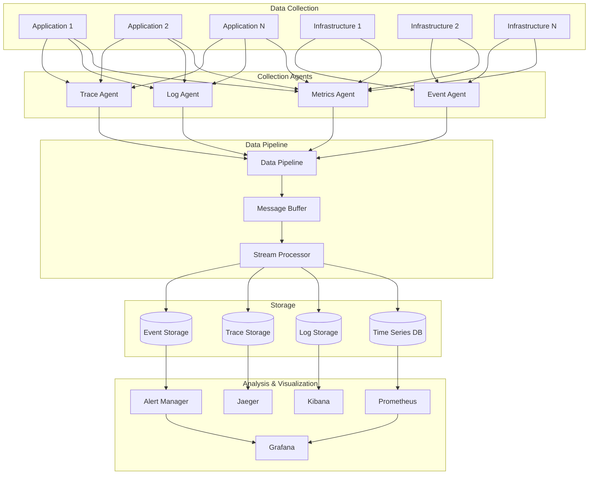

# TMCP Monitoring, Logging, and Observability Design

## 1. Overview

This document outlines the comprehensive monitoring, logging, and observability strategy for the TMCP (Tween Mini-App Communication Protocol) Server, providing visibility into system performance, health, and user experience across all components.

## 2. Observability Architecture



## 3. Metrics Collection

### 3.1 Application Metrics

```javascript
class MetricsCollector {
  constructor(registry) {
    this.registry = registry;
    this.setupMetrics();
  }
  
  setupMetrics() {
    // Request metrics
    this.requestCounter = new this.registry.Counter({
      name: 'http_requests_total',
      help: 'Total number of HTTP requests',
      labelNames: ['method', 'endpoint', 'status_code', 'app_id']
    });
    
    this.requestDuration = new this.registry.Histogram({
      name: 'http_request_duration_seconds',
      help: 'HTTP request duration in seconds',
      labelNames: ['method', 'endpoint', 'app_id'],
      buckets: [0.001, 0.005, 0.01, 0.05, 0.1, 0.5, 1, 5]
    });
    
    // Authentication metrics
    this.authCounter = new this.registry.Counter({
      name: 'authentication_attempts_total',
      help: 'Total authentication attempts',
      labelNames: ['result', 'method', 'mfa_used']
    });
    
    // Payment metrics
    this.paymentCounter = new this.registry.Counter({
      name: 'payment_transactions_total',
      help: 'Total payment transactions',
      labelNames: ['status', 'payment_method', 'currency']
    });
    
    this.paymentAmount = new this.registry.Histogram({
      name: 'payment_amount_dollars',
      help: 'Payment amount in dollars',
      labelNames: ['payment_method', 'currency'],
      buckets: [1, 5, 10, 25, 50, 100, 250, 500, 1000]
    });
    
    // Storage metrics
    this.storageOperations = new this.registry.Counter({
      name: 'storage_operations_total',
      help: 'Total storage operations',
      labelNames: ['operation', 'result', 'app_id']
    });
    
    this.storageSize = new this.registry.Gauge({
      name: 'storage_used_bytes',
      help: 'Storage used in bytes',
      labelNames: ['user_id', 'app_id']
    });
    
    // App store metrics
    this.appDownloads = new this.registry.Counter({
      name: 'app_downloads_total',
      help: 'Total app downloads',
      labelNames: ['app_id', 'category', 'classification']
    });
    
    this.appReviews = new this.registry.Counter({
      name: 'app_reviews_total',
      help: 'Total app reviews',
      labelNames: ['app_id', 'rating']
    });
  }
  
  recordRequest(method, endpoint, statusCode, duration, appId) {
    this.requestCounter
      .labels(method, endpoint, statusCode.toString(), appId)
      .inc();
    this.requestDuration
      .labels(method, endpoint, appId)
      .observe(duration);
  }
  
  recordAuthentication(result, method, mfaUsed) {
    this.authCounter
      .labels(result, method, mfaUsed.toString())
      .inc();
  }
  
  recordPayment(status, paymentMethod, currency, amount) {
    this.paymentCounter
      .labels(status, paymentMethod, currency)
      .inc();
    this.paymentAmount
      .labels(paymentMethod, currency)
      .observe(amount);
  }
}
```

### 3.2 Infrastructure Metrics

```yaml
# Node Exporter configuration
node_exporter:
  enabled: true
  collectors:
    - cpu
    - diskstats
    - filesystem
    - meminfo
    - netdev
    - netstat
    - systemd
    - time
    - vmstat
  
  custom_metrics:
    - name: app_container_cpu_usage
      type: gauge
      help: CPU usage by application container
      labels: [container_name, app_id]
    
    - name: app_container_memory_usage
      type: gauge
      help: Memory usage by application container
      labels: [container_name, app_id]
    
    - name: database_connections_active
      type: gauge
      help: Active database connections
      labels: [database, service]
    
    - name: cache_hit_ratio
      type: gauge
      help: Cache hit ratio
      labels: [cache_type, service]
```

### 3.3 Business Metrics

```javascript
class BusinessMetricsCollector {
  constructor(metricsCollector) {
    this.metrics = metricsCollector;
    this.setupBusinessMetrics();
  }
  
  setupBusinessMetrics() {
    // User engagement metrics
    this.activeUsers = new this.metrics.registry.Gauge({
      name: 'active_users_total',
      help: 'Number of active users',
      labelNames: ['period', 'app_id']
    });
    
    this.userRetention = new this.metrics.registry.Gauge({
      name: 'user_retention_rate',
      help: 'User retention rate',
      labelNames: ['period', 'cohort']
    });
    
    // Revenue metrics
    this.revenue = new this.metrics.registry.Counter({
      name: 'revenue_total',
      help: 'Total revenue',
      labelNames: ['currency', 'payment_method', 'app_id']
    });
    
    this.averageRevenuePerUser = new this.metrics.registry.Gauge({
      name: 'average_revenue_per_user',
      help: 'Average revenue per user',
      labelNames: ['period', 'currency']
    });
    
    // App ecosystem metrics
    this.appCount = new this.metrics.registry.Gauge({
      name: 'apps_total',
      help: 'Total number of apps',
      labelNames: ['category', 'classification', 'status']
    });
    
    this.appUsage = new this.metrics.registry.Counter({
      name: 'app_sessions_total',
      help: 'Total app sessions',
      labelNames: ['app_id', 'user_type']
    });
  }
  
  updateActiveUsers(period, appId, count) {
    this.activeUsers
      .labels(period, appId)
      .set(count);
  }
  
  recordRevenue(currency, paymentMethod, appId, amount) {
    this.revenue
      .labels(currency, paymentMethod, appId)
      .inc(amount);
  }
}
```

## 4. Logging Strategy

### 4.1 Structured Logging

```javascript
class StructuredLogger {
  constructor(serviceName, version) {
    this.service = serviceName;
    this.version = version;
    this.logLevel = process.env.LOG_LEVEL || 'info';
  }
  
  log(level, message, context = {}) {
    if (!this.shouldLog(level)) return;
    
    const logEntry = {
      timestamp: new Date().toISOString(),
      level: level.toUpperCase(),
      service: this.service,
      version: this.version,
      message,
      context: {
        ...context,
        trace_id: context.trace_id || this.getCurrentTraceId(),
        span_id: context.span_id || this.getCurrentSpanId()
      }
    };
    
    // Add error details if available
    if (context.error) {
      logEntry.error = {
        name: context.error.name,
        message: context.error.message,
        stack: context.error.stack
      };
    }
    
    console.log(JSON.stringify(logEntry));
  }
  
  info(message, context) {
    this.log('info', message, context);
  }
  
  warn(message, context) {
    this.log('warn', message, context);
  }
  
  error(message, context) {
    this.log('error', message, context);
  }
  
  debug(message, context) {
    this.log('debug', message, context);
  }
  
  shouldLog(level) {
    const levels = { debug: 0, info: 1, warn: 2, error: 3 };
    return levels[level] >= levels[this.logLevel];
  }
  
  getCurrentTraceId() {
    // Get from current execution context (e.g., async hooks)
    return async_hooks.executionAsyncId().toString();
  }
  
  getCurrentSpanId() {
    // Get from current span context
    return getCurrentSpanId();
  }
}

// Usage examples
const logger = new StructuredLogger('payment-service', '1.2.0');

logger.info('Payment processed successfully', {
  payment_id: 'pay_123',
  user_id: 'user_456',
  amount: 99.99,
  currency: 'USD',
  payment_method: 'card',
  duration_ms: 1250
});

logger.error('Payment processing failed', {
  payment_id: 'pay_123',
  user_id: 'user_456',
  error: new Error('Insufficient funds'),
  amount: 99.99,
  currency: 'USD'
});
```

### 4.2 Log Aggregation and Processing

```yaml
# Logstash configuration
input {
  beats {
    port => 5044
  }
}

filter {
  # Parse JSON logs
  json {
    source => "message"
  }
  
  # Add environment information
  mutate {
    add_field => { "[@metadata][environment]" => "${ENVIRONMENT}" }
  }
  
  # Parse timestamp
  date {
    match => [ "timestamp", "ISO8601" ]
  }
  
  # Extract service information
  if [service] {
    mutate {
      add_field => { "[@metadata][service]" => "%{service}" }
    }
  }
  
  # Handle error logs
  if [level] == "ERROR" {
    mutate {
      add_tag => [ "error" ]
    }
  }
  
  # Extract performance metrics
  if [duration_ms] {
    mutate {
      convert => { "duration_ms" => "integer" }
    }
  }
}

output {
  elasticsearch {
    hosts => ["elasticsearch:9200"]
    index => "tmcp-logs-%{+YYYY.MM.dd}"
  }
  
  # Send error logs to alerting system
  if "error" in [tags] {
    http {
      url => "http://alertmanager:9093/api/v1/alerts"
      http_method => "post"
      format => "json"
      mapping => {
        "alerts" => [{
          "labels" => {
            "alertname" => "ApplicationError",
            "service" => "%{service}",
            "severity" => "critical"
          },
          "annotations" => {
            "summary" => "%{message}",
            "description" => "%{[error][message]}"
          }
        }]
      }
    }
  }
}
```

## 5. Distributed Tracing

### 5.1 Trace Context Propagation

```javascript
class TraceContext {
  constructor(traceId, spanId, parentSpanId = null, flags = 0) {
    this.traceId = traceId;
    this.spanId = spanId;
    this.parentSpanId = parentSpanId;
    this.flags = flags;
    this.baggage = new Map();
  }
  
  static fromString(traceString) {
    const parts = traceString.split('-');
    if (parts.length < 2) return null;
    
    return new TraceContext(
      parts[0], // traceId
      parts[1], // spanId
      parts[2] || null, // parentSpanId
      parseInt(parts[3] || '0', 16) // flags
    );
  }
  
  toString() {
    const parts = [this.traceId, this.spanId];
    if (this.parentSpanId) parts.push(this.parentSpanId);
    parts.push(this.flags.toString(16));
    return parts.join('-');
  }
  
  withBaggage(key, value) {
    const newContext = new TraceContext(
      this.traceId,
      this.spanId,
      this.parentSpanId,
      this.flags
    );
    newContext.baggage = new Map(this.baggage);
    newContext.baggage.set(key, value);
    return newContext;
  }
}

class Tracer {
  constructor(serviceName) {
    this.serviceName = serviceName;
    this.activeSpans = new Map();
  }
  
  startSpan(name, parentContext = null) {
    const traceId = parentContext ? parentContext.traceId : this.generateTraceId();
    const spanId = this.generateSpanId();
    const parentSpanId = parentContext ? parentContext.spanId : null;
    
    const span = {
      traceId,
      spanId,
      parentSpanId,
      serviceName: this.serviceName,
      operationName: name,
      startTime: Date.now(),
      tags: {},
      logs: [],
      status: 'ok'
    };
    
    this.activeSpans.set(spanId, span);
    return span;
  }
  
  finishSpan(span, status = 'ok') {
    span.endTime = Date.now();
    span.duration = span.endTime - span.startTime;
    span.status = status;
    
    this.activeSpans.delete(span.spanId);
    this.reportSpan(span);
  }
  
  setTag(span, key, value) {
    span.tags[key] = value;
  }
  
  logEvent(span, eventName, payload = {}) {
    span.logs.push({
      timestamp: Date.now(),
      eventName,
      payload
    });
  }
  
  reportSpan(span) {
    // Send to Jaeger or other tracing backend
    const spanData = {
      traceId: span.traceId,
      id: span.spanId,
      parentId: span.parentSpanId,
      operation: span.operationName,
      startTime: span.startTime,
      duration: span.duration,
      tags: Object.entries(span.tags).map(([key, value]) => ({ key, value: value.toString() })),
      logs: span.logs,
      status: span.status
    };
    
    // Send to tracing backend
    this.sendToTracingBackend(spanData);
  }
  
  generateTraceId() {
    return Math.random().toString(36).substring(2, 15) + 
           Math.random().toString(36).substring(2, 15);
  }
  
  generateSpanId() {
    return Math.random().toString(36).substring(2, 15);
  }
}
```

### 5.2 Trace Sampling

```javascript
class TraceSampler {
  constructor(config) {
    this.config = config;
    this.samplingRates = new Map();
    this.setupSamplingRates();
  }
  
  setupSamplingRates() {
    // Default sampling rates
    this.samplingRates.set('default', this.config.defaultSamplingRate || 0.001);
    
    // Service-specific sampling rates
    this.samplingRates.set('payment-service', this.config.paymentSamplingRate || 0.1);
    this.samplingRates.set('authentication-service', this.config.authSamplingRate || 0.01);
    this.samplingRates.set('app-store-service', this.config.storeSamplingRate || 0.005);
    
    // Operation-specific sampling rates
    this.samplingRates.set('payment_process', 0.5);
    this.samplingRates.set('authentication_login', 0.1);
    this.samplingRates.set('error', 1.0); // Always sample errors
  }
  
  shouldSample(traceContext, operationName, tags = {}) {
    // Always sample errors
    if (tags.error || tags.status === 'error') {
      return true;
    }
    
    // Check operation-specific sampling
    const operationRate = this.samplingRates.get(operationName);
    if (operationRate !== undefined) {
      return Math.random() < operationRate;
    }
    
    // Check service-specific sampling
    const serviceRate = this.samplingRates.get(tags.service);
    if (serviceRate !== undefined) {
      return Math.random() < serviceRate;
    }
    
    // Use default sampling rate
    const defaultRate = this.samplingRates.get('default');
    return Math.random() < defaultRate;
  }
  
  getSamplingDecision(traceContext, operationName, tags = {}) {
    const shouldSample = this.shouldSample(traceContext, operationName, tags);
    
    return {
      decision: shouldSample ? 'sampled' : 'not_sampled',
      samplingRate: this.getEffectiveSamplingRate(operationName, tags),
      traceId: traceContext.traceId
    };
  }
  
  getEffectiveSamplingRate(operationName, tags) {
    return this.samplingRates.get(operationName) ||
           this.samplingRates.get(tags.service) ||
           this.samplingRates.get('default');
  }
}
```

## 6. Alerting Strategy

### 6.1 Alert Rules

```yaml
# Prometheus alerting rules
groups:
  - name: tmcp.rules
    rules:
      # Service availability alerts
      - alert: ServiceDown
        expr: up{job=~"tmcp-.*"} == 0
        for: 1m
        labels:
          severity: critical
        annotations:
          summary: "Service {{ $labels.job }} is down"
          description: "Service {{ $labels.job }} has been down for more than 1 minute."
      
      # High error rate alerts
      - alert: HighErrorRate
        expr: rate(http_requests_total{status_code=~"5.."}[5m]) / rate(http_requests_total[5m]) > 0.05
        for: 2m
        labels:
          severity: warning
        annotations:
          summary: "High error rate detected"
          description: "Error rate is {{ $value | humanizePercentage }} for {{ $labels.job }}"
      
      # Response time alerts
      - alert: HighResponseTime
        expr: histogram_quantile(0.95, rate(http_request_duration_seconds_bucket[5m])) > 1
        for: 3m
        labels:
          severity: warning
        annotations:
          summary: "High response time detected"
          description: "95th percentile response time is {{ $value }}s for {{ $labels.job }}"
      
      # Authentication failure alerts
      - alert: HighAuthFailureRate
        expr: rate(authentication_attempts_total{result="failed"}[5m]) / rate(authentication_attempts_total[5m]) > 0.2
        for: 1m
        labels:
          severity: critical
        annotations:
          summary: "High authentication failure rate"
          description: "Authentication failure rate is {{ $value | humanizePercentage }}"
      
      # Payment failure alerts
      - alert: PaymentProcessingFailure
        expr: rate(payment_transactions_total{status="failed"}[5m]) > 0.1
        for: 1m
        labels:
          severity: critical
        annotations:
          summary: "Payment processing failures detected"
          description: "Payment failure rate is {{ $value | humanizePercentage }}"
      
      # Database connection alerts
      - alert: DatabaseConnectionHigh
        expr: database_connections_active / database_connections_max > 0.8
        for: 2m
        labels:
          severity: warning
        annotations:
          summary: "High database connection usage"
          description: "Database connection usage is {{ $value | humanizePercentage }}"
      
      # Storage quota alerts
      - alert: StorageQuotaExceeded
        expr: storage_used_bytes / storage_quota_bytes > 0.95
        for: 5m
        labels:
          severity: warning
        annotations:
          summary: "Storage quota nearly exceeded"
          description: "Storage usage is {{ $value | humanizePercentage }} for user {{ $labels.user_id }}"
```

### 6.2 Alert Management

```javascript
class AlertManager {
  constructor(notificationService, escalationService) {
    this.notificationService = notificationService;
    this.escalationService = escalationService;
    this.activeAlerts = new Map();
    this.alertHistory = [];
  }
  
  async processAlert(alert) {
    const alertId = this.generateAlertId(alert);
    const existingAlert = this.activeAlerts.get(alertId);
    
    if (existingAlert) {
      // Update existing alert
      await this.updateAlert(existingAlert, alert);
    } else {
      // New alert
      await this.createNewAlert(alertId, alert);
    }
  }
  
  async createNewAlert(alertId, alert) {
    const alertRecord = {
      id: alertId,
      ...alert,
      status: 'firing',
      createdAt: new Date(),
      acknowledgedAt: null,
      resolvedAt: null,
      escalationLevel: 0
    };
    
    this.activeAlerts.set(alertId, alertRecord);
    this.alertHistory.push(alertRecord);
    
    // Send initial notification
    await this.sendNotification(alertRecord, 'new');
    
    // Check if immediate escalation is needed
    if (this.requiresImmediateEscalation(alertRecord)) {
      await this.escalateAlert(alertRecord);
    }
  }
  
  async updateAlert(existingAlert, newAlert) {
    existingAlert.lastUpdated = new Date();
    existingAlert.annotations = { ...existingAlert.annotations, ...newAlert.annotations };
    
    // Check if alert should be resolved
    if (this.isAlertResolved(existingAlert, newAlert)) {
      await this.resolveAlert(existingAlert);
    }
  }
  
  async resolveAlert(alert) {
    alert.status = 'resolved';
    alert.resolvedAt = new Date();
    
    this.activeAlerts.delete(alert.id);
    
    // Send resolution notification
    await this.sendNotification(alert, 'resolved');
    
    // Cancel any pending escalations
    await this.escalationService.cancelEscalation(alert.id);
  }
  
  async escalateAlert(alert) {
    alert.escalationLevel += 1;
    alert.escalatedAt = new Date();
    
    // Send escalation notification
    await this.sendNotification(alert, 'escalated');
    
    // Schedule next escalation if needed
    if (alert.escalationLevel < this.getMaxEscalationLevel(alert)) {
      await this.escalationService.scheduleEscalation(
        alert,
        this.getEscalationDelay(alert.escalationLevel)
      );
    }
  }
  
  async sendNotification(alert, type) {
    const channels = this.getNotificationChannels(alert, type);
    
    for (const channel of channels) {
      await this.notificationService.send(channel, {
        type,
        alert,
        message: this.formatNotificationMessage(alert, type)
      });
    }
  }
  
  getNotificationChannels(alert, type) {
    const channels = [];
    
    // Always send to primary channel
    channels.push('slack');
    
    // Add email for critical alerts
    if (alert.labels.severity === 'critical') {
      channels.push('email');
    }
    
    // Add SMS for high severity escalations
    if (type === 'escalated' && alert.escalationLevel >= 2) {
      channels.push('sms');
    }
    
    // Add PagerDuty for critical alerts
    if (alert.labels.severity === 'critical' && type === 'new') {
      channels.push('pagerduty');
    }
    
    return channels;
  }
}
```

## 7. Dashboard Design

### 7.1 System Overview Dashboard

```yaml
# Grafana dashboard configuration
dashboard:
  title: "TMCP System Overview"
  panels:
    - title: "Request Rate"
      type: "graph"
      targets:
        - expr: "rate(http_requests_total[5m])"
          legendFormat: "{{ job }} - {{ method }}"
    
    - title: "Error Rate"
      type: "singlestat"
      targets:
        - expr: "rate(http_requests_total{status_code=~\"5..\"}[5m]) / rate(http_requests_total[5m])"
          legendFormat: "Error Rate"
    
    - title: "Response Time"
      type: "graph"
      targets:
        - expr: "histogram_quantile(0.95, rate(http_request_duration_seconds_bucket[5m]))"
          legendFormat: "95th percentile"
        - expr: "histogram_quantile(0.50, rate(http_request_duration_seconds_bucket[5m]))"
          legendFormat: "50th percentile"
    
    - title: "Active Users"
      type: "singlestat"
      targets:
        - expr: "active_users_total{period=\"1h\"}"
          legendFormat: "Active Users (1h)"
    
    - title: "Payment Transactions"
      type: "graph"
      targets:
        - expr: "rate(payment_transactions_total[5m])"
          legendFormat: "{{ status }}"
    
    - title: "Storage Usage"
      type: "graph"
      targets:
        - expr: "storage_used_bytes / storage_quota_bytes"
          legendFormat: "Usage Ratio"
```

### 7.2 Service-Specific Dashboards

```yaml
# Payment Service Dashboard
dashboard:
  title: "Payment Service Metrics"
  panels:
    - title: "Payment Volume"
      type: "graph"
      targets:
        - expr: "rate(payment_transactions_total[5m])"
          legendFormat: "{{ payment_method }}"
    
    - title: "Payment Success Rate"
      type: "singlestat"
      targets:
        - expr: "rate(payment_transactions_total{status=\"completed\"}[5m]) / rate(payment_transactions_total[5m])"
          legendFormat: "Success Rate"
    
    - title: "MFA Usage"
      type: "piechart"
      targets:
        - expr: "sum by (mfa_method) (rate(authentication_attempts_total{mfa_used=\"true\"}[5m]))"
          legendFormat: "{{ mfa_method }}"
    
    - title: "Payment Amount Distribution"
      type: "heatmap"
      targets:
        - expr: "rate(payment_amount_dollars_bucket[5m])"
          legendFormat: "{{ le }}"
```

## 8. Performance Monitoring

### 8.1 Application Performance Monitoring (APM)

```javascript
class APMCollector {
  constructor() {
    this.metrics = new Map();
    this.transactions = new Map();
  }
  
  startTransaction(name, type = 'web') {
    const transaction = {
      id: this.generateId(),
      name,
      type,
      startTime: performance.now(),
      duration: null,
      result: null,
      spans: [],
      context: {}
    };
    
    this.transactions.set(transaction.id, transaction);
    return transaction;
  }
  
  endTransaction(transactionId, result = 'success') {
    const transaction = this.transactions.get(transactionId);
    if (!transaction) return;
    
    transaction.duration = performance.now() - transaction.startTime;
    transaction.result = result;
    
    // Calculate metrics
    this.updateTransactionMetrics(transaction);
    
    // Send to APM backend
    this.sendTransaction(transaction);
    
    this.transactions.delete(transactionId);
  }
  
  startSpan(transactionId, name, type = 'custom') {
    const transaction = this.transactions.get(transactionId);
    if (!transaction) return null;
    
    const span = {
      id: this.generateId(),
      name,
      type,
      startTime: performance.now(),
      duration: null,
      parentSpanId: this.getCurrentSpanId(transaction)
    };
    
    transaction.spans.push(span);
    this.setCurrentSpanId(transaction, span.id);
    return span;
  }
  
  endSpan(transactionId, spanId) {
    const transaction = this.transactions.get(transactionId);
    if (!transaction) return;
    
    const span = transaction.spans.find(s => s.id === spanId);
    if (!span) return;
    
    span.duration = performance.now() - span.startTime;
    
    // Restore parent span
    this.restoreParentSpanId(transaction, span);
  }
  
  updateTransactionMetrics(transaction) {
    const key = `${transaction.type}:${transaction.name}`;
    
    if (!this.metrics.has(key)) {
      this.metrics.set(key, {
        count: 0,
        totalDuration: 0,
        minDuration: Infinity,
        maxDuration: 0,
        errorCount: 0
      });
    }
    
    const metrics = this.metrics.get(key);
    metrics.count++;
    metrics.totalDuration += transaction.duration;
    metrics.minDuration = Math.min(metrics.minDuration, transaction.duration);
    metrics.maxDuration = Math.max(metrics.maxDuration, transaction.duration);
    
    if (transaction.result !== 'success') {
      metrics.errorCount++;
    }
  }
}
```

### 8.2 Synthetic Monitoring

```javascript
class SyntheticMonitor {
  constructor(testRunner, alertManager) {
    this.testRunner = testRunner;
    this.alertManager = alertManager;
    this.tests = new Map();
  }
  
  addTest(name, config) {
    const test = {
      name,
      config,
      lastRun: null,
      lastResult: null,
      consecutiveFailures: 0
    };
    
    this.tests.set(name, test);
    this.scheduleTest(test);
  }
  
  async runTest(test) {
    const startTime = Date.now();
    
    try {
      const result = await this.testRunner.run(test.config);
      const duration = Date.now() - startTime;
      
      test.lastRun = new Date();
      test.lastResult = {
        status: 'passed',
        duration,
        responseTime: result.responseTime,
        statusCode: result.statusCode,
        assertions: result.assertions
      };
      
      test.consecutiveFailures = 0;
      
      // Check performance thresholds
      this.checkPerformanceThresholds(test, result);
      
    } catch (error) {
      test.lastRun = new Date();
      test.lastResult = {
        status: 'failed',
        error: error.message,
        duration: Date.now() - startTime
      };
      
      test.consecutiveFailures++;
      
      // Send alert if threshold exceeded
      if (test.consecutiveFailures >= test.config.failureThreshold) {
        await this.alertManager.sendAlert({
          name: `Synthetic Test Failure: ${test.name}`,
          severity: 'warning',
          message: `Test ${test.name} has failed ${test.consecutiveFailures} times consecutively`,
          details: test.lastResult
        });
      }
    }
  }
  
  scheduleTest(test) {
    const interval = setInterval(() => {
      this.runTest(test);
    }, test.config.interval || 60000); // Default 1 minute
    
    test.intervalId = interval;
  }
  
  checkPerformanceThresholds(test, result) {
    if (test.config.responseTimeThreshold && 
        result.responseTime > test.config.responseTimeThreshold) {
      
      this.alertManager.sendAlert({
        name: `Performance Degradation: ${test.name}`,
        severity: 'warning',
        message: `Response time ${result.responseTime}ms exceeds threshold ${test.config.responseTimeThreshold}ms`,
        details: result
      });
    }
  }
}
```

## 9. Log Analysis and Anomaly Detection

### 9.1 Log Pattern Analysis

```javascript
class LogAnalyzer {
  constructor() {
    this.patterns = new Map();
    this.anomalies = [];
    this.setupPatterns();
  }
  
  setupPatterns() {
    // Error patterns
    this.patterns.set('database_error', {
      regex: /database.*error|connection.*failed|timeout.*database/i,
      severity: 'high',
      category: 'infrastructure'
    });
    
    this.patterns.set('authentication_failure', {
      regex: /authentication.*failed|login.*failed|invalid.*credentials/i,
      severity: 'medium',
      category: 'security'
    });
    
    this.patterns.set('payment_failure', {
      regex: /payment.*failed|transaction.*declined|insufficient.*funds/i,
      severity: 'high',
      category: 'business'
    });
    
    // Performance patterns
    this.patterns.set('slow_query', {
      regex: /slow.*query|query.*timeout|execution.*time.*exceeded/i,
      severity: 'medium',
      category: 'performance'
    });
    
    this.patterns.set('high_memory_usage', {
      regex: /out.*of.*memory|memory.*exceeded|heap.*space/i,
      severity: 'high',
      category: 'infrastructure'
    });
  }
  
  analyzeLog(logEntry) {
    const findings = [];
    
    for (const [patternName, pattern] of this.patterns) {
      if (pattern.regex.test(logEntry.message)) {
        findings.push({
          pattern: patternName,
          severity: pattern.severity,
          category: pattern.category,
          matchedText: logEntry.message.match(pattern.regex)[0]
        });
      }
    }
    
    // Check for anomalies
    const anomalies = this.detectAnomalies(logEntry);
    
    return {
      logId: logEntry.id,
      timestamp: logEntry.timestamp,
      service: logEntry.service,
      findings,
      anomalies
    };
  }
  
  detectAnomalies(logEntry) {
    const anomalies = [];
    
    // Unusual error rate
    if (logEntry.level === 'ERROR') {
      const recentErrorRate = this.getRecentErrorRate(logEntry.service);
      if (recentErrorRate > this.getBaselineErrorRate(logEntry.service) * 2) {
        anomalies.push({
          type: 'high_error_rate',
          severity: 'high',
          description: `Error rate is ${recentErrorRate}%, which is 2x higher than baseline`
        });
      }
    }
    
    // Unusual response time
    if (logEntry.duration_ms) {
      const avgResponseTime = this.getAverageResponseTime(logEntry.service);
      if (logEntry.duration_ms > avgResponseTime * 3) {
        anomalies.push({
          type: 'slow_response',
          severity: 'medium',
          description: `Response time ${logEntry.duration_ms}ms is 3x higher than average`
        });
      }
    }
    
    return anomalies;
  }
}
```

This comprehensive monitoring, logging, and observability design provides full visibility into the TMCP system, enabling proactive issue detection, rapid troubleshooting, and data-driven optimization decisions.