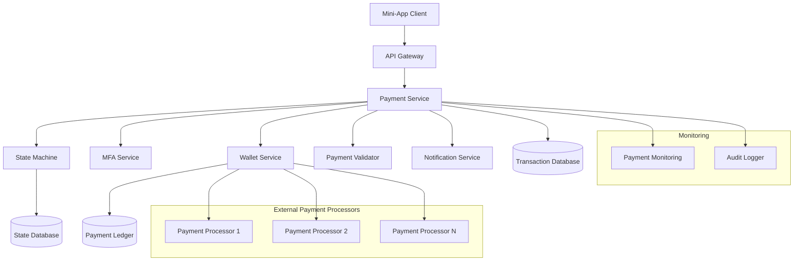
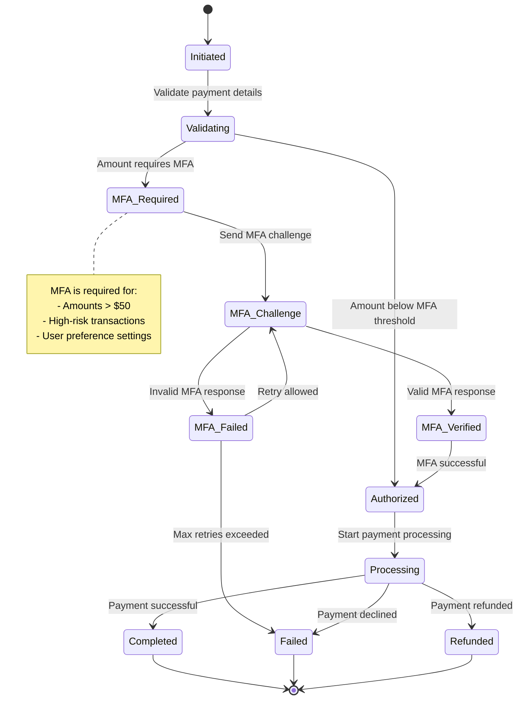
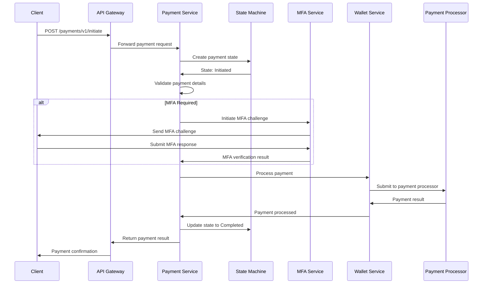
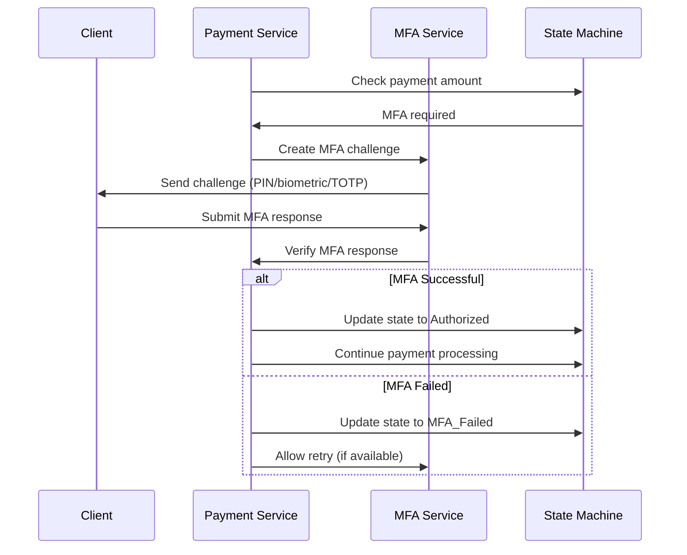
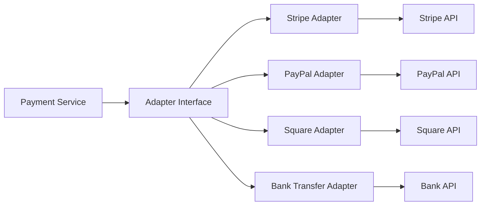

# TMCP Payment Processing System Design

## 1. Overview

The TMCP Payment Processing System provides a secure, reliable payment infrastructure for mini-apps, featuring a comprehensive state machine, multi-factor authentication integration, and wallet service connectivity. It handles payment authorization, processing, and settlement with proper security controls.

## 2. System Architecture



## 3. Payment State Machine

### 3.1 State Diagram



### 3.2 State Transitions Table

| Current State | Event | Next State | Conditions |
|---------------|-------|------------|------------|
| Initiated | validate | Validating | Valid payment request |
| Initiated | cancel | Failed | User cancellation |
| Validating | mfa_required | MFA_Required | Amount > threshold |
| Validating | authorized | Authorized | Amount ≤ threshold |
| Validating | invalid | Failed | Invalid payment details |
| MFA_Required | challenge_sent | MFA_Challenge | MFA method available |
| MFA_Challenge | mfa_verified | MFA_Verified | Valid MFA response |
| MFA_Challenge | mfa_failed | MFA_Failed | Invalid MFA response |
| MFA_Challenge | max_retries | Failed | Retry limit exceeded |
| MFA_Verified | authorized | Authorized | MFA successful |
| Authorized | process | Processing | Start payment processing |
| Processing | completed | Completed | Payment successful |
| Processing | declined | Failed | Payment declined |
| Processing | refund | Refunded | Payment refunded |
| Failed | retry | Initiated | Retry allowed |
| Refunded | retry | Initiated | Retry allowed |

## 4. API Design

### 4.1 Payment Operations

```
POST /payments/v1/initiate
GET /payments/v1/{paymentId}
POST /payments/v1/{paymentId}/authorize
POST /payments/v1/{paymentId}/cancel
POST /payments/v1/{paymentId}/refund
```

### 4.2 MFA Operations

```
POST /payments/v1/{paymentId}/mfa/challenge
POST /payments/v1/{paymentId}/mfa/verify
GET /payments/v1/{paymentId}/mfa/status
```

### 4.3 Query Operations

```
GET /payments/v1/user/{userId}/transactions
GET /payments/v1/user/{userId}/balance
GET /payments/v1/user/{userId}/payment-methods
```

## 5. Payment Flow

### 5.1 Standard Payment Flow



### 5.2 Payment with MFA Flow



## 6. Component Details

### 6.1 Payment Service

**Responsibilities:**
- Payment request validation
- State machine orchestration
- MFA integration
- Wallet service communication
- Transaction logging

**Key Features:**
- Multi-currency support
- Multiple payment methods
- Transaction limits and controls
- Refund processing
- Dispute handling

### 6.2 State Machine

**Responsibilities:**
- Payment state management
- State transition validation
- Event handling
- State persistence
- Timeout management

**State Persistence:**
```sql
CREATE TABLE payment_states (
    payment_id UUID PRIMARY KEY,
    current_state VARCHAR(50) NOT NULL,
    previous_state VARCHAR(50),
    event_history JSONB,
    created_at TIMESTAMP DEFAULT NOW(),
    updated_at TIMESTAMP DEFAULT NOW(),
    expires_at TIMESTAMP
);
```

### 6.3 MFA Integration

**MFA Triggers:**
- Amount > $50 (configurable)
- High-risk transactions
- User preference settings
- Unusual payment patterns
- New payment methods

**MFA Methods:**
1. **Transaction PIN** - 6-digit PIN
2. **Biometric** - Fingerprint/Face ID
3. **TOTP** - Time-based codes

### 6.4 Wallet Service

**Responsibilities:**
- User wallet management
- Payment method handling
- Balance management
- Transaction processing
- External processor integration

**Wallet Features:**
- Multiple payment methods
- Balance tracking
- Transaction history
- Auto-recharge options
- Spending limits

## 7. Data Models

### 7.1 Payment Transaction Model

```json
{
  "paymentId": "uuid",
  "userId": "uuid",
  "appId": "uuid",
  "amount": {
    "value": 9999,
    "currency": "USD"
  },
  "paymentMethod": {
    "type": "card",
    "id": "pm_123",
    "last4": "4242"
  },
  "description": "Premium subscription",
  "metadata": {
    "orderId": "order_123",
    "items": ["premium_plan"]
  },
  "status": "completed",
  "state": "Completed",
  "mfaRequired": true,
  "mfaMethod": "transaction_pin",
  "createdAt": "2025-12-20T01:15:00Z",
  "updatedAt": "2025-12-20T01:18:00Z",
  "completedAt": "2025-12-20T01:18:00Z"
}
```

### 7.2 MFA Challenge Model

```json
{
  "challengeId": "uuid",
  "paymentId": "uuid",
  "userId": "uuid",
  "method": "transaction_pin",
  "status": "pending",
  "attempts": 0,
  "maxAttempts": 3,
  "expiresAt": "2025-12-20T01:20:00Z",
  "createdAt": "2025-12-20T01:15:00Z"
}
```

### 7.3 Payment Method Model

```json
{
  "id": "pm_123",
  "userId": "uuid",
  "type": "card",
  "provider": "stripe",
  "card": {
    "brand": "visa",
    "last4": "4242",
    "expMonth": 12,
    "expYear": 2025
  },
  "isDefault": true,
  "metadata": {},
  "createdAt": "2025-12-20T01:15:00Z"
}
```

## 8. Database Schema

### 8.1 Payment Transactions Table

```sql
CREATE TABLE payment_transactions (
    payment_id UUID PRIMARY KEY,
    user_id UUID NOT NULL,
    app_id UUID NOT NULL,
    amount BIGINT NOT NULL,
    currency VARCHAR(3) NOT NULL,
    payment_method_id UUID,
    description TEXT,
    metadata JSONB,
    status VARCHAR(50) NOT NULL,
    state VARCHAR(50) NOT NULL,
    mfa_required BOOLEAN DEFAULT FALSE,
    mfa_method VARCHAR(50),
    processor_id VARCHAR(255),
    processor_transaction_id VARCHAR(255),
    created_at TIMESTAMP DEFAULT NOW(),
    updated_at TIMESTAMP DEFAULT NOW(),
    completed_at TIMESTAMP
);

CREATE INDEX idx_payment_transactions_user ON payment_transactions(user_id);
CREATE INDEX idx_payment_transactions_status ON payment_transactions(status);
CREATE INDEX idx_payment_transactions_created ON payment_transactions(created_at);
```

### 8.2 Payment Methods Table

```sql
CREATE TABLE payment_methods (
    id UUID PRIMARY KEY,
    user_id UUID NOT NULL,
    type VARCHAR(50) NOT NULL,
    provider VARCHAR(50) NOT NULL,
    provider_method_id VARCHAR(255) NOT NULL,
    method_data JSONB NOT NULL,
    is_default BOOLEAN DEFAULT FALSE,
    is_active BOOLEAN DEFAULT TRUE,
    metadata JSONB,
    created_at TIMESTAMP DEFAULT NOW(),
    updated_at TIMESTAMP DEFAULT NOW()
);

CREATE INDEX idx_payment_methods_user ON payment_methods(user_id);
CREATE UNIQUE INDEX idx_payment_methods_provider ON payment_methods(provider, provider_method_id);
```

### 8.3 Payment Ledger Table

```sql
CREATE TABLE payment_ledger (
    id UUID PRIMARY KEY,
    payment_id UUID REFERENCES payment_transactions(payment_id),
    user_id UUID NOT NULL,
    amount BIGINT NOT NULL,
    currency VARCHAR(3) NOT NULL,
    type VARCHAR(20) NOT NULL, -- 'payment', 'refund', 'fee'
    balance_after BIGINT,
    description TEXT,
    created_at TIMESTAMP DEFAULT NOW()
);

CREATE INDEX idx_payment_ledger_user ON payment_ledger(user_id);
CREATE INDEX idx_payment_ledger_payment ON payment_ledger(payment_id);
```

## 9. Security Considerations

### 9.1 Payment Security

**Data Protection:**
- PCI DSS compliance for card data
- Tokenization of sensitive payment information
- Encryption of payment details at rest
- Secure transmission with TLS

**Fraud Prevention:**
- Transaction velocity limits
- Device fingerprinting
- Behavioral analysis
- Risk scoring for transactions

### 9.2 MFA Security

**MFA Requirements:**
- Amount-based triggers
- Frequency-based triggers
- Location-based triggers
- User preference settings

**MFA Security:**
- Rate limiting for MFA attempts
- Secure challenge generation
- Time-limited challenges
- Secure verification process

## 10. Error Handling

### 10.1 Payment Error Codes

| Error Code | Description | HTTP Status |
|------------|-------------|-------------|
| PAYMENT_REQUIRED | Payment method required | 402 |
| INSUFFICIENT_FUNDS | Insufficient balance | 402 |
| PAYMENT_DECLINED | Payment declined by processor | 402 |
| MFA_REQUIRED | MFA challenge required | 428 |
| MFA_FAILED | MFA verification failed | 401 |
| INVALID_AMOUNT | Invalid payment amount | 400 |
| EXPIRED_CARD | Expired payment method | 400 |
| PROCESSOR_ERROR | Payment processor error | 502 |

### 10.2 Error Response Format

```json
{
  "error": {
    "code": "MFA_REQUIRED",
    "message": "Multi-factor authentication is required for this payment",
    "details": {
      "paymentId": "uuid",
      "mfaMethods": ["transaction_pin", "biometric", "totp"],
      "challengeId": "uuid"
    }
  }
}
```

## 11. Monitoring and Observability

### 11.1 Key Metrics

**Payment Metrics:**
- Transaction volume and value
- Success/failure rates
- Processing latency
- MFA challenge success rates

**Financial Metrics:**
- Revenue tracking
- Refund rates
- Chargeback rates
- Payment method distribution

### 11.2 Alerting

**Critical Alerts:**
- Payment service unavailable
- High failure rates
- Security incidents
- Processor connectivity issues

**Warning Alerts:**
- Increased MFA failures
- Processing latency spikes
- Unusual transaction patterns

## 12. Integration with External Systems

### 12.1 Payment Processor Integration

**Supported Processors:**
- Stripe
- PayPal
- Square
- Bank transfers

**Integration Pattern:**


### 12.2 Webhook Handling

**Webhook Events:**
- Payment completed
- Payment failed
- Payment refunded
- Dispute created

**Webhook Security:**
- Signature verification
- Replay protection
- Idempotency handling
- Retry logic

This design provides a comprehensive payment processing system that meets the TMCP protocol requirements while ensuring security, reliability, and flexibility for various payment scenarios.