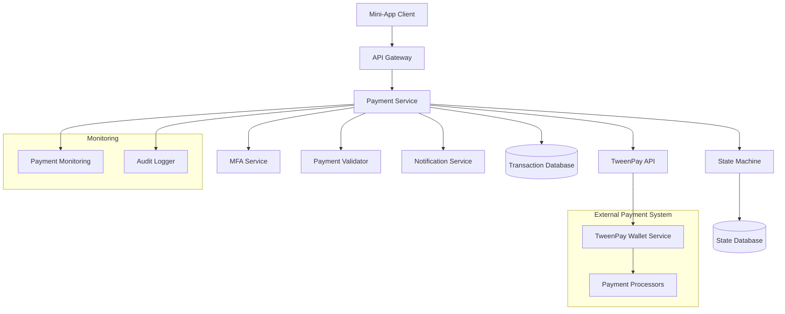
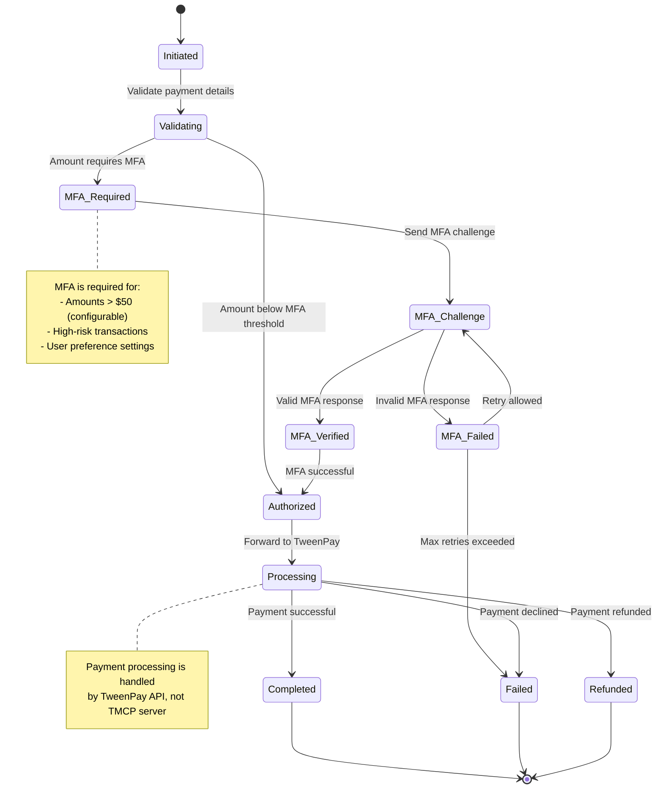
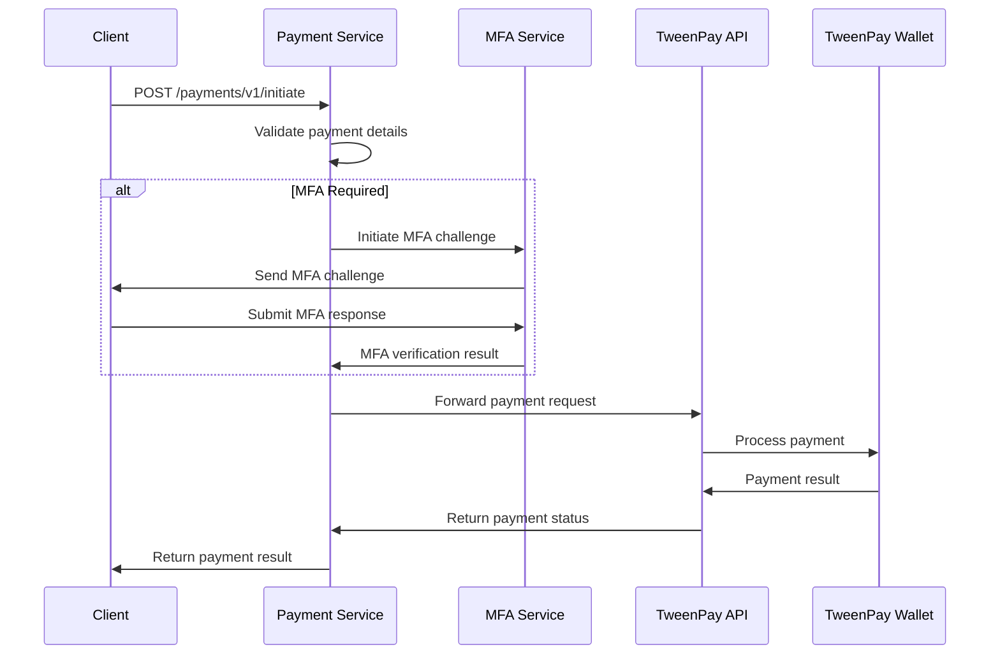

# TMCP Payment Processing System Design (Revised)

## 1. Overview

The TMCP Payment Processing System provides a secure interface for mini-apps to initiate payments through the TweenPay API, implementing MFA integration and payment state management as defined in the TMCP protocol v1.2.0. This system acts as a bridge between mini-apps and the TweenPay wallet service.

## 2. System Architecture



## 3. Payment State Machine (Protocol Compliant)

### 3.1 State Diagram



## 4. API Design (Protocol Compliant)

### 4.1 Payment Operations

```
POST /payments/v1/initiate
GET /payments/v1/{paymentId}
POST /payments/v1/{paymentId}/authorize
POST /payments/v1/{paymentId}/cancel
POST /payments/v1/{paymentId}/refund
```

### 4.2 MFA Operations (Protocol Section 7.4)

```
POST /payments/v1/{paymentId}/mfa/challenge
POST /payments/v1/{paymentId}/mfa/verify
GET /payments/v1/{paymentId}/mfa/status
```

### 4.3 Query Operations

```
GET /payments/v1/user/{userId}/transactions
GET /payments/v1/user/{userId}/balance
```

## 5. TweenPay API Integration

### 5.1 Payment Processing Flow



### 5.2 TweenPay API Interface

```javascript
class TweenPayApiClient {
  constructor(apiKey, baseUrl) {
    this.apiKey = apiKey;
    this.baseUrl = baseUrl;
  }
  
  async initiatePayment(paymentData) {
    const response = await fetch(`${this.baseUrl}/payments`, {
      method: 'POST',
      headers: {
        'Authorization': `Bearer ${this.apiKey}`,
        'Content-Type': 'application/json'
      },
      body: JSON.stringify({
        userId: paymentData.userId,
        amount: paymentData.amount,
        currency: paymentData.currency,
        description: paymentData.description,
        metadata: paymentData.metadata,
        mfaRequired: paymentData.mfaRequired
      })
    });
    
    return response.json();
  }
  
  async getPaymentStatus(paymentId) {
    const response = await fetch(`${this.baseUrl}/payments/${paymentId}`, {
      method: 'GET',
      headers: {
        'Authorization': `Bearer ${this.apiKey}`
      }
    });
    
    return response.json();
  }
  
  async refundPayment(paymentId, amount = null) {
    const response = await fetch(`${this.baseUrl}/payments/${paymentId}/refund`, {
      method: 'POST',
      headers: {
        'Authorization': `Bearer ${this.apiKey}`,
        'Content-Type': 'application/json'
      },
      body: JSON.stringify({
        amount: amount // null for full refund
      })
    });
    
    return response.json();
  }
  
  async getUserBalance(userId) {
    const response = await fetch(`${this.baseUrl}/users/${userId}/balance`, {
      method: 'GET',
      headers: {
        'Authorization': `Bearer ${this.apiKey}`
      }
    });
    
    return response.json();
  }
}
```

## 6. Component Details

### 6.1 Payment Service

**Responsibilities:**
- Payment request validation
- State machine orchestration (per protocol)
- MFA integration
- TweenPay API communication
- Transaction logging

**Key Features:**
- Multi-currency support
- Multiple payment methods (via TweenPay)
- Transaction limits and controls
- Refund processing (via TweenPay)
- Dispute handling (via TweenPay)

### 6.2 State Machine (Protocol Compliant)

**Responsibilities:**
- Payment state management (per TMCP protocol)
- State transition validation
- Event handling
- State persistence
- Timeout management

**State Persistence:**
```sql
CREATE TABLE payment_states (
    payment_id UUID PRIMARY KEY,
    current_state VARCHAR(50) NOT NULL,
    previous_state VARCHAR(50),
    event_history JSONB,
    created_at TIMESTAMP DEFAULT NOW(),
    updated_at TIMESTAMP DEFAULT NOW(),
    expires_at TIMESTAMP
);
```

### 6.3 MFA Integration (Protocol Section 7.4)

**MFA Triggers:**
- Amount > $50 (configurable)
- High-risk transactions
- User preference settings
- Unusual payment patterns

**MFA Methods (per protocol):**
1. **Transaction PIN** - 6-digit PIN
2. **Biometric** - Fingerprint/Face ID
3. **TOTP** - Time-based codes

## 7. Data Models

### 7.1 Payment Transaction Model

```json
{
  "paymentId": "uuid",
  "userId": "uuid",
  "appId": "uuid",
  "amount": {
    "value": 9999,
    "currency": "USD"
  },
  "description": "Premium subscription",
  "metadata": {
    "orderId": "order_123",
    "items": ["premium_plan"]
  },
  "status": "completed",
  "state": "Completed",
  "mfaRequired": true,
  "mfaMethod": "transaction_pin",
  "tweenPayTransactionId": "tp_txn_123",
  "createdAt": "2025-12-20T01:15:00Z",
  "updatedAt": "2025-12-20T01:18:00Z",
  "completedAt": "2025-12-20T01:18:00Z"
}
```

### 7.2 MFA Challenge Model (Protocol Section 7.4)

```json
{
  "challengeId": "uuid",
  "paymentId": "uuid",
  "userId": "uuid",
  "method": "transaction_pin",
  "status": "pending",
  "attempts": 0,
  "maxAttempts": 3,
  "expiresAt": "2025-12-20T01:20:00Z",
  "createdAt": "2025-12-20T01:15:00Z"
}
```

## 8. Database Schema

### 8.1 Payment Transactions Table

```sql
CREATE TABLE payment_transactions (
    payment_id UUID PRIMARY KEY DEFAULT gen_random_uuid(),
    user_id UUID NOT NULL,
    app_id VARCHAR(255),
    amount BIGINT NOT NULL,
    currency VARCHAR(3) NOT NULL DEFAULT 'USD',
    description TEXT,
    metadata JSONB DEFAULT '{}',
    status VARCHAR(50) NOT NULL,
    state VARCHAR(50) NOT NULL,
    mfa_required BOOLEAN DEFAULT FALSE,
    mfa_method VARCHAR(50),
    tweenpay_transaction_id VARCHAR(255),
    failure_reason TEXT,
    created_at TIMESTAMP DEFAULT NOW(),
    updated_at TIMESTAMP DEFAULT NOW(),
    completed_at TIMESTAMP
);

CREATE INDEX idx_payment_transactions_user ON payment_transactions(user_id);
CREATE INDEX idx_payment_transactions_status ON payment_transactions(status);
CREATE INDEX idx_payment_transactions_created ON payment_transactions(created_at);
CREATE INDEX idx_payment_transactions_tweenpay ON payment_transactions(tweenpay_transaction_id);
```

### 8.2 Payment MFA Challenges Table (Protocol Section 7.4)

```sql
CREATE TABLE payment_mfa_challenges (
    challenge_id UUID PRIMARY KEY DEFAULT gen_random_uuid(),
    payment_id UUID NOT NULL REFERENCES payment_transactions(payment_id),
    user_id UUID NOT NULL,
    method_type VARCHAR(50) NOT NULL, -- 'transaction_pin', 'biometric', 'totp'
    challenge_data JSONB NOT NULL,
    status VARCHAR(50) DEFAULT 'pending', -- 'pending', 'verified', 'failed', 'expired'
    attempts INTEGER DEFAULT 0,
    max_attempts INTEGER DEFAULT 3,
    expires_at TIMESTAMP NOT NULL,
    created_at TIMESTAMP DEFAULT NOW(),
    verified_at TIMESTAMP
);

CREATE INDEX idx_payment_mfa_challenges_payment ON payment_mfa_challenges(payment_id);
CREATE INDEX idx_payment_mfa_challenges_user ON payment_mfa_challenges(user_id);
```

## 9. Error Handling (Protocol Section 12.2)

### 9.1 Payment Error Codes

| Error Code | Description | HTTP Status |
|------------|-------------|-------------|
| MFA_REQUIRED | MFA challenge required | 428 |
| MFA_LOCKED | MFA account locked | 423 |
| INVALID_MFA_CREDENTIALS | Invalid MFA response | 401 |
| PAYMENT_REQUIRED | Payment method required | 402 |
| INSUFFICIENT_FUNDS | Insufficient balance | 402 |
| PAYMENT_DECLINED | Payment declined by processor | 402 |
| INVALID_AMOUNT | Invalid payment amount | 400 |
| EXPIRED_CARD | Expired payment method | 400 |
| PROCESSOR_ERROR | Payment processor error | 502 |

### 9.2 Error Response Format

```json
{
  "error": {
    "code": "MFA_REQUIRED",
    "message": "Multi-factor authentication is required for this payment",
    "details": {
      "paymentId": "uuid",
      "mfaMethods": ["transaction_pin", "biometric", "totp"],
      "challengeId": "uuid"
    }
  }
}
```

## 10. Security Considerations

### 10.1 Payment Security

**Data Protection:**
- No direct storage of payment method details
- Tokenization handled by TweenPay
- Encryption of payment details at rest
- Secure transmission with TLS

**Fraud Prevention:**
- Transaction velocity limits
- Device fingerprinting
- Behavioral analysis
- Risk scoring for transactions

### 10.2 MFA Security (Protocol Section 7.4)

**MFA Requirements:**
- Amount-based triggers
- Frequency-based triggers
- Location-based triggers
- User preference settings

**MFA Security:**
- Rate limiting for MFA attempts
- Secure challenge generation
- Time-limited challenges
- Secure verification process

## 11. Rate Limiting (Protocol Section 11.4.1)

### 11.1 Required Headers

```http
X-RateLimit-Limit: 100
X-RateLimit-Remaining: 95
X-RateLimit-Reset: 1640995200
X-RateLimit-Retry-After: 60
```

### 11.2 Rate Limiting Implementation

**Token Bucket Algorithm (per protocol):**
- Default: 100 requests per minute
- Authentication: 10 requests per minute
- MFA verification: 3 attempts per challenge
- Token refresh: 10 requests per minute

## 12. Integration Points

### 12.1 TweenPay API Endpoints

```
POST /payments - Initiate payment
GET /payments/{id} - Get payment status
POST /payments/{id}/refund - Refund payment
GET /users/{id}/balance - Get user balance
POST /mfa/challenge - Initiate MFA challenge
POST /mfa/verify - Verify MFA response
```

### 12.2 Webhook Handling

**Webhook Events (from TweenPay):**
- Payment completed
- Payment failed
- Payment refunded
- Dispute created

**Webhook Security:**
- Signature verification
- Replay protection
- Idempotency handling
- Retry logic

This revised design ensures compliance with the TMCP protocol while properly integrating with the TweenPay API for payment processing, without directly managing wallet functionality.