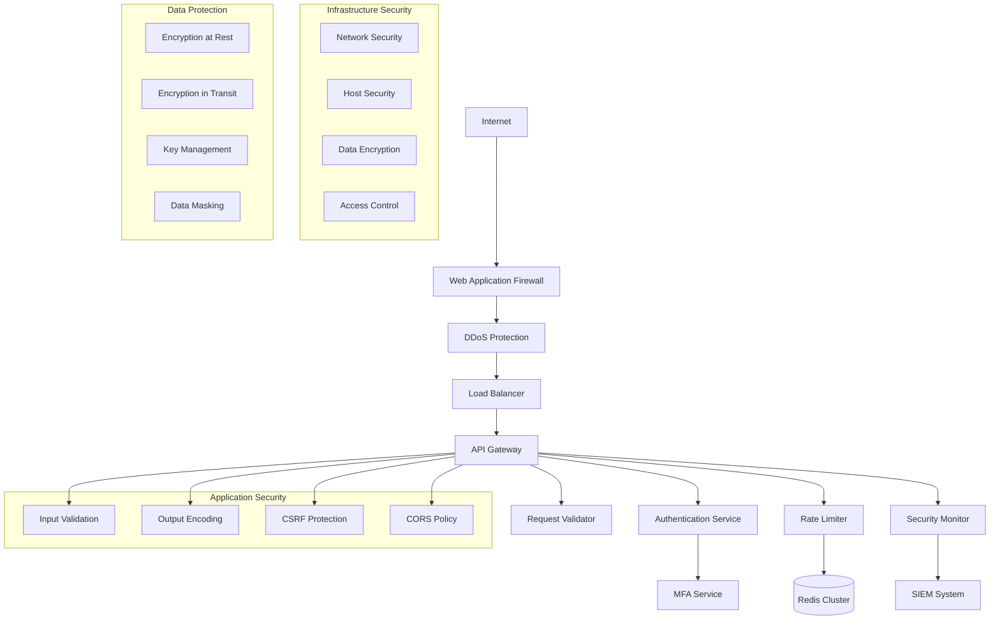
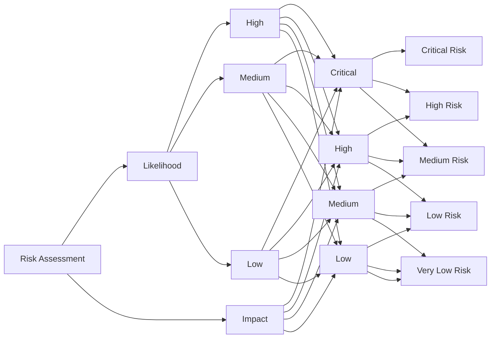
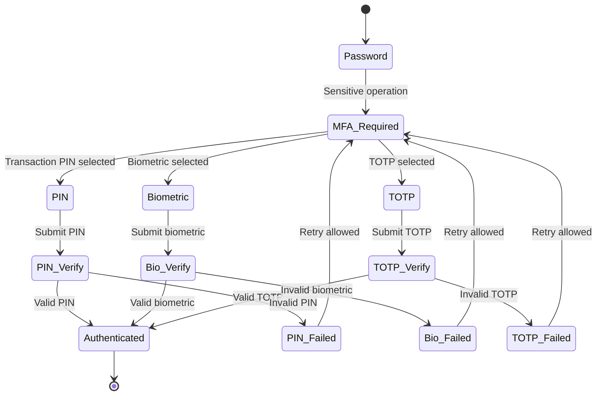
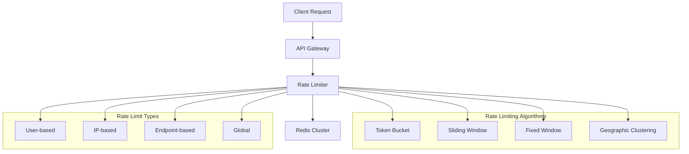
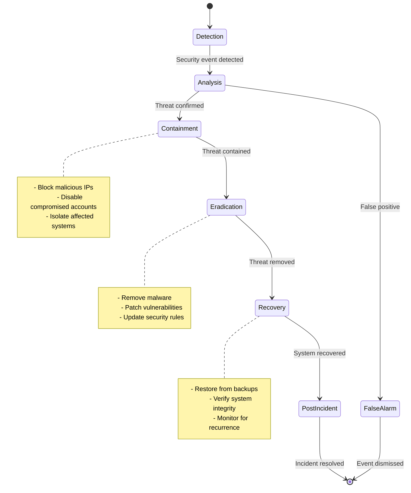

# TMCP Security and Rate Limiting Design

## 1. Overview

This document outlines the comprehensive security measures and rate limiting implementation for the TMCP (Tween Mini-App Communication Protocol) Server, ensuring protection against various security threats while maintaining system performance and availability.

## 2. Security Architecture



## 3. Threat Model and Mitigation

### 3.1 Common Security Threats

| Threat Category | Specific Threats | Mitigation Strategies |
|-----------------|-----------------|----------------------|
| **Authentication** | Brute force attacks, Credential stuffing, Session hijacking | MFA, Rate limiting, Secure session management |
| **Authorization** | Privilege escalation, Scope abuse, Token theft | Scope validation, JWT security, Token rotation |
| **Data Protection** | Data breaches, PII exposure, Data tampering | Encryption, Access controls, Audit logging |
| **API Security** | Injection attacks, DoS attacks, Parameter tampering | Input validation, Rate limiting, Request signing |
| **Infrastructure** | Network intrusion, Server compromise, Supply chain attacks | Network segmentation, Hardening, Vulnerability scanning |

### 3.2 Risk Assessment Matrix



## 4. Authentication Security

### 4.1 Multi-Factor Authentication (MFA)



**MFA Implementation:**
```javascript
class MFAService {
  async initiateMFA(userId, operationType) {
    const user = await this.getUser(userId);
    const mfaMethods = await this.getMFAMethods(userId);
    
    // Determine if MFA is required based on risk assessment
    const mfaRequired = await this.assessRisk(user, operationType);
    
    if (mfaRequired) {
      const challenge = await this.createChallenge(userId, mfaMethods);
      return { mfaRequired: true, challenge };
    }
    
    return { mfaRequired: false };
  }
  
  async verifyMFA(challengeId, response) {
    const challenge = await this.getChallenge(challengeId);
    
    // Verify response based on method type
    let isValid = false;
    switch (challenge.methodType) {
      case 'transaction_pin':
        isValid = await this.verifyPIN(challenge, response);
        break;
      case 'biometric':
        isValid = await this.verifyBiometric(challenge, response);
        break;
      case 'totp':
        isValid = await this.verifyTOTP(challenge, response);
        break;
    }
    
    if (isValid) {
      await this.markChallengeVerified(challengeId);
    } else {
      await this.incrementFailedAttempts(challengeId);
    }
    
    return isValid;
  }
}
```

### 4.2 Token Security

**JWT Token Structure:**
```json
{
  "header": {
    "alg": "RS256",
    "typ": "JWT",
    "kid": "key-id-2025"
  },
  "payload": {
    "iss": "https://api.tween.com",
    "sub": "user-uuid",
    "aud": "tmcp-server",
    "exp": 1734708000,
    "iat": 1734704400,
    "jti": "token-uuid",
    "scp": ["profile", "storage:read", "storage:write"],
    "app_id": "com.tween.browser",
    "auth_time": 1734704400,
    "amr": ["pwd", "mfa"]
  }
}
```

**Token Security Measures:**
- Short-lived access tokens (15-60 minutes)
- Refresh token rotation
- Asymmetric key signing (RS256)
- Key rotation every 90 days
- Token revocation list
- Audience validation

## 5. Rate Limiting Implementation

### 5.1 Rate Limiting Architecture



### 5.2 Rate Limiting Configuration

```yaml
rate_limits:
  global:
    requests_per_second: 10000
    burst: 20000
    
  ip_based:
    standard:
      requests_per_minute: 1000
      burst: 100
    suspicious:
      requests_per_minute: 100
      burst: 20
    
  user_based:
    authenticated:
      requests_per_minute: 500
      burst: 50
    premium:
      requests_per_minute: 2000
      burst: 200
    
  endpoint_based:
    authentication:
      requests_per_minute: 10
      burst: 5
    payments:
      requests_per_minute: 30
      burst: 10
    storage:
      requests_per_minute: 200
      burst: 50
    app_store:
      requests_per_minute: 100
      burst: 25
```

### 5.3 Rate Limiting Implementation

```javascript
class RateLimiter {
  constructor(redisClient) {
    this.redis = redisClient;
    this.algorithms = {
      tokenBucket: new TokenBucketAlgorithm(redisClient),
      slidingWindow: new SlidingWindowAlgorithm(redisClient),
      fixedWindow: new FixedWindowAlgorithm(redisClient)
    };
  }
  
  async checkLimit(key, config) {
    const algorithm = this.selectAlgorithm(config.algorithm);
    const result = await algorithm.checkLimit(key, config);
    
    // Log rate limit violations
    if (!result.allowed) {
      await this.logViolation(key, config, result);
    }
    
    return result;
  }
  
  selectAlgorithm(algorithmType) {
    switch (algorithmType) {
      case 'token_bucket':
        return this.algorithms.tokenBucket;
      case 'sliding_window':
        return this.algorithms.slidingWindow;
      case 'fixed_window':
      default:
        return this.algorithms.fixedWindow;
    }
  }
}

class TokenBucketAlgorithm {
  async checkLimit(key, config) {
    const now = Date.now();
    const bucketKey = `rate_limit:bucket:${key}`;
    
    // Get current bucket state
    const bucket = await this.redis.hgetall(bucketKey);
    
    // Initialize bucket if doesn't exist
    if (!bucket.tokens) {
      bucket.tokens = config.burst;
      bucket.lastRefill = now;
    }
    
    // Calculate tokens to add based on time elapsed
    const timePassed = now - parseInt(bucket.lastRefill);
    const tokensToAdd = Math.floor(timePassed * config.rate / 1000);
    
    // Update bucket
    bucket.tokens = Math.min(config.burst, parseInt(bucket.tokens) + tokensToAdd);
    bucket.lastRefill = now;
    
    // Check if request can be processed
    if (bucket.tokens >= 1) {
      bucket.tokens -= 1;
      await this.redis.hmset(bucketKey, bucket);
      await this.redis.expire(bucketKey, Math.ceil(config.burst / config.rate));
      
      return {
        allowed: true,
        remainingTokens: bucket.tokens,
        resetTime: now + Math.ceil((config.burst - bucket.tokens) * 1000 / config.rate)
      };
    } else {
      await this.redis.hmset(bucketKey, bucket);
      await this.redis.expire(bucketKey, Math.ceil(config.burst / config.rate));
      
      return {
        allowed: false,
        remainingTokens: 0,
        resetTime: now + Math.ceil((config.burst - bucket.tokens) * 1000 / config.rate),
        retryAfter: Math.ceil((config.burst - bucket.tokens) * 1000 / config.rate)
      };
    }
  }
}
```

## 6. Input Validation and Output Encoding

### 6.1 Input Validation Framework

```javascript
class InputValidator {
  constructor() {
    this.schemas = new Map();
    this.setupSchemas();
  }
  
  setupSchemas() {
    // User registration schema
    this.schemas.set('user_registration', {
      username: {
        type: 'string',
        minLength: 3,
        maxLength: 50,
        pattern: /^[a-zA-Z0-9_-]+$/,
        sanitize: true
      },
      email: {
        type: 'string',
        format: 'email',
        maxLength: 255,
        sanitize: true
      },
      password: {
        type: 'string',
        minLength: 8,
        maxLength: 128,
        pattern: /^(?=.*[a-z])(?=.*[A-Z])(?=.*\d)(?=.*[@$!%*?&])[A-Za-z\d@$!%*?&]/
      }
    });
    
    // Payment transaction schema
    this.schemas.set('payment_transaction', {
      amount: {
        type: 'number',
        minimum: 0.01,
        maximum: 10000,
        precision: 2
      },
      currency: {
        type: 'string',
        enum: ['USD', 'EUR', 'GBP', 'JPY']
      },
      payment_method_id: {
        type: 'string',
        format: 'uuid'
      },
      description: {
        type: 'string',
        maxLength: 500,
        sanitize: true,
        escape: true
      }
    });
  }
  
  validate(schemaName, data) {
    const schema = this.schemas.get(schemaName);
    if (!schema) {
      throw new Error(`Schema ${schemaName} not found`);
    }
    
    const errors = [];
    const sanitizedData = {};
    
    for (const [field, rules] of Object.entries(schema)) {
      const value = data[field];
      
      // Check required fields
      if (value === undefined && rules.required) {
        errors.push(`${field} is required`);
        continue;
      }
      
      if (value !== undefined) {
        // Type validation
        if (!this.validateType(value, rules.type)) {
          errors.push(`${field} must be of type ${rules.type}`);
          continue;
        }
        
        // Length validation
        if (rules.minLength && value.length < rules.minLength) {
          errors.push(`${field} must be at least ${rules.minLength} characters`);
        }
        
        if (rules.maxLength && value.length > rules.maxLength) {
          errors.push(`${field} must be at most ${rules.maxLength} characters`);
        }
        
        // Pattern validation
        if (rules.pattern && !rules.pattern.test(value)) {
          errors.push(`${field} format is invalid`);
        }
        
        // Enum validation
        if (rules.enum && !rules.enum.includes(value)) {
          errors.push(`${field} must be one of: ${rules.enum.join(', ')}`);
        }
        
        // Sanitization
        if (rules.sanitize) {
          sanitizedData[field] = this.sanitize(value);
        } else if (rules.escape) {
          sanitizedData[field] = this.escape(value);
        } else {
          sanitizedData[field] = value;
        }
      }
    }
    
    return {
      valid: errors.length === 0,
      errors,
      data: sanitizedData
    };
  }
  
  sanitize(input) {
    if (typeof input !== 'string') return input;
    
    return input
      .replace(/<script\b[^<]*(?:(?!<\/script>)<[^<]*)*<\/script>/gi, '')
      .replace(/<iframe\b[^<]*(?:(?!<\/iframe>)<[^<]*)*<\/iframe>/gi, '')
      .replace(/javascript:/gi, '')
      .replace(/on\w+\s*=/gi, '')
      .trim();
  }
  
  escape(input) {
    if (typeof input !== 'string') return input;
    
    const htmlEscapes = {
      '&': '&',
      '<': '<',
      '>': '>',
      '"': '"',
      "'": '&#x27;',
      '/': '&#x2F;'
    };
    
    return input.replace(/[&<>"'/]/g, (match) => htmlEscapes[match]);
  }
}
```

### 6.2 SQL Injection Prevention

```javascript
class SecureQueryBuilder {
  constructor(connection) {
    this.connection = connection;
  }
  
  async query(template, params = {}) {
    // Validate template against SQL injection patterns
    if (this.detectSQLInjection(template)) {
      throw new Error('Potential SQL injection detected');
    }
    
    // Use parameterized queries
    const query = this.buildParameterizedQuery(template, params);
    return await this.connection.query(query.text, query.values);
  }
  
  detectSQLInjection(sql) {
    const injectionPatterns = [
      /(\b(SELECT|INSERT|UPDATE|DELETE|DROP|CREATE|ALTER|EXEC|UNION)\b)/i,
      /(--|;|\/\*|\*\/|xp_|sp_)/i,
      /(\b(OR|AND)\s+\d+\s*=\s*\d+)/i,
      /(\b(OR|AND)\s+['"].*['"]\s*=\s*['"].*['"])/i
    ];
    
    return injectionPatterns.some(pattern => pattern.test(sql));
  }
  
  buildParameterizedQuery(template, params) {
    const values = [];
    let paramIndex = 1;
    
    const text = template.replace(/\$\{(\w+)\}/g, (match, paramName) => {
      if (params[paramName] === undefined) {
        throw new Error(`Parameter ${paramName} not provided`);
      }
      
      values.push(params[paramName]);
      return `$${paramIndex++}`;
    });
    
    return { text, values };
  }
}
```

## 7. Data Protection

### 7.1 Encryption at Rest

```javascript
class EncryptionService {
  constructor(keyManager) {
    this.keyManager = keyManager;
    this.algorithm = 'aes-256-gcm';
  }
  
  async encrypt(data, context = {}) {
    const key = await this.keyManager.getEncryptionKey(context);
    const iv = crypto.randomBytes(16);
    
    const cipher = crypto.createCipher(this.algorithm, key, iv);
    
    let encrypted = cipher.update(JSON.stringify(data), 'utf8', 'hex');
    encrypted += cipher.final('hex');
    
    const authTag = cipher.getAuthTag();
    
    return {
      encrypted,
      iv: iv.toString('hex'),
      authTag: authTag.toString('hex'),
      keyId: key.id,
      algorithm: this.algorithm
    };
  }
  
  async decrypt(encryptedData, context = {}) {
    const key = await this.keyManager.getDecryptionKey(encryptedData.keyId, context);
    
    const decipher = crypto.createDecipher(
      encryptedData.algorithm,
      key,
      Buffer.from(encryptedData.iv, 'hex')
    );
    
    decipher.setAuthTag(Buffer.from(encryptedData.authTag, 'hex'));
    
    let decrypted = decipher.update(encryptedData.encrypted, 'hex', 'utf8');
    decrypted += decipher.final('utf8');
    
    return JSON.parse(decrypted);
  }
}
```

### 7.2 Data Masking

```javascript
class DataMaskingService {
  maskPII(data, userContext) {
    const maskedData = { ...data };
    
    // Mask email addresses
    if (maskedData.email) {
      maskedData.email = this.maskEmail(maskedData.email);
    }
    
    // Mask phone numbers
    if (maskedData.phone) {
      maskedData.phone = this.maskPhone(maskedData.phone);
    }
    
    // Mask credit card numbers
    if (maskedData.cardNumber) {
      maskedData.cardNumber = this.maskCardNumber(maskedData.cardNumber);
    }
    
    // Only show full data to authorized users
    if (this.hasFullAccess(userContext)) {
      return data;
    }
    
    return maskedData;
  }
  
  maskEmail(email) {
    const [username, domain] = email.split('@');
    const maskedUsername = username.substring(0, 2) + '*'.repeat(username.length - 2);
    return `${maskedUsername}@${domain}`;
  }
  
  maskPhone(phone) {
    return phone.replace(/(\d{3})\d{4}(\d{4})/, '$1****$2');
  }
  
  maskCardNumber(cardNumber) {
    return cardNumber.replace(/\d(?=\d{4})/g, '*');
  }
  
  hasFullAccess(userContext) {
    return userContext.roles.includes('admin') || 
           userContext.roles.includes('support') ||
           userContext.hasDataAccess;
  }
}
```

## 8. Security Monitoring and Incident Response

### 8.1 Security Event Monitoring

```javascript
class SecurityMonitor {
  constructor(eventLogger, alertManager) {
    this.eventLogger = eventLogger;
    this.alertManager = alertManager;
    this.threatDetectors = new Map();
    this.setupThreatDetectors();
  }
  
  setupThreatDetectors() {
    // Brute force attack detector
    this.threatDetectors.set('brute_force', {
      threshold: 5,
      window: 300000, // 5 minutes
      check: (events) => events.filter(e => e.type === 'auth_failed').length >= 5
    });
    
    // Unusual access pattern detector
    this.threatDetectors.set('unusual_access', {
      threshold: 3,
      window: 600000, // 10 minutes
      check: (events) => {
        const uniqueIPs = new Set(events.map(e => e.ipAddress));
        return uniqueIPs.size >= 3;
      }
    });
    
    // Privilege escalation detector
    this.threatDetectors.set('privilege_escalation', {
      threshold: 1,
      window: 0,
      check: (events) => events.some(e => e.type === 'scope_escalation')
    });
  }
  
  async processSecurityEvent(event) {
    // Log the event
    await this.eventLogger.logSecurityEvent(event);
    
    // Check for threats
    const threats = await this.detectThreats(event);
    
    // Send alerts if threats detected
    if (threats.length > 0) {
      await this.alertManager.sendSecurityAlert({
        threats,
        event,
        timestamp: new Date().toISOString()
      });
    }
  }
  
  async detectThreats(currentEvent) {
    const detectedThreats = [];
    
    for (const [threatType, detector] of this.threatDetectors) {
      const events = await this.getRecentEvents(
        currentEvent.userId || currentEvent.ipAddress,
        detector.window
      );
      
      events.push(currentEvent);
      
      if (detector.check(events)) {
        detectedThreats.push({
          type: threatType,
          severity: this.calculateSeverity(threatType, events),
          events
        });
      }
    }
    
    return detectedThreats;
  }
}
```

### 8.2 Incident Response Workflow



## 9. Compliance and Auditing

### 9.1 Compliance Framework

```javascript
class ComplianceManager {
  constructor() {
    this.regulations = new Map();
    this.setupRegulations();
  }
  
  setupRegulations() {
    // GDPR compliance
    this.regulations.set('GDPR', {
      dataSubjectRights: ['access', 'rectification', 'erasure', 'portability'],
      dataRetentionPeriod: 365, // days
      consentRequired: true,
      breachNotification: 72 // hours
    });
    
    // PCI DSS compliance
    this.regulations.set('PCI_DSS', {
      dataEncryption: true,
      accessControl: true,
      networkSecurity: true,
      vulnerabilityManagement: true,
      monitoring: true
    });
    
    // SOC 2 compliance
    this.regulations.set('SOC2', {
      security: true,
      availability: true,
      processingIntegrity: true,
      confidentiality: true,
      privacy: true
    });
  }
  
  async checkCompliance(regulation, data) {
    const rules = this.regulations.get(regulation);
    if (!rules) {
      throw new Error(`Regulation ${regulation} not configured`);
    }
    
    const complianceResults = {};
    
    for (const [rule, requirement] of Object.entries(rules)) {
      complianceResults[rule] = await this.evaluateRule(rule, requirement, data);
    }
    
    return {
      regulation,
      compliant: Object.values(complianceResults).every(result => result),
      details: complianceResults
    };
  }
}
```

### 9.2 Audit Logging

```javascript
class AuditLogger {
  constructor(database) {
    this.db = database;
  }
  
  async logAuditEvent(event) {
    const auditRecord = {
      id: generateUUID(),
      timestamp: new Date().toISOString(),
      userId: event.userId,
      action: event.action,
      resource: event.resource,
      resourceId: event.resourceId,
      ipAddress: event.ipAddress,
      userAgent: event.userAgent,
      result: event.result,
      details: event.details,
      sessionId: event.sessionId
    };
    
    await this.db.collection('audit_logs').insertOne(auditRecord);
    
    // Also send to SIEM system
    await this.sendToSIEM(auditRecord);
  }
  
  async getAuditLogs(filters, pagination) {
    const query = this.buildQuery(filters);
    const options = {
      sort: { timestamp: -1 },
      limit: pagination.limit,
      skip: pagination.offset
    };
    
    return await this.db.collection('audit_logs').find(query, options).toArray();
  }
  
  buildQuery(filters) {
    const query = {};
    
    if (filters.userId) query.userId = filters.userId;
    if (filters.action) query.action = filters.action;
    if (filters.resource) query.resource = filters.resource;
    if (filters.startDate || filters.endDate) {
      query.timestamp = {};
      if (filters.startDate) query.timestamp.$gte = filters.startDate;
      if (filters.endDate) query.timestamp.$lte = filters.endDate;
    }
    
    return query;
  }
}
```

## 10. Security Testing

### 10.1 Security Testing Framework

```javascript
class SecurityTestSuite {
  constructor() {
    this.tests = [];
    this.setupTests();
  }
  
  setupTests() {
    // Authentication tests
    this.addTest('weak_password_detection', async () => {
      const weakPasswords = ['password', '123456', 'qwerty'];
      for (const password of weakPasswords) {
        const result = await this.testPasswordStrength(password);
        if (result.strength > 2) {
          throw new Error(`Weak password accepted: ${password}`);
        }
      }
    });
    
    // Input validation tests
    this.addTest('sql_injection_protection', async () => {
      const injectionAttempts = [
        "' OR '1'='1",
        "'; DROP TABLE users; --",
        "1' UNION SELECT * FROM users --"
      ];
      
      for (const injection of injectionAttempts) {
        const result = await this.testInputValidation(injection);
        if (result.accepted) {
          throw new Error(`SQL injection accepted: ${injection}`);
        }
      }
    });
    
    // Rate limiting tests
    this.addTest('rate_limiting_enforcement', async () => {
      const requests = [];
      for (let i = 0; i < 20; i++) {
        requests.push(this.makeRequest('/api/auth/login'));
      }
      
      const results = await Promise.all(requests);
      const rejectedCount = results.filter(r => r.status === 429).length;
      
      if (rejectedCount < 10) {
        throw new Error('Rate limiting not properly enforced');
      }
    });
  }
  
  async runTests() {
    const results = [];
    
    for (const test of this.tests) {
      try {
        await test.fn();
        results.push({ name: test.name, status: 'passed' });
      } catch (error) {
        results.push({ 
          name: test.name, 
          status: 'failed', 
          error: error.message 
        });
      }
    }
    
    return results;
  }
}
```

This comprehensive security and rate limiting design provides robust protection for the TMCP server against various security threats while maintaining system performance and user experience. The implementation includes multiple layers of security controls, monitoring, and incident response capabilities.