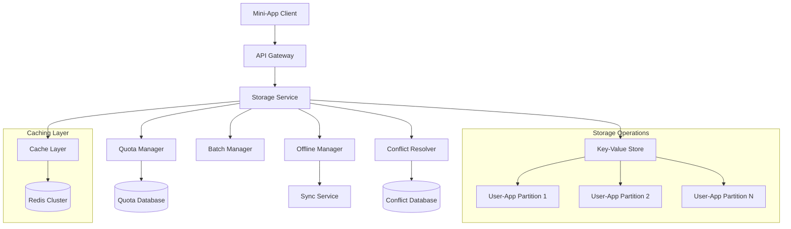
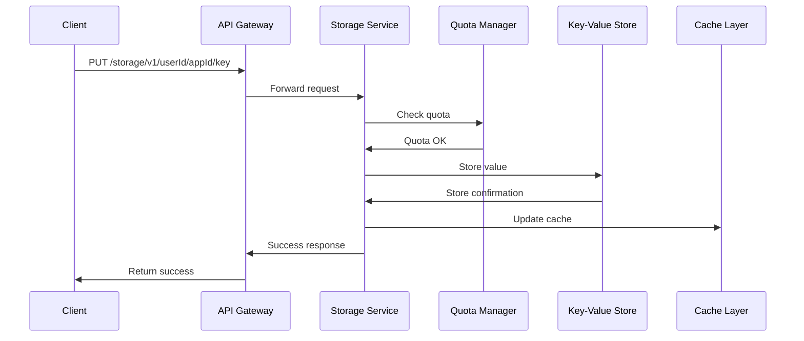
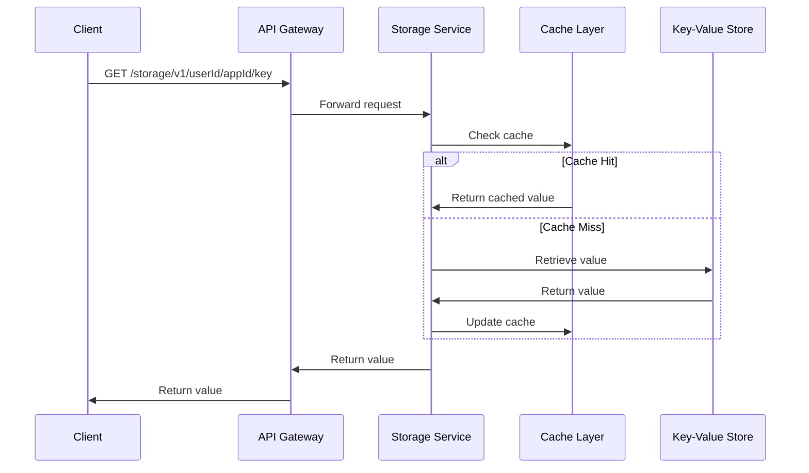
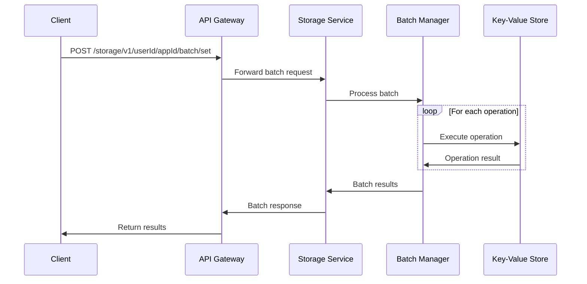
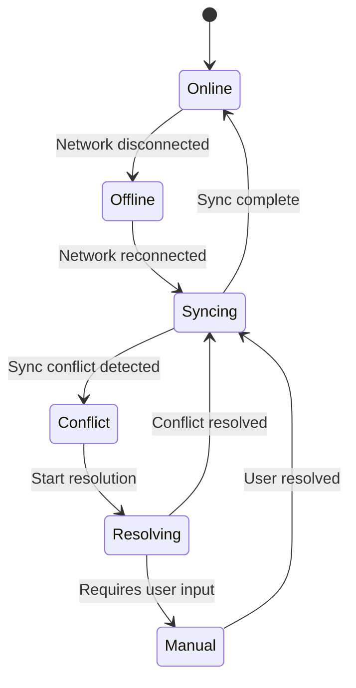

# TMCP Mini-App Storage System Design

## 1. Overview

The TMCP Mini-App Storage System provides a key-value storage solution for mini-apps with quota management, offline support, and conflict resolution. It allows mini-apps to store and retrieve data with defined quotas and scopes.

## 2. System Architecture



## 3. Storage Model

### 3.1 Data Organization

```
Storage Hierarchy:
├── User ID
│   ├── App ID 1
│   │   ├── Key 1 (≤1MB)
│   │   ├── Key 2 (≤1MB)
│   │   └── ...
│   ├── App ID 2
│   │   ├── Key 1 (≤1MB)
│   │   ├── Key 2 (≤1MB)
│   │   └── ...
│   └── ...
```

### 3.2 Quota Limits

- **Per User/App**: 10MB total storage
- **Per Key**: 1MB maximum size
- **Key Count**: Maximum 1000 keys per user/app
- **Default TTL**: No expiration unless specified

## 4. API Design

### 4.1 Basic Operations

```
PUT /storage/v1/{userId}/{appId}/{key}
GET /storage/v1/{userId}/{appId}/{key}
DELETE /storage/v1/{userId}/{appId}/{key}
```

### 4.2 Batch Operations

```
POST /storage/v1/{userId}/{appId}/batch/get
POST /storage/v1/{userId}/{appId}/batch/set
POST /storage/v1/{userId}/{appId}/batch/delete
```

### 4.3 Metadata Operations

```
GET /storage/v1/{userId}/{appId}/keys
GET /storage/v1/{userId}/{appId}/quota
GET /storage/v1/{userId}/{appId}/usage
```

### 4.4 Offline Operations

```
POST /storage/v1/{userId}/{appId}/sync/pull
POST /storage/v1/{userId}/{appId}/sync/push
GET /storage/v1/{userId}/{appId}/sync/status
```

## 5. Data Flow

### 5.1 Write Operation Flow



### 5.2 Read Operation Flow



### 5.3 Batch Operation Flow



## 6. Component Details

### 6.1 Storage Service

**Responsibilities:**
- Request validation and routing
- Authentication and authorization
- Response formatting
- Error handling

**Key Features:**
- JSON and binary data support
- Compression for large values
- Versioning for conflict resolution
- TTL support for keys

### 6.2 Quota Manager

**Responsibilities:**
- Enforce storage quotas
- Track usage statistics
- Provide quota information
- Handle quota exceeded scenarios

**Implementation:**
```sql
-- Quota tracking table
CREATE TABLE storage_quotas (
    user_id UUID NOT NULL,
    app_id UUID NOT NULL,
    used_bytes BIGINT DEFAULT 0,
    key_count INTEGER DEFAULT 0,
    last_updated TIMESTAMP DEFAULT NOW(),
    PRIMARY KEY (user_id, app_id)
);
```

### 6.3 Conflict Resolver

**Responsibilities:**
- Detect storage conflicts
- Apply conflict resolution strategies
- Maintain conflict history
- Provide resolution options

**Conflict Resolution Strategies:**
1. **Last Write Wins (LWW)** - Default strategy
2. **Merge** - For structured data
3. **Manual Resolution** - User intervention required
4. **Version-based** - Keep multiple versions

### 6.4 Batch Manager

**Responsibilities:**
- Process batch operations
- Optimize batch performance
- Handle partial failures
- Maintain transaction integrity

**Batch Operation Format:**
```json
{
  "operations": [
    {
      "type": "set",
      "key": "user.profile",
      "value": {"name": "John", "age": 30},
      "ttl": 3600
    },
    {
      "type": "delete",
      "key": "temp.cache"
    },
    {
      "type": "get",
      "key": "app.settings"
    }
  ]
}
```

### 6.5 Offline Manager

**Responsibilities:**
- Handle offline storage operations
- Manage synchronization queues
- Resolve sync conflicts
- Provide sync status

**Offline Sync Flow:**


## 7. Data Models

### 7.1 Storage Entry Model

```json
{
  "key": "user.profile",
  "value": {"name": "John", "age": 30},
  "contentType": "application/json",
  "version": 3,
  "createdAt": "2025-12-20T01:15:00Z",
  "updatedAt": "2025-12-20T01:20:00Z",
  "ttl": 3600,
  "size": 45,
  "checksum": "sha256:abc123..."
}
```

### 7.2 Quota Information Model

```json
{
  "userId": "uuid",
  "appId": "uuid",
  "quota": {
    "totalBytes": 10485760,
    "usedBytes": 5242880,
    "availableBytes": 5242880,
    "totalKeys": 1000,
    "usedKeys": 250,
    "availableKeys": 750
  },
  "lastUpdated": "2025-12-20T01:20:00Z"
}
```

### 7.3 Sync Status Model

```json
{
  "userId": "uuid",
  "appId": "uuid",
  "status": "syncing",
  "lastSync": "2025-12-20T01:15:00Z",
  "pendingOperations": 5,
  "conflicts": 1,
  "operations": [
    {
      "id": "op123",
      "type": "set",
      "key": "user.profile",
      "status": "pending",
      "timestamp": "2025-12-20T01:18:00Z"
    }
  ]
}
```

## 8. Database Schema

### 8.1 Key-Value Store Schema

```sql
-- Main storage table
CREATE TABLE storage_entries (
    user_id UUID NOT NULL,
    app_id UUID NOT NULL,
    key VARCHAR(255) NOT NULL,
    value BYTEA NOT NULL,
    content_type VARCHAR(100) DEFAULT 'application/octet-stream',
    version INTEGER DEFAULT 1,
    created_at TIMESTAMP DEFAULT NOW(),
    updated_at TIMESTAMP DEFAULT NOW(),
    ttl INTEGER, -- seconds until expiration
    size INTEGER NOT NULL,
    checksum VARCHAR(64) NOT NULL,
    PRIMARY KEY (user_id, app_id, key)
);

-- Indexes for performance
CREATE INDEX idx_storage_entries_user_app ON storage_entries(user_id, app_id);
CREATE INDEX idx_storage_entries_updated_at ON storage_entries(updated_at);
CREATE INDEX idx_storage_entries_ttl ON storage_entries(ttl) WHERE ttl IS NOT NULL;
```

### 8.2 Sync Operations Table

```sql
CREATE TABLE sync_operations (
    id UUID PRIMARY KEY,
    user_id UUID NOT NULL,
    app_id UUID NOT NULL,
    operation_type VARCHAR(20) NOT NULL, -- 'set', 'delete'
    key VARCHAR(255) NOT NULL,
    value BYTEA,
    version INTEGER,
    status VARCHAR(20) DEFAULT 'pending', -- 'pending', 'completed', 'failed'
    created_at TIMESTAMP DEFAULT NOW(),
    processed_at TIMESTAMP,
    error_message TEXT
);

CREATE INDEX idx_sync_operations_user_app ON sync_operations(user_id, app_id);
CREATE INDEX idx_sync_operations_status ON sync_operations(status);
```

## 9. Performance Considerations

### 9.1 Caching Strategy

**Multi-level Caching:**
1. **Application Cache** - In-memory LRU cache
2. **Redis Cache** - Distributed cache layer
3. **Database Cache** - Query result caching

**Cache Keys:**
```
storage:{userId}:{appId}:{key} - Individual values
storage:{userId}:{appId}:keys - Key list
storage:{userId}:{appId}:quota - Quota information
```

### 9.2 Partitioning Strategy

**Horizontal Partitioning:**
- Partition by user_id for even distribution
- Sub-partition by app_id within user partitions
- Consider time-based partitioning for large datasets

**Partition Example:**
```sql
-- Partitioned by user hash
CREATE TABLE storage_entries_p0 PARTITION OF storage_entries
FOR VALUES WITH (MODULUS 4, REMAINDER 0);

CREATE TABLE storage_entries_p1 PARTITION OF storage_entries
FOR VALUES WITH (MODULUS 4, REMAINDER 1);
```

### 9.3 Optimization Techniques

**Batch Operations:**
- Transaction grouping for multiple operations
- Parallel processing for independent operations
- Bulk database operations for efficiency

**Compression:**
- Compress values larger than 1KB
- Use appropriate compression algorithms (gzip, lz4)
- Store compression metadata for decompression

## 10. Security Considerations

### 10.1 Access Control

**Scope-based Authorization:**
- `storage:read` - Read access to app storage
- `storage:write` - Write access to app storage
- User-app isolation enforced at database level

**Data Encryption:**
- Encryption at rest for sensitive data
- Encryption in transit using TLS
- Optional client-side encryption for highly sensitive data

### 10.2 Data Validation

**Input Validation:**
- Key format validation
- Size limits enforcement
- Content type validation
- Malicious content scanning

**Output Sanitization:**
- Data sanitization before return
- PII filtering when appropriate
- Audit logging for sensitive operations

## 11. Monitoring and Observability

### 11.1 Key Metrics

**Storage Metrics:**
- Storage usage by user/app
- Operation latency and throughput
- Cache hit/miss ratios
- Error rates by operation type

**Sync Metrics:**
- Sync success/failure rates
- Conflict resolution time
- Queue depth and processing time
- Offline operation counts

### 11.2 Alerting

**Critical Alerts:**
- Storage service unavailable
- Database connection failures
- Cache service failures
- Quota exceeded for critical apps

**Warning Alerts:**
- High latency thresholds
- Low cache hit ratios
- Increasing error rates
- Sync operation backlogs

This design provides a comprehensive storage system that meets the TMCP protocol requirements while ensuring performance, scalability, and reliability for mini-app data storage needs.