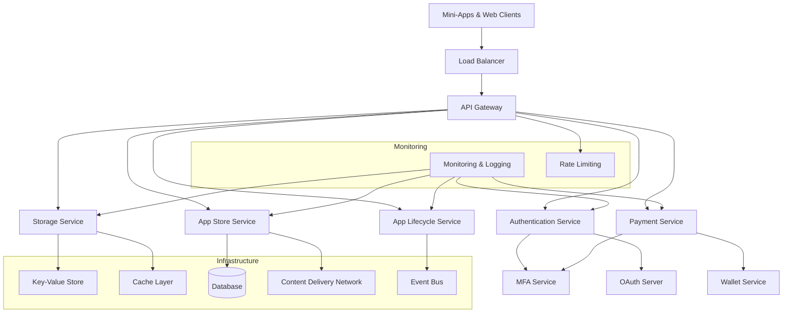

# TMCP Server Architecture Plan

## 1. System Overview

The Tween Mini-App Communication Protocol (TMCP) Server is a comprehensive platform that enables mini-apps to run within the Tween ecosystem, providing services for authentication, storage, payments, app distribution, and lifecycle management.

### Key Components Based on Protocol v1.2.0:

1. **Authentication & Authorization System**
   - OAuth 2.0 with PKCE for mini-apps
   - Multi-Factor Authentication (MFA) with transaction PIN, biometric, and TOTP
   - Device registration for biometric MFA
   - Privileged scopes for official apps

2. **Mini-App Storage System**
   - Key-value storage with quotas (10MB per user/app, 1MB per key, 1000 keys)
   - Offline storage support with conflict resolution
   - Batch operations for efficiency
   - Storage scopes (storage:read, storage:write)

3. **Payment Processing System**
   - Payment state machine with MFA_REQUIRED state
   - MFA challenge-response for payment authorization
   - Wallet Service integration

4. **Mini-App Store & Discovery**
   - App classification (official, verified, community, beta)
   - Preinstallation manifest and loading process
   - Internal URL scheme (tween-internal://)
   - App ranking algorithm and trending detection
   - Update management with verification

5. **App Lifecycle Management**
   - Installation, updates, and uninstallation events
   - Matrix events for lifecycle tracking

6. **Rate Limiting & Security**
   - Token bucket/sliding window algorithms
   - Required rate limit headers
   - Audit logging for privileged operations

## 2. High-Level Architecture

## 3. Service Boundaries

### API Gateway
- Request routing and protocol translation
- Rate limiting enforcement
- Request/response validation
- Authentication token verification
- API versioning

### Authentication Service
- User authentication and session management
- OAuth 2.0 authorization flows
- Token issuance and validation
- Scope management

### MFA Service
- Multi-factor authentication challenges
- Device registration and biometric attestation
- TOTP generation and validation
- Transaction PIN verification

### App Store Service
- App discovery and search
- App metadata management
- Ranking and trending algorithms
- App installation and updates
- Preinstallation manifest handling

### Payment Service
- Payment transaction processing
- Payment state machine management
- Wallet integration
- MFA enforcement for payments

### Storage Service
- Key-value storage operations
- Quota management
- Offline sync and conflict resolution
- Batch operations

### App Lifecycle Service
- App installation, update, and uninstallation
- Lifecycle event generation
- Matrix event publishing

## 4. Data Flow Patterns

### Authentication Flow
1. Client initiates OAuth flow with PKCE
2. Authentication service validates credentials
3. MFA service challenges if required
4. OAuth server issues access token with scopes
5. API gateway validates tokens on subsequent requests

### Payment Flow
1. Client initiates payment through Payment Service
2. Payment Service checks if MFA is required
3. If MFA required, MFA Service challenges user
4. Upon successful MFA, Payment Service processes transaction
5. Wallet Service handles actual payment processing
6. Payment state is updated and client is notified

### Storage Flow
1. Client requests storage operation through API Gateway
2. Storage Service validates quota and permissions
3. Operation is performed on Key-Value Store
4. Cache layer is updated for frequently accessed data
5. Conflict resolution is applied for offline sync

### App Installation Flow
1. Client discovers app through App Store Service
2. App metadata and installation package are retrieved
3. App Lifecycle Service handles installation process
4. Lifecycle events are published to Event Bus
5. Client receives installation confirmation

## 5. Technology Considerations

### Backend Framework
- Microservices architecture with containerized services
- API-first design with RESTful endpoints
- Event-driven architecture for async operations

### Data Storage
- Relational database for structured data (users, apps, transactions)
- Key-value store for app storage system
- Cache layer for performance optimization
- Event bus for async communication

### Security
- JWT tokens with proper expiration
- Rate limiting with token bucket algorithm
- Comprehensive audit logging
- Secure biometric data handling

### Scalability
- Horizontal scaling for stateless services
- Database sharding for large datasets
- CDN for app distribution
- Load balancing for high availability

This architecture provides a foundation for implementing the TMCP protocol while ensuring security, scalability, and maintainability.