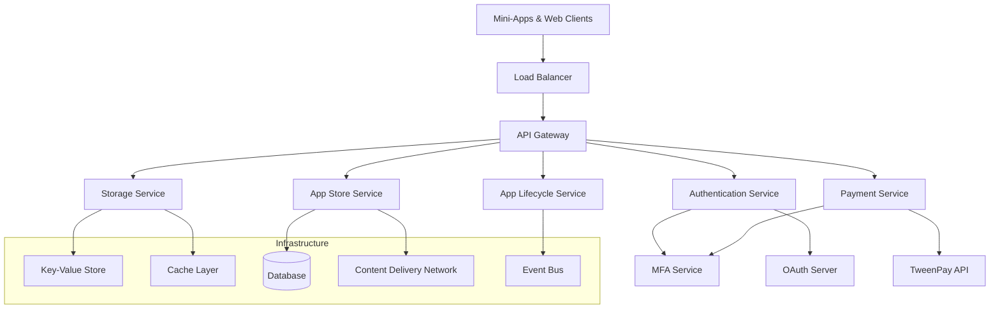

# TMCP Server Implementation Summary

## 1. Overview

This document provides a comprehensive summary of the TMCP (Tween Mini-App Communication Protocol) Server architecture and implementation plan, consolidating all design documents created during the planning phase.

## 2. Architecture Overview

The TMCP Server is designed as a microservices-based platform that provides:

- **Authentication & Authorization**: OAuth 2.0 with PKCE and MFA support
- **Storage System**: Key-value storage with quotas and offline sync
- **Payment Processing**: Integration with TweenPay API with MFA for high-value transactions
- **App Store**: Discovery, installation, and lifecycle management
- **API Gateway**: Centralized routing, rate limiting, and security

### 2.1 High-Level Architecture

## 3. Core Components

### 3.1 Authentication & Authorization System

**Key Features:**
- OAuth 2.0 with PKCE for mini-apps
- Multi-Factor Authentication (PIN, biometric, TOTP)
- Device registration for biometric MFA
- Scope-based authorization
- Token security with rotation

**Compliance:**
- TMCP Protocol Section 7.4: MFA for Payments
- TMCP Protocol Section 16.10: OAuth Server Implementation

### 3.2 Storage System

**Key Features:**
- Key-value storage with 10MB per user/app quota
- 1MB per key limit, 1000 keys maximum
- Offline storage with conflict resolution
- Batch operations for efficiency
- Storage scopes (storage:read, storage:write)

**Compliance:**
- TMCP Protocol Section 10.3: Mini-App Storage System

### 3.3 Payment Processing System

**Key Features:**
- Integration with TweenPay API (not direct wallet management)
- Payment state machine with MFA_REQUIRED state
- MFA challenge-response for payment authorization
- Support for transaction PIN, biometric, and TOTP
- Transaction logging and audit trails

**Compliance:**
- TMCP Protocol Section 7.4: MFA for Payments
- Integration with TweenPay API (external wallet system)

### 3.4 App Store & Discovery

**Key Features:**
- App classification (official, verified, community, beta)
- Preinstallation manifest support
- Internal URL scheme (tween-internal://)
- App ranking algorithm and trending
- Update management with verification
- Privileged scopes for official apps

**Compliance:**
- TMCP Protocol Section 16: Official and Preinstalled Mini-Apps

### 3.5 API Gateway

**Key Features:**
- Request routing and protocol translation
- Rate limiting with token bucket algorithm
- Authentication token verification
- API versioning support
- Security headers and CORS

**Compliance:**
- TMCP Protocol Section 11.4.1: Rate Limiting Implementation

## 4. Data Architecture

### 4.1 Database Design

**Primary Database:** PostgreSQL with:
- User management and authentication data
- App metadata and classifications
- Payment transaction records
- App lifecycle events
- Audit logs

**Cache Layer:** Redis with:
- Session storage
- Rate limiting data
- Frequently accessed data
- Temporary storage

**Search:** Elasticsearch with:
- App discovery and search
- Log aggregation
- Analytics data

### 4.2 Key Data Models

**User Management:**
- Users, sessions, MFA methods, device registrations
- OAuth clients and tokens

**App Ecosystem:**
- Apps, versions, reviews, installations
- Categories and classifications

**Payments:**
- Transactions (with TweenPay integration)
- MFA challenges
- Payment state tracking

**Storage:**
- Key-value entries
- Quota management
- Sync operations and conflicts

## 5. Security Architecture

### 5.1 Security Measures

**Authentication Security:**
- MFA with multiple methods
- Device registration for biometrics
- Token rotation and expiration
- Secure session management

**API Security:**
- Input validation and sanitization
- SQL injection prevention
- Rate limiting (token bucket/sliding window)
- Request/response filtering

**Data Security:**
- Encryption at rest and in transit
- Data masking for PII
- Row-level security
- Audit logging

### 5.2 Compliance

**TMCP Protocol Compliance:**
- Section 7.4: MFA for Payments
- Section 10.3: Storage System
- Section 11.4.1: Rate Limiting
- Section 12.2: Error Codes
- Section 16: Official Apps

**Industry Standards:**
- OAuth 2.0 with PKCE
- JWT token security
- TLS encryption
- PCI DSS considerations (via TweenPay)

## 6. Monitoring & Observability

### 6.1 Monitoring Stack

**Metrics Collection:**
- Application metrics (Prometheus)
- Infrastructure metrics (Node Exporter)
- Business metrics (custom collectors)
- Synthetic monitoring

**Logging:**
- Structured logging (JSON format)
- Log aggregation (ELK stack)
- Distributed tracing (Jaeger)
- Log analysis and anomaly detection

**Alerting:**
- Real-time alerting (AlertManager)
- Escalation procedures
- Incident response workflows
- SLA monitoring

### 6.2 Key Metrics

**System Metrics:**
- Request rate and response time
- Error rates and types
- Resource utilization
- Database performance

**Business Metrics:**
- Active users and sessions
- App installations and usage
- Payment transaction volume
- Storage utilization

## 7. Deployment Architecture

### 7.1 Infrastructure

**Cloud Provider:** AWS with:
- Kubernetes clusters (EKS)
- Managed databases (RDS PostgreSQL)
- Cache clusters (ElastiCache Redis)
- Object storage (S3)
- CDN integration

**High Availability:**
- Multi-AZ deployment
- Auto-scaling groups
- Load balancing
- Disaster recovery

### 7.2 CI/CD Pipeline

**Development Workflow:**
- GitHub Actions for CI/CD
- Automated testing and security scanning
- Container registry management
- Helm charts for deployment

**Deployment Strategy:**
- Blue-green deployments
- Canary releases
- Rollback procedures
- Environment promotion

## 8. Implementation Roadmap

### 8.1 Phases

**Phase 1: Foundation (Weeks 1-4)**
- Infrastructure setup
- Database schema
- API gateway
- Basic monitoring

**Phase 2: Core Services (Weeks 5-8)**
- Authentication service
- Storage service
- Payment integration

**Phase 3: App Ecosystem (Weeks 9-12)**
- App store service
- App lifecycle management
- MFA implementation

**Phase 4: Enhancement (Weeks 13-16)**
- Security hardening
- Performance optimization
- Advanced monitoring

**Phase 5: Production (Weeks 17-20)**
- Load testing
- Security audit
- Production launch

### 8.2 Success Metrics

**Technical Goals:**
- < 100ms response time (95th percentile)
- 99.9% uptime
- 10,000 concurrent users
- < 0.1% error rate

**Business Goals:**
- 1,000+ active users (3 months)
- 50+ mini-apps (6 months)
- 10,000+ transactions/day
- 4.5+ star rating

## 9. Key Design Decisions

### 9.1 Architecture Decisions

1. **Microservices Architecture**: For scalability and maintainability
2. **Kubernetes Deployment**: For container orchestration and auto-scaling
3. **PostgreSQL Primary**: For relational data consistency
4. **Redis for Caching**: For performance optimization
5. **TweenPay Integration**: Instead of direct wallet management

### 9.2 Technology Choices

**Backend**: Node.js with TypeScript
**Database**: PostgreSQL with Redis
**Infrastructure**: AWS with Kubernetes
**Monitoring**: Prometheus, Grafana, ELK stack
**CI/CD**: GitHub Actions with Helm

## 10. Risk Mitigation

### 10.1 Technical Risks

**Performance**: Caching, query optimization, read replicas
**Security**: Regular audits, penetration testing, code reviews
**Scalability**: Auto-scaling, load testing, capacity planning
**Integration**: Comprehensive testing, API versioning

### 10.2 Project Risks

**Timeline**: Agile methodology, regular reviews, buffer time
**Resources**: Resource planning, cross-training, contractor support
**Requirements**: Change management, stakeholder communication
**Team**: Documentation, knowledge sharing, succession planning

## 11. Next Steps

1. **Review and Approval**: Stakeholder review of all design documents
2. **Resource Allocation**: Team formation and resource planning
3. **Infrastructure Setup**: Begin Phase 1 implementation
4. **Development Kickoff**: Start core service development
5. **Regular Reviews**: Weekly progress reviews and adjustments

## 12. Documentation Structure

All design documents are organized as follows:

1. **TMCP_Architecture_Plan.md**: High-level system overview
2. **Authentication_System_Design.md**: Authentication and MFA details
3. **Storage_System_Design.md**: Key-value storage architecture
4. **Payment_System_Revised_Design.md**: Payment processing with TweenPay
5. **App_Store_System_Design.md**: App discovery and lifecycle
6. **API_Gateway_Design.md**: Request routing and security
7. **Database_Schema_Design.md**: Complete database schema
8. **Security_and_Rate_Limiting_Design.md**: Security measures
9. **Monitoring_and_Observability_Design.md**: Monitoring strategy
10. **Deployment_Architecture_Design.md**: Infrastructure and deployment
11. **Development_Roadmap.md**: Implementation phases and timeline

This comprehensive architecture provides a solid foundation for implementing the TMCP server while ensuring compliance with the protocol requirements and delivering a scalable, secure, and maintainable system.