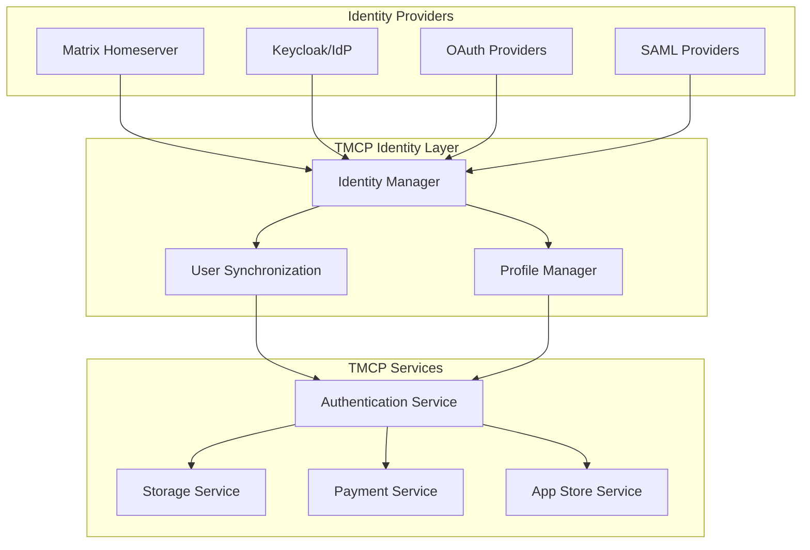
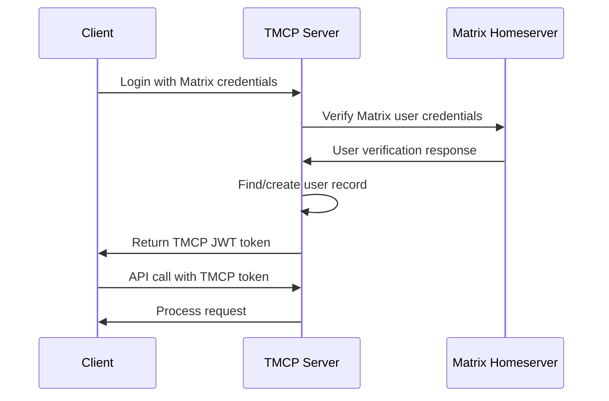

# TMCP User Management and Matrix Integration Analysis

## 1. Overview

This document analyzes user management and Matrix integration requirements for TMCP (Tween Mini-App Communication Protocol) Server, based on the protocol changelog and best practices for distributed identity systems.

## 2. Protocol Analysis

### 2.1 What TMCP Specifies

From PROTO.md analysis:
- **Section 8.1.4**: "Added Matrix events for app installation, updates, and uninstallation"
- **Section 16.10**: "OAuth Server Implementation with Keycloak"
- **Section 7.4**: MFA for payments (implies user identity)
- **Section 10.3**: Storage system with user/app isolation

### 2.2 What TMCP Doesn't Explicitly Specify

- User registration/management flows
- Matrix username handling
- Identity provider integration details
- User profile management
- Matrix homeserver configuration

## 3. User Management Architecture

### 3.1 Recommended Approach: Federated Identity



### 3.2 User Identity Models

```ruby
# app/models/user.rb
class User < ApplicationRecord
  # Core identity fields
  has_many :user_identities, dependent: :destroy
  has_many :oauth_applications, dependent: :destroy
  has_many :app_installations, dependent: :destroy
  has_many :payment_transactions, dependent: :destroy
  has_many :storage_entries, dependent: :destroy
  
  # Profile information
  has_one :user_profile, dependent: :destroy
  
  # Authentication methods
  has_many :mfa_methods, dependent: :destroy
  has_many :device_registrations, dependent: :destroy
  
  def matrix_identity
    user_identities.find_by(provider: 'matrix')
  end
  
  def matrix_user_id
    matrix_identity&.external_id
  end
  
  def matrix_username
    matrix_identity&.username
  end
  
  def matrix_homeserver
    matrix_identity&.provider_details&.dig('homeserver')
  end
end

# app/models/user_identity.rb
class UserIdentity < ApplicationRecord
  belongs_to :user
  
  validates :provider, presence: true, inclusion: { in: %w[matrix keycloak oauth saml] }
  validates :external_id, presence: true
  validates :user, uniqueness: { scope: :provider, external_id }
  
  serialize :provider_details, JSON
  
  def matrix?
    provider == 'matrix'
  end
end
```

## 4. Matrix Integration Strategy

### 4.1 Matrix as Identity Provider

**Approach**: Treat Matrix homeserver as an identity provider similar to OAuth/SAML

**Benefits:**
- Leverages existing Matrix user base
- No need for separate user registration
- Matrix handles authentication and user management
- Natural fit for decentralized identity

**Implementation:**
```ruby
# app/services/matrix_identity_service.rb
class MatrixIdentityService
  MATRIX_CLIENT_URL = ENV['MATRIX_CLIENT_URL']
  MATRIX_ACCESS_TOKEN = ENV['MATRIX_ACCESS_TOKEN']
  
  def self.authenticate_user(matrix_user_id, access_token)
    # Verify Matrix user credentials
    response = HTTParty.get(
      "#{MATRIX_CLIENT_URL}/_matrix/client/r0/profile/#{matrix_user_id}",
      headers: { 'Authorization' => "Bearer #{access_token}" }
    )
    
    if response.success?
      user_data = JSON.parse(response.body)
      find_or_create_user(user_data)
    else
      nil
    end
  end
  
  def self.find_or_create_user(matrix_user_data)
    user_identity = UserIdentity.find_by(
      provider: 'matrix',
      external_id: matrix_user_data['user_id']
    )
    
    if user_identity
      return user_identity.user
    end
    
    # Create new user and identity
    user = User.create!(
      email: matrix_user_data['email'] || generate_placeholder_email,
      username: extract_username(matrix_user_data['user_id']),
      status: 'active'
    )
    
    user_identity = user.user_identities.create!(
      provider: 'matrix',
      external_id: matrix_user_data['user_id'],
      username: extract_username(matrix_user_data['user_id']),
      provider_details: {
        homeserver: extract_homeserver(matrix_user_data['user_id']),
        display_name: matrix_user_data['displayname'],
        avatar_url: matrix_user_data['avatar_url']
      }
    )
    
    # Create user profile
    user.create_user_profile!(
      display_name: matrix_user_data['displayname'],
      avatar_url: matrix_user_data['avatar_url']
    )
    
    user
  end
  
  private
  
  def self.extract_username(matrix_user_id)
    # Extract username from Matrix ID (@username:homeserver)
    match = matrix_user_id.match(/^@([^:]+):/)
    match ? match[1] : matrix_user_id
  end
  
  def self.extract_homeserver(matrix_user_id)
    # Extract homeserver from Matrix ID (@username:homeserver)
    match = matrix_user_id.match(/^@[^:]+:(.+)$/)
    match ? match[1] : 'matrix.org'
  end
end
```

### 4.2 Matrix Events for App Lifecycle

```ruby
# app/services/matrix_event_service.rb
class MatrixEventService
  MATRIX_SERVER_URL = ENV['MATRIX_SERVER_URL']
  MATRIX_ACCESS_TOKEN = ENV['MATRIX_ACCESS_TOKEN']
  
  def self.publish_app_lifecycle_event(event_type, user, app, details = {})
    room_id = get_or_create_app_room(app)
    
    event_content = {
      msgtype: 'm.text',
      body: format_lifecycle_message(event_type, user, app, details),
      format: 'org.tween.tmcp.app_lifecycle',
      event_type: event_type,
      app_id: app.id,
      user_id: user.matrix_user_id,
      timestamp: Time.current.iso8601,
      details: details
    }
    
    response = HTTParty.put(
      "#{MATRIX_SERVER_URL}/_matrix/client/r0/rooms/#{room_id}/send/m.room.message",
      headers: {
        'Authorization' => "Bearer #{MATRIX_ACCESS_TOKEN}",
        'Content-Type' => 'application/json'
      },
      body: event_content.to_json
    )
    
    response.success?
  end
  
  def self.get_or_create_app_room(app)
    # Create or find Matrix room for app events
    room_alias = "#tmcp_app_#{app.id}:#{ENV['MATRIX_HOMESERVER']}"
    
    # Try to find existing room
    response = HTTParty.get(
      "#{MATRIX_SERVER_URL}/_matrix/client/r0/directory/room/#{room_alias}",
      headers: { 'Authorization' => "Bearer #{MATRIX_ACCESS_TOKEN}" }
    )
    
    if response.success?
      JSON.parse(response.body)['room_id']
    else
      # Create new room
      create_app_room(app, room_alias)
    end
  end
  
  def self.create_app_room(app, room_alias)
    room_data = {
      preset: 'public_chat',
      room_alias_name: "tmcp_app_#{app.id}",
      name: "#{app.name} - TMCP Events",
      topic: "App lifecycle events for #{app.name}",
      creation_content: {
        "m.federate": true
      }
    }
    
    response = HTTParty.post(
      "#{MATRIX_SERVER_URL}/_matrix/client/r0/createRoom",
      headers: {
        'Authorization' => "Bearer #{MATRIX_ACCESS_TOKEN}",
        'Content-Type' => 'application/json'
      },
      body: room_data.to_json
    )
    
    if response.success?
      JSON.parse(response.body)['room_id']
    else
      raise "Failed to create Matrix room: #{response.body}"
    end
  end
  
  private
  
  def self.format_lifecycle_message(event_type, user, app, details)
    case event_type
    when 'app_installed'
      "User #{user.matrix_username} installed app #{app.name}"
    when 'app_updated'
      "User #{user.matrix_username} updated app #{app.name} to version #{details[:version]}"
    when 'app_uninstalled'
      "User #{user.matrix_username} uninstalled app #{app.name}"
    else
      "App #{app.name} lifecycle event: #{event_type}"
    end
  end
end
```

## 5. Authentication Flow with Matrix

### 5.1 Matrix-Based Authentication



### 5.2 Authentication Controller Implementation

```ruby
# app/controllers/api/v1/authentication_controller.rb
class Api::V1::AuthenticationController < ApplicationController
  skip_before_action :authenticate_user, only: [:matrix_login]
  
  def matrix_login
    matrix_user_id = params[:matrix_user_id]
    access_token = params[:access_token]
    
    # Authenticate with Matrix
    user = MatrixIdentityService.authenticate_user(matrix_user_id, access_token)
    
    if user
      token = JWTService.encode({
        sub: user.id,
        matrix_user_id: matrix_user_id,
        provider: 'matrix',
        exp: 1.hour.from_now.to_i,
        iat: Time.current.to_i,
        jti: SecureRandom.uuid
      })
      
      render json: {
        access_token: token,
        token_type: 'Bearer',
        expires_in: 3600,
        user: {
          id: user.id,
          matrix_user_id: user.matrix_user_id,
          matrix_username: user.matrix_username
        }
      }
    else
      render json: { error: 'invalid_matrix_credentials' }, status: 401
    end
  end
  
  def oauth_login
    # Standard OAuth flow for non-Matrix users
    # ... existing OAuth implementation
  end
end
```

## 6. User Profile Management

### 6.1 Profile Synchronization

```ruby
# app/services/user_profile_sync_service.rb
class UserProfileSyncService
  def self.sync_from_matrix(user)
    matrix_identity = user.matrix_identity
    return unless matrix_identity
    
    # Get user profile from Matrix
    response = HTTParty.get(
      "#{ENV['MATRIX_CLIENT_URL']}/_matrix/client/r0/profile/#{matrix_identity.external_id}",
      headers: { 'Authorization' => "Bearer #{ENV['MATRIX_ACCESS_TOKEN']}" }
    )
    
    if response.success?
      profile_data = JSON.parse(response.body)
      
      user.user_profile.update!(
        display_name: profile_data['displayname'],
        avatar_url: profile_data['avatar_url'],
        bio: profile_data['bio'],
        matrix_data: profile_data
      )
    end
  end
  
  def self.sync_to_matrix(user)
    profile = user.user_profile
    matrix_identity = user.matrix_identity
    return unless matrix_identity
    
    # Update Matrix profile
    profile_data = {
      displayname: profile.display_name,
      avatar_url: profile.avatar_url
    }.compact
    
    response = HTTParty.put(
      "#{ENV['MATRIX_CLIENT_URL']}/_matrix/client/r0/profile/#{matrix_identity.external_id}/displayname",
      headers: {
        'Authorization' => "Bearer #{ENV['MATRIX_ACCESS_TOKEN']}",
        'Content-Type' => 'application/json'
      },
      body: { displayname: profile_data[:displayname] }.to_json
    )
    
    # Update avatar if provided
    if profile_data[:avatar_url]
      # Upload avatar to Matrix
      avatar_response = upload_avatar_to_matrix(user, profile_data[:avatar_url])
      
      if avatar_response.success?
        avatar_url = JSON.parse(avatar_response.body)['avatar_url']
        
        HTTParty.put(
          "#{ENV['MATRIX_CLIENT_URL']}/_matrix/client/r0/profile/#{matrix_identity.external_id}/avatar_url",
          headers: {
            'Authorization' => "Bearer #{ENV['MATRIX_ACCESS_TOKEN']}",
            'Content-Type' => 'application/json'
          },
          body: { avatar_url: avatar_url }.to_json
        )
      end
    end
  end
end
```

## 7. Configuration and Environment

### 7.1 Environment Variables

```ruby
# config/initializers/matrix.rb
Rails.application.configure do
  config.matrix = {
    client_url: ENV['MATRIX_CLIENT_URL'],
    server_url: ENV['MATRIX_SERVER_URL'],
    access_token: ENV['MATRIX_ACCESS_TOKEN'],
    homeserver: ENV['MATRIX_HOMESERVER'] || 'matrix.org',
    bot_user_id: ENV['MATRIX_BOT_USER_ID'],
    bot_access_token: ENV['MATRIX_BOT_ACCESS_TOKEN']
  }
end

# config/environments/development.rb
Rails.application.configure do
  config.matrix.client_url = 'https://matrix-client.example.com'
  config.matrix.server_url = 'https://matrix.example.com'
  config.matrix.homeserver = 'matrix.example.com'
end

# config/environments/production.rb
Rails.application.configure do
  config.matrix.client_url = ENV['MATRIX_CLIENT_URL']
  config.matrix.server_url = ENV['MATRIX_SERVER_URL']
  config.matrix.homeserver = ENV['MATRIX_HOMESERVER']
end
```

## 8. Migration Strategy

### 8.1 Supporting Multiple Identity Providers

```ruby
# app/models/user_identity.rb
class UserIdentity < ApplicationRecord
  belongs_to :user
  
  validates :provider, presence: true, inclusion: { in: %w[matrix keycloak oauth saml email] }
  validates :external_id, presence: true
  validates :user, uniqueness: { scope: :provider, external_id }
  
  serialize :provider_details, JSON
  
  # Scopes for different providers
  def self.matrix_scopes
    %w[profile read_contacts]
  end
  
  def self.keycloak_scopes
    %w[openid email profile]
  end
  
  def self.oauth_scopes
    %w[email profile]
  end
end

# app/services/identity_provider_service.rb
class IdentityProviderService
  def self.get_provider_config(provider)
    case provider
    when 'matrix'
      {
        auth_url: "#{Rails.application.config.matrix.client_url}/login",
        token_url: "#{Rails.application.config.matrix.client_url}/_matrix/client/r0/login",
        user_info_url: "#{Rails.application.config.matrix.client_url}/_matrix/client/r0/profile",
        scopes: UserIdentity.matrix_scopes
      }
    when 'keycloak'
      {
        auth_url: "#{ENV['KEYCLOAK_URL']}/auth",
        token_url: "#{ENV['KEYCLOAK_URL']}/token",
        user_info_url: "#{ENV['KEYCLOAK_URL']}/userinfo",
        scopes: UserIdentity.keycloak_scopes
      }
    else
      raise "Unsupported identity provider: #{provider}"
    end
  end
end
```

## 9. Security Considerations

### 9.1 Matrix Security

**Token Validation:**
- Validate Matrix access tokens
- Implement token refresh
- Handle token expiration
- Secure token storage

**User Identity Mapping:**
- Secure mapping between Matrix users and TMCP users
- Prevent identity spoofing
- Implement proper authorization checks
- Audit identity linking events

### 9.2 Privacy and Data Protection

**Data Minimization:**
- Only collect necessary Matrix profile data
- Implement data retention policies
- Provide user consent mechanisms
- Allow data export/deletion

**Federation Security:**
- Validate Matrix homeserver certificates
- Implement proper federation policies
- Handle cross-homeserver authentication
- Monitor for suspicious activities

## 10. Implementation Recommendations

### 10.1 Phase 1: Basic Matrix Integration

1. **Matrix Authentication Flow**
   - Implement Matrix login endpoint
   - Add Matrix user identity mapping
   - Create JWT tokens with Matrix context

2. **Basic Event Publishing**
   - Implement app lifecycle event publishing
   - Create Matrix rooms for apps
   - Add event formatting

### 10.2 Phase 2: Enhanced Integration

1. **Profile Synchronization**
   - Sync profiles between Matrix and TMCP
   - Handle profile updates
   - Implement avatar management

2. **Advanced Event Handling**
   - Add rich event content
   - Implement event filtering
   - Add event history

### 10.3 Phase 3: Multi-Provider Support

1. **Multiple Identity Providers**
   - Add Keycloak integration
   - Support OAuth providers
   - Implement SAML support

2. **Identity Federation**
   - Link multiple identities
   - Implement identity switching
   - Add consent management

## 11. Conclusion

The TMCP protocol doesn't explicitly specify user management or Matrix username handling, but based on the references to Matrix events and OAuth implementation, the recommended approach is:

1. **Treat Matrix as an Identity Provider** - Similar to OAuth/SAML
2. **Implement Federated Identity Management** - Support multiple identity providers
3. **Use Matrix for App Lifecycle Events** - Publish installation/update events to Matrix rooms
4. **Maintain User Mapping** - Map Matrix users to TMCP user records
5. **Enable Profile Synchronization** - Sync profiles between systems

This approach provides a robust, flexible identity system that leverages Matrix while maintaining compatibility with other identity providers and ensuring the TMCP server can work with various user management approaches.