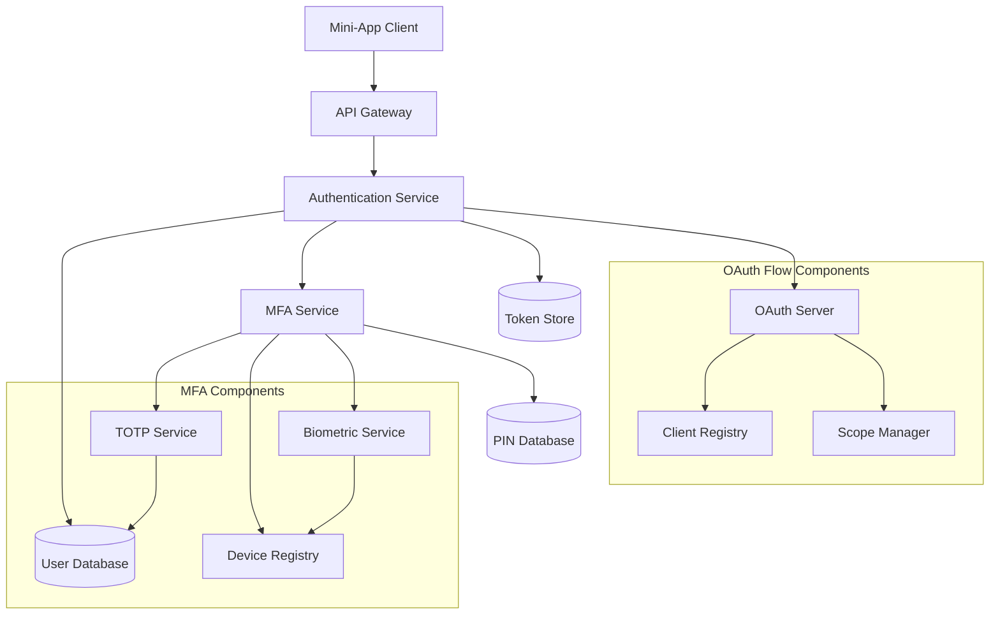
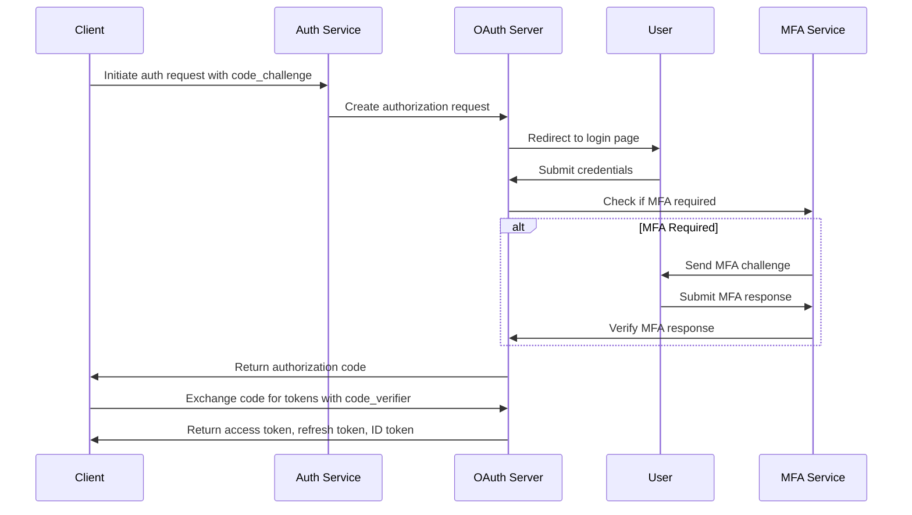
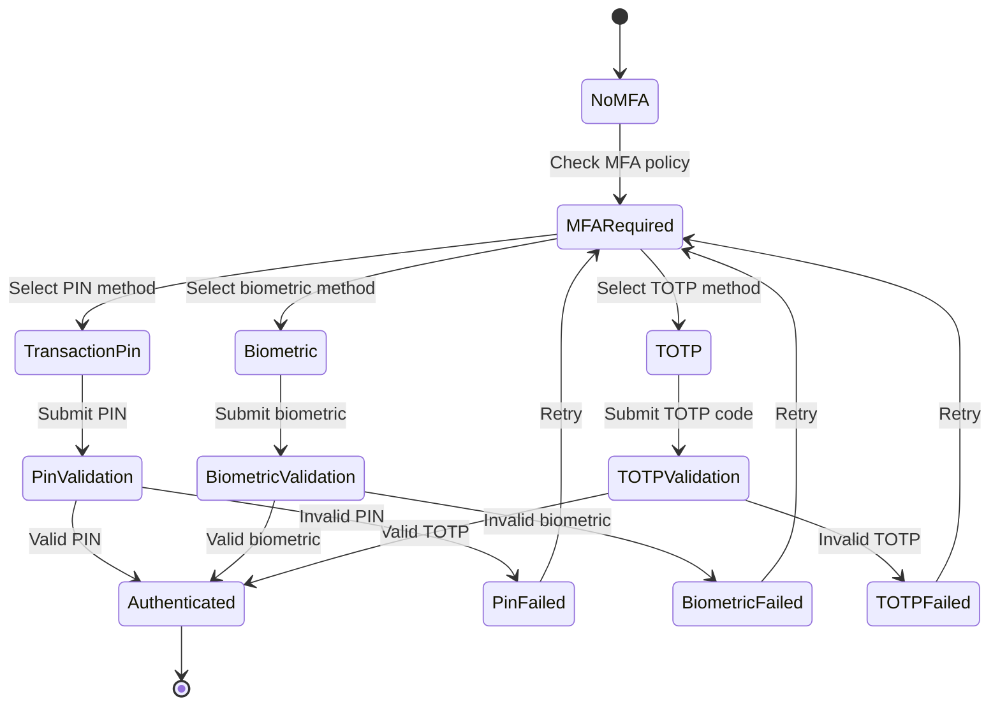
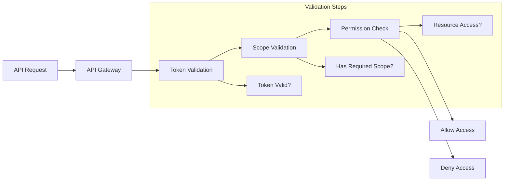

# TMCP Authentication & Authorization System Design

## 1. Overview

The TMCP Authentication & Authorization System provides secure access control for the mini-app ecosystem, supporting standard OAuth 2.0 flows with PKCE, multi-factor authentication, and granular scope-based authorization.

## 2. System Architecture



## 3. Authentication Flow

### 3.1 Standard OAuth 2.0 with PKCE



### 3.2 MFA Challenge Flow



## 4. Component Details

### 4.1 Authentication Service

**Responsibilities:**
- User credential validation
- Session management
- Token issuance and validation
- Authentication event logging

**Key APIs:**
```
POST /auth/login
POST /auth/logout
POST /auth/refresh
POST /auth/validate
GET /auth/session
```

### 4.2 OAuth Server

**Responsibilities:**
- OAuth 2.0 authorization flows
- PKCE implementation
- Client registration and management
- Scope validation and enforcement

**Key APIs:**
```
GET /oauth/authorize
POST /oauth/token
POST /oauth/revoke
GET /oauth/userinfo
```

**OAuth Flow Implementation:**
- Authorization Code Flow with PKCE for public clients (mini-apps)
- Client Credentials Flow for server-to-server communication
- Refresh Token Flow for token renewal

### 4.3 MFA Service

**Responsibilities:**
- MFA method management
- Challenge generation and validation
- Device registration for biometrics
- MFA policy enforcement

**Key APIs:**
```
POST /mfa/challenge
POST /mfa/verify
POST /mfa/register-device
GET /mfa/methods
PUT /mfa/preferences
```

**MFA Methods:**
1. **Transaction PIN**
   - 6-digit numeric PIN
   - Rate limiting to prevent brute force
   - Locked after failed attempts

2. **Biometric Authentication**
   - Device-bound biometric keys
   - Attestation verification
   - Fallback to other methods

3. **TOTP (Time-based One-Time Password)**
   - RFC 6238 compliant implementation
   - QR code setup for authenticator apps
   - Backup codes for recovery

## 5. Authorization Model

### 5.1 Scope System

**Basic Scopes (auto-approved):**
- `profile` - Access to user profile information
- `email` - Access to user email
- `storage:read` - Read access to app storage
- `storage:write` - Write access to app storage

**Privileged Scopes (require approval):**
- `payment:read` - Read payment history
- `payment:write` - Initiate payments
- `payment:mfa` - Bypass MFA for small amounts
- `device:register` - Register devices for biometrics
- `app:install` - Install other apps
- `app:manage` - Manage app lifecycle

**Official App Scopes:**
- `admin:users` - User management
- `admin:apps` - App store management
- `admin:system` - System administration

### 5.2 Scope Validation



## 6. Security Considerations

### 6.1 Token Security

**Access Tokens:**
- JWT format with short expiration (15-60 minutes)
- Include user ID, scopes, and issuer
- Signed with asymmetric keys

**Refresh Tokens:**
- Long-lived tokens (30 days)
- Stored securely with rotation
- Bound to client device

### 6.2 PKCE Implementation

**Code Challenge Generation:**
```
code_verifier = random_string(43-128 chars)
code_challenge = BASE64URL(SHA256(code_verifier))
```

**Flow:**
1. Client generates code_verifier and code_challenge
2. Client sends code_challenge in authorization request
3. Server stores code_challenge with authorization code
4. Client sends code_verifier in token request
5. Server verifies code_verifier matches stored code_challenge

### 6.3 MFA Security

**Biometric Security:**
- Device-bound keys using platform secure storage
- Attestation verification to ensure device integrity
- Fallback mechanisms for device loss

**Transaction PIN Security:**
- Salted hash storage
- Rate limiting with exponential backoff
- Account lockout after repeated failures

**TOTP Security:**
- Time-based codes with 30-second window
- Backup codes for recovery scenarios
- Secure setup process with verification

## 7. Implementation Guidelines

### 7.1 Matrix Authentication Service (MAS) Integration (PROTO Section 4.2)

**MAS Client Registration:**
- TMCP Server registered as confidential client with MAS
- Client authentication method: `client_secret_post`
- Grant types: `urn:ietf:params:oauth:grant-type:token-exchange`, `refresh_token`
- Scope: `urn:matrix:org.matrix.msc2967.client:api:*`

**Authentication Flows:**
- **Matrix Session Delegation (RFC 8693)**: For users with active Element session
  - Sub-second authentication without user interaction
  - Token exchange from Matrix access token to TEP token
  - Consent handling for sensitive scopes

- **Device Authorization Grant (RFC 8628)**: For new users without session
  - User enters code on web interface
  - Poll-based token retrieval
  - Exchange MAS token for TEP

- **Authorization Code Flow with PKCE (RFC 7636)**: For web mini-apps
  - Browser redirect flow
  - PKCE for security
  - Exchange authorization code for tokens

**Mini-App Client Registration:**
- Each mini-app registered in MAS
- Grant types: `authorization_code`, `urn:ietf:params:oauth:grant-type:device_code`, `urn:ietf:params:oauth:grant-type:token-exchange`, `refresh_token`
- Scope includes Matrix C-S API scope

### 7.2 Database Schema

**Users Table:**
```sql
CREATE TABLE users (
    id UUID PRIMARY KEY,
    username VARCHAR(255) UNIQUE NOT NULL,
    email VARCHAR(255) UNIQUE NOT NULL,
    password_hash VARCHAR(255) NOT NULL,
    mfa_enabled BOOLEAN DEFAULT FALSE,
    created_at TIMESTAMP DEFAULT NOW(),
    updated_at TIMESTAMP DEFAULT NOW()
);
```

**MFA Methods Table:**
```sql
CREATE TABLE mfa_methods (
    id UUID PRIMARY KEY,
    user_id UUID REFERENCES users(id),
    method_type VARCHAR(50) NOT NULL, -- 'pin', 'biometric', 'totp'
    method_data JSONB NOT NULL,
    is_primary BOOLEAN DEFAULT FALSE,
    created_at TIMESTAMP DEFAULT NOW()
);
```

**Device Registrations Table:**
```sql
CREATE TABLE device_registrations (
    id UUID PRIMARY KEY,
    user_id UUID REFERENCES users(id),
    device_id VARCHAR(255) NOT NULL,
    device_name VARCHAR(255),
    biometric_key_id VARCHAR(255),
    attestation_data JSONB,
    created_at TIMESTAMP DEFAULT NOW(),
    last_used TIMESTAMP
);
```

## 8. Rate Limiting

**Authentication Endpoints:**
- Login: 5 attempts per minute per IP
- MFA verification: 3 attempts per challenge
- Token refresh: 10 requests per minute per token

**Implementation:**
- Token bucket algorithm
- Sliding window counters
- Distributed storage for multi-instance deployments

## 9. Audit Logging

**Events to Log:**
- Successful and failed authentication attempts
- MFA challenges and responses
- Token issuance and refresh
- Scope usage and privilege escalations
- Device registrations and changes

**Log Format:**
```json
{
  "timestamp": "2025-12-20T01:15:00Z",
  "event_type": "auth.login.success",
  "user_id": "uuid",
  "client_id": "mini-app-id",
  "ip_address": "client-ip",
  "user_agent": "client-user-agent",
  "mfa_used": true,
  "scopes_granted": ["profile", "storage:read", "storage:write"]
}
```

This design provides a comprehensive authentication and authorization system that meets the TMCP protocol requirements while ensuring security, scalability, and maintainability.